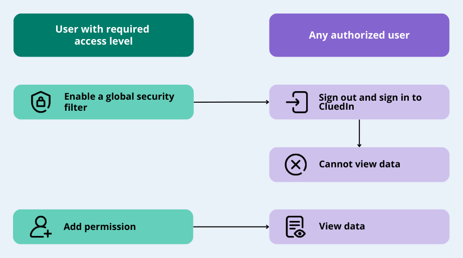

## On this page
{: .no_toc .text-delta }
1. TOC
{:toc}

In this article, you will learn how to restrict access to data using a global security filter and how to add permissions to specific data.

**_This article is intended for users with the OrganizationAdmin role or users with the following claim access levels._**

| Section | Claim | Access level |
|--|--|--|
| Management | Data Catalog | At least Consulted |
| Management | Annotation | At least Consulted |
| Admin | Tenant Management | At least Consulted |
| Integration | Enrichment | At least Consulted |
| Integration | Configured Integrations | At least Consulted |
| Integration | Manual Data Entry Project Management | At least Consulted |
| Integration | Data Source Groups | At least Consulted |
| Consume | Export Targets | At least Consulted |

To make sure that the right users have access to the right data, perform the following steps:

1. [Enable a global security filter](#enable-a-global-security-filter)

2. [Add permission for users in data resource](#add-users-to-data-sources)

The following diagram shows the flow of restricting access to data.

## Enable a global security filter

Global security filter is used for managing the overall access to data within the platform. It can be in one of the following statuses:

- **Disabled** – the users can view all data in CluedIn.

    If the global security filter is disabled, you will see a message similar to the one below when you check permissions for data sources, manual data entry projects, configured integrations, and enrichers.

    

- **Enabled** – the users cannot view the data in CluedIn unless you have specifically added permissions for data.

    If the global security filter is enabled, you will see a list of users who have access to data when you check permissions for data sources, manual data entry projects, configured integrations, and enrichers.

    

**To enable a global security filter**

1. Go to **Administration** > **Settings**.

1. In the **Global Security Filter** section, turn on the toggle next to the status.

     

    The global security filter is enabled. The users need to sign out and sign in again for the changes to take effect.

After you turn on the global security filter, the users will not be able to view any data in CluedIn. To give users access to the data required for performing their data-related tasks, [add permissions for users in data resources](#add-permission-for-users-in-data-resource).

**Exception in global security filter**

The table below contains the combination of section-claim-access level that grants users a permission to view the data regardless of whether the global security filter is turned on or not.

| Section | Claim | Access level |
|--|--|--|
| Admin | Data Management | Informed |
| Management | Deduplication Project Management | Informed |
| Management | Deduplication Review | Informed |

## Add permission for users in data resource

With the global security filter turned on, you need to add permissions for users in the data resources so that they can work with the required data.

**To add permission in data resource**

1. Depending on the data resource, do one of the following:

    - To add permission to data associated with a certain data source, on the navigation pane, go to **Integrations** > **Data Sources**. Then, expand the group and select the needed data source.

    - To add permission to records in the manual data entry project, on the navigation pane, go to **Integrations** > **Manual Data Entry**. Then, select the needed project.

    - To add permission to data pushed by a certain integration source, on the navigation pane, go to **Integrations** > **Configured**. Then, select the needed integration.

    - To add permission to enriched data, on the navigation pane, go to **Preparation** > **Enrich**. Then, select the needed enricher.

1. Go to the **Permissions** tab and select **Add Users**.

1. Select the checkbox next to the users you want to grant access to data. Then, select **Grant access**.

    

    For the changes to take effect, the users have to sign out and sign in again. Now, the users can view data, and they are listed on the **Permissions** tab of the data resource.

{:.important}
The operations that users can perform with data depend on the roles assigned to the users. For more information, see [Roles](/administration/roles).