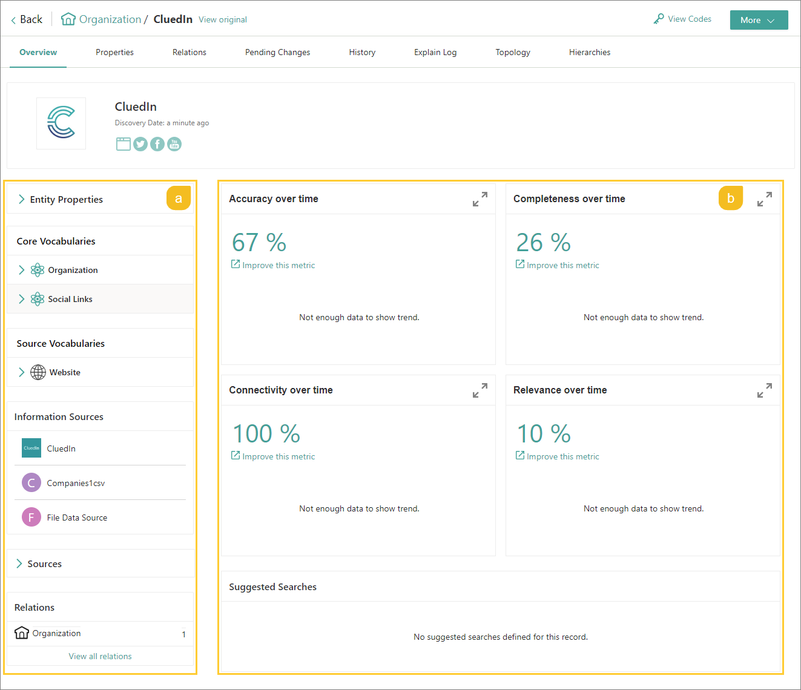
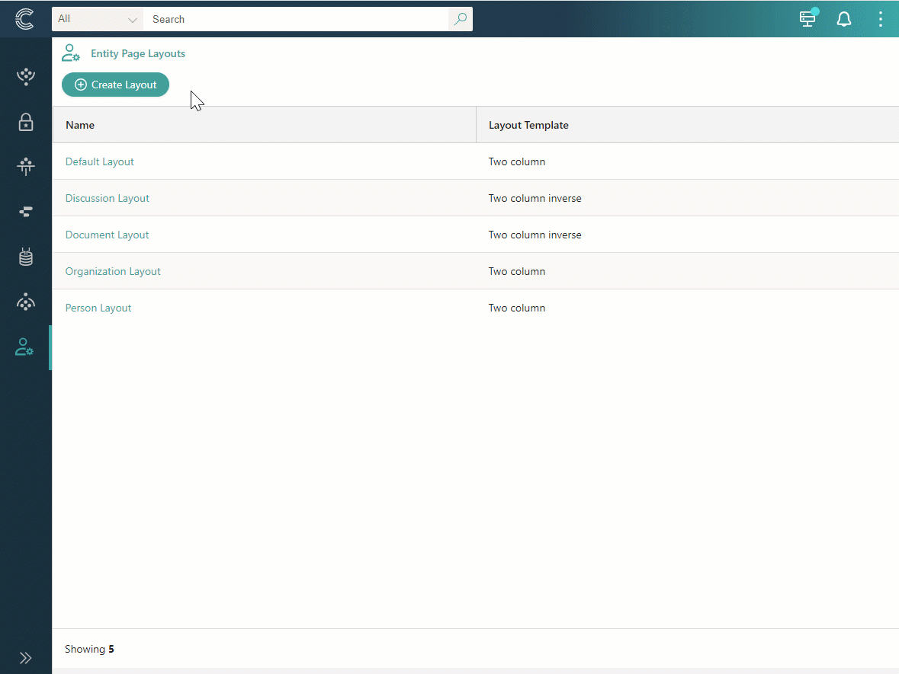
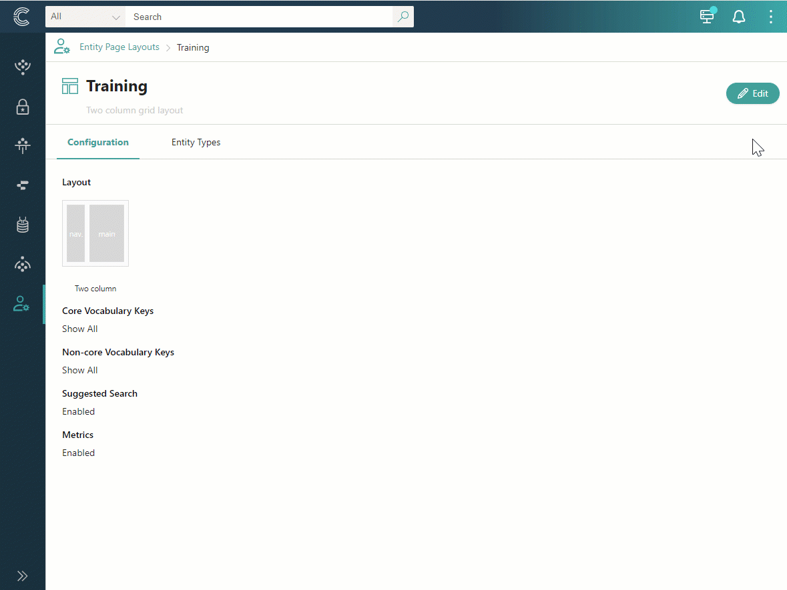

## On this page
{: .no_toc .text-delta }
- TOC
{:toc}

An entity page layout is the way in which information about a golden record is arranged on the golden record overview page. In this article, you will learn about the types of layouts and how they are applied to golden records.

## Overview of entity page layouts

The entity page layout is assigned to the entity type. This ensures that all golden records belonging to that entity type consistently display relevant information on the golden record overview page.

All layouts are stored in **Administration** > **Entity page layouts**. CluedIn contains several built-in entity page layouts:

- Default layout

- Discussion layout

- Document layout

- Organization layout

- Person layout

You cannot edit built-in layouts, but you can create custom layouts.

When you create a new entity type while creating mapping, the default layout is assigned to such entity type. You change the layout later by [editing](/management/entity-type#manage-an-entity-type) the entity type.

The layouts consist of the following elements:

- Nav – a container for the following information about a golden record: entity properties, core vocabularies, source vocabularies, information sources, sources, and relations.

- Main – a container for the following information about a golden record: quality metrics and suggested searches.

The following screenshot displays the arrangement of nav (a) and main (b) containers on the golden record overview page.

## Layout details page

On the layout details page, you can view relevant information about the entity page layout and take other actions to manage the layout.

**Configuration**

This tab contains general information about the layout, including:

- Layout template that defines the arrangement of elements on the golden record overview page (the placement of main and nav containers).

- Elements that are displayed on the golden record overview page (all or custom core and non-core vocabulary keys, suggested search, and quality metrics).

**Entity types**

This tab contains all entity types that use the current layout. You can also add more entity types to which the layout will be assigned.

## Create a layout

If built-in layouts are not sufficient for you, you create your own layout.

**To create a layout**

1. On the navigation pane, go to **Administration** > **Entity page layouts**.

1. Select **Create layout**.

1. Enter the display name of the layout.

1. Choose the layout template for organizing the information on the golden record overview page: simple, two column, header, or two column inverse.

1. Select **Create**.

    

    Alternatively, you can create a layout from the entity type page. You can do it when editing the entity type.

    After the layout is created, you can assign it to the entity type. As a result, the information on the **Overview** tab of all golden records belonging to the entity type will be arranged according to the selected layout.

## Manage a layout

You can change the layout configuration and choose the elements that should be displayed on the golden record overview page. Note that you cannot delete the layout.

**To edit a layout**

1. On the navigation pane, go to **Administration** > **Entity page layouts**.

1. Open the layout that you want to edit, and then select **Edit**.

    The layout template opens in edit mode and contains the following sections:

    - Display name – you can change the layout name.

    - Select layout template – you can choose another layout template.

    - Configure layout – you can choose what elements you want to be displayed on the golden records details page. By default, all core vocabulary keys and non-core vocabulary keys that the golden record contains are displayed on the golden record details page, together with quality metrics and suggested searches. You can select custom core and non-core vocabulary keys or disable the quality metrics and suggested searches.

1. To add custom core or non-core vocabulary keys, in the corresponding section, choose the **Custom** option, and then do the following:

    1. Select **Add vocabulary keys**.

    1. Find and select the vocabulary keys to be displayed on the golden record details page.

    1. Select **Add**.

    The vocabulary keys that you added are displayed on the page.

1. Make other changes as needed.

1. After completing your edits to the layout, select **Save**.

    

    The changes will be automatically applied to the overview pages of all golden records that belong to the entity type associated with the current layout.