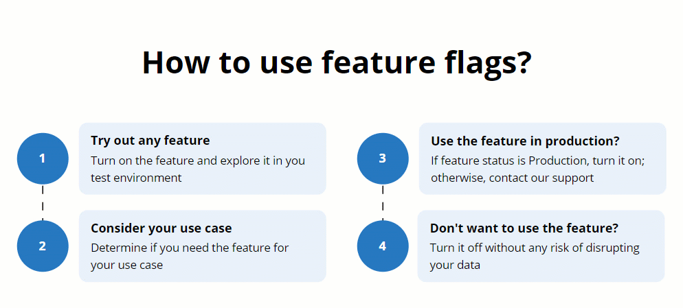
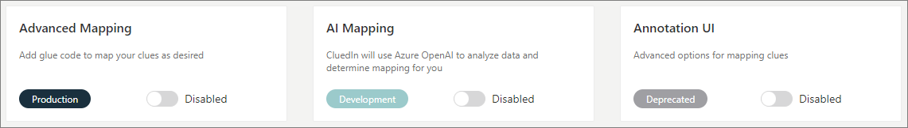

In this article, you will learn about the features in CluedIn that you can turn on or off as needed.

Since not all features are suitable for every business use case, they are stored separately in **Administration** > **Feature Flags**. This allows you to turn on only those features that are most relevant to your needs. However, you are free to try out any feature and see how it works for yourself.

{:.important}
Turning on these features is safe and will not cause any disruptions to your data or affect the stability of your instance of CluedIn. If you encounter any issues or do something wrong while using these features, remember that you can always revert your actions.

Each feature has a status to indicate the state of the feature's readiness for production. The following table provides a description of each feature status.

| Feature status | Description |
|--|--|
| Deprecated | The feature is no longer recommended for use, and it will be eventually removed in future versions. |
| Development | The feature is in the process of development. It has been tested but not yet validated. You can turn on such feature only in the test environment. You might encounter issues or bugs when using such feature.  |
| Alpha | The feature is in the process of validation. You can turn on such feature only in the test environment. You might encounter issues or bugs when using such feature. |
| Beta | The feature has been partially validated and tested; no user documentation has been prepared yet. You can turn on such feature only in the test environment. To make sure the feature works as expected, we use this feature with selected customers in the production environment. |
| Release Candidate | The feature has been validated and thoroughly tested, but it still might have some outstanding minor issues. You can turn on such feature only in the test environment.  |
| Production | The feature has passed all validations and tests and can be used in the production environment. If the feature has this status and is still listed on the **Feature Flags** page, it means that this feature might not be suitable for all business use cases. So, you can turn it on if you need it for your specific use case.   |

If you want to use a feature in the production environment, but the feature status is other than Production, reach out to CluedIn support at <a href="mailto:support@cluedin.com">support@cluedin.com</a> and we'll help you do it.
