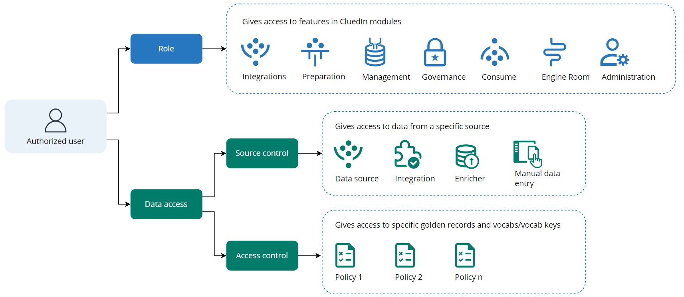

In this section, you will learn about the main aspects that define user access in CluedIn.

Every authorized user in CluedIn has an assigned **role** that defines the user's permission to interact with CluedIn modules: Integrations, Preparation, Management, Governance, Consume, Engine Room, and Administration. Every module contains features that enable you to perform specific tasks. For example, in the Preparation module, you can create and work with clean projects. Access to those features is managed by CluedIn roles. For more information, see [Feature access](/administration/user-access/feature-access).

Roles do not affect **data access** in CluedIn. For example, if you have access to the glossary, you still won't be able to view golden records from a glossary term without specific data access. To configure secure and reliable access to the data in CluedIn, you need to set up source control and access control permissions. For more information, see [Data access](/administration/user-access/data-access).