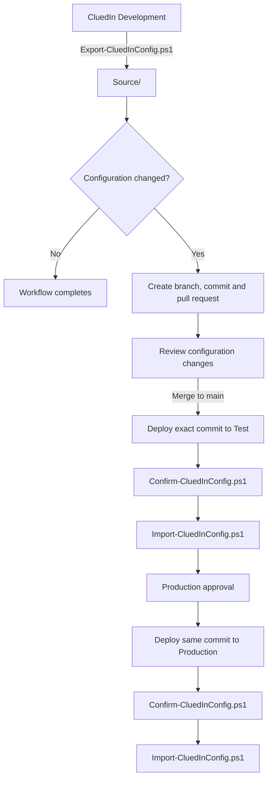

This article explains how to use GitHub Actions and [CluedIn.Product.Toolkit](https://github.com/CluedIn-io/CluedIn.Product.Toolkit) to capture configuration from a CluedIn development environment and promote the reviewed configuration to test and production environments.

The pipeline described here promotes **CluedIn configuration**. It does not deploy or upgrade the CluedIn application, Kubernetes infrastructure, or platform binaries.

## On this page
{: .no_toc .text-delta }
- TOC
{:toc}

## Overview

The recommended approach is to treat Git as the source of truth for configuration releases.

Configuration is first exported from the development environment into a `Source/` folder in a dedicated GitHub repository. If the exported configuration differs from the version stored in Git, the capture workflow creates a branch, commits the changes, and opens a pull request. After review and merge, a separate promotion workflow imports the exact same Git commit into test and then production.

The `CluedIn.Product.Toolkit` source code is **not copied into the configuration repository**. Each workflow downloads a pinned published Toolkit release and uses the Toolkit's export, comparison, and import scripts.



## Prerequisites

Before creating the workflows, make sure that you have:

- A CluedIn development environment where configuration changes are created.
- A CluedIn test environment.
- A CluedIn production environment.
- A dedicated GitHub repository for the configuration.
- GitHub Actions enabled for the repository.
- A CluedIn service account for each environment with the permissions required by the Toolkit operations you plan to run.
- A GitHub Actions runner that can reach the frontend of each CluedIn environment.
- Access to published [CluedIn.Product.Toolkit releases](https://github.com/CluedIn-io/CluedIn.Product.Toolkit/releases).

If a CluedIn environment is not reachable from a GitHub-hosted runner, use a self-hosted runner with network access to that environment.

## Step 1: Prepare the configuration repository

Use a dedicated repository for the exported CluedIn configuration. A minimal repository structure is:

```text
.
├── .github/
│   └── workflows/
│       ├── capture-dev.yml
│       └── promote.yml
├── Source/
└── README.md
```

`Source/` is the deployable configuration payload. The Toolkit writes the exported JSON files and folders below this directory.

Do not copy the `CluedIn.Product.Toolkit` repository, modules, or scripts into this repository. The workflows download the selected Toolkit release when they run.

The examples in this article use `main` as the default branch of the configuration repository. If your repository uses a different default branch, replace `main` in the workflow files.

## Step 2: Create repository variables

In the configuration repository, go to **Settings** > **Secrets and variables** > **Actions** > **Variables**, and create the following repository variables.

| Variable | Example | Description |
|---|---|---|
| `CLUEDIN_TOOLKIT_VERSION` | `2026.02.00+1` | Published Toolkit release to use. Do not prefix the value with `v`. |
| `CLUEDIN_VOCABULARIES` | `customer,product,organization` | Optional comma-separated vocabulary names or IDs to export. Leave empty to export no vocabularies. |
| `CLUEDIN_EXPORT_ADMIN_SETTINGS` | `false` | Set to `true` only when administration settings are intentionally part of the promoted configuration. |

Use a specific Toolkit release instead of automatically using `latest`. This makes deployments reproducible and prevents a new Toolkit release from changing deployment behavior unexpectedly.

You can find available versions on the [CluedIn.Product.Toolkit releases page](https://github.com/CluedIn-io/CluedIn.Product.Toolkit/releases).

{:.important}
`-SelectVocabularies All` is not supported by the Toolkit. If `CLUEDIN_VOCABULARIES` is empty, the capture workflow below passes `None` to `-SelectVocabularies`. To export vocabularies, specify their names or IDs as a comma-separated value.

## Step 3: Create GitHub Environments

In the configuration repository, go to **Settings** > **Environments** and create these environments:

- `development`
- `test`
- `production`

For each environment, add the following **Environment variables**:

| Variable | Example |
|---|---|
| `CLUEDIN_BASE_URL` | `customer.com` |
| `CLUEDIN_ORGANIZATION` | `dev`, `test`, or `prod` |

For example, if the environment URL is `https://dev.customer.com`, use:

```text
CLUEDIN_BASE_URL=customer.com
CLUEDIN_ORGANIZATION=dev
```

For each environment, add the following **Environment secrets**:

| Secret | Description |
|---|---|
| `CLUEDIN_USERNAME` | CluedIn service account username for that environment. |
| `CLUEDIN_PASSWORD` | Password for the service account. |

Use separate credentials for development, test, and production. Do not store CluedIn usernames or passwords in workflow YAML or in repository variables.

## Step 4: Allow the capture workflow to create pull requests

The capture workflow pushes a generated branch and opens a pull request. The workflow therefore requires:

```yaml
permissions:
  contents: write
  pull-requests: write
```

Also check the repository or organization GitHub Actions policy. If GitHub Actions is not permitted to create pull requests, enable the setting that allows GitHub Actions to create pull requests for the repository.

If you cannot change that setting because it is controlled by an organization policy, ask a GitHub organization administrator to enable it or use your organization's approved pull-request automation method.

## Step 5: Add the development capture workflow

Create `.github/workflows/capture-dev.yml` with the following content.

```yaml
name: Capture CluedIn DEV configuration

on:
  workflow_dispatch:

permissions:
  contents: write
  pull-requests: write

concurrency:
  group: cluedin-capture-dev
  cancel-in-progress: false

env:
  CONFIG_PATH: Source
  TOOLKIT_REPOSITORY: CluedIn-io/CluedIn.Product.Toolkit

jobs:
  capture-dev:
    name: Capture DEV
    runs-on: ubuntu-latest
    environment: development

    steps:
      - name: Checkout configuration repository
        uses: actions/checkout@v4
        with:
          ref: main
          fetch-depth: 0

      - name: Download CluedIn Product Toolkit
        shell: pwsh
        env:
          GH_TOKEN: ${{ github.token }}
          TOOLKIT_VERSION: ${{ vars.CLUEDIN_TOOLKIT_VERSION }}
        run: |
          $ErrorActionPreference = 'Stop'

          if ([string]::IsNullOrWhiteSpace($env:TOOLKIT_VERSION)) {
              throw "Repository variable CLUEDIN_TOOLKIT_VERSION has not been configured."
          }

          $tag = "v$env:TOOLKIT_VERSION"
          $asset = "product.toolkit.$env:TOOLKIT_VERSION.zip"
          $downloadPath = Join-Path "${{ runner.temp }}" "cluedin-toolkit"
          $extractPath = Join-Path $downloadPath "release"

          New-Item -ItemType Directory -Path $downloadPath -Force | Out-Null

          Write-Host "Downloading CluedIn.Product.Toolkit release '$tag'"

          gh release download $tag `
              --repo "${{ env.TOOLKIT_REPOSITORY }}" `
              --pattern $asset `
              --dir $downloadPath

          $archivePath = Join-Path $downloadPath $asset

          if (-not (Test-Path $archivePath)) {
              throw "Toolkit release asset was not downloaded: $archivePath"
          }

          Expand-Archive `
              -Path $archivePath `
              -DestinationPath $extractPath `
              -Force

          $exportScript = Get-ChildItem `
              -Path $extractPath `
              -Filter "Export-CluedInConfig.ps1" `
              -File `
              -Recurse |
              Select-Object -First 1

          if (-not $exportScript) {
              throw "Export-CluedInConfig.ps1 could not be found in Toolkit release '$tag'."
          }

          $scriptsPath = Split-Path $exportScript.FullName -Parent
          $toolkitRoot = Split-Path $scriptsPath -Parent

          "CLUEDIN_TOOLKIT_ROOT=$toolkitRoot" >> $env:GITHUB_ENV
          "CLUEDIN_TOOLKIT_VERSION_RESOLVED=$env:TOOLKIT_VERSION" >> $env:GITHUB_ENV

      - name: Prepare Source directory
        shell: pwsh
        run: |
          $ErrorActionPreference = 'Stop'

          $sourcePath = Join-Path `
              "${{ github.workspace }}" `
              "${{ env.CONFIG_PATH }}"

          if (Test-Path $sourcePath) {
              Get-ChildItem `
                  -Path $sourcePath `
                  -Force `
                  -ErrorAction SilentlyContinue |
                  Remove-Item -Recurse -Force
          }
          else {
              New-Item `
                  -ItemType Directory `
                  -Path $sourcePath `
                  -Force | Out-Null
          }

      - name: Export CluedIn DEV configuration
        shell: pwsh
        env:
          CLUEDIN_USERNAME: ${{ secrets.CLUEDIN_USERNAME }}
          CLUEDIN_PASSWORD: ${{ secrets.CLUEDIN_PASSWORD }}
          CLUEDIN_BASE_URL: ${{ vars.CLUEDIN_BASE_URL }}
          CLUEDIN_ORGANIZATION: ${{ vars.CLUEDIN_ORGANIZATION }}
          CLUEDIN_VOCABULARIES: ${{ vars.CLUEDIN_VOCABULARIES }}
          CLUEDIN_EXPORT_ADMIN_SETTINGS: ${{ vars.CLUEDIN_EXPORT_ADMIN_SETTINGS }}
        run: |
          $ErrorActionPreference = 'Stop'

          if ([string]::IsNullOrWhiteSpace($env:CLUEDIN_BASE_URL)) {
              throw "CLUEDIN_BASE_URL has not been configured for the development environment."
          }

          if ([string]::IsNullOrWhiteSpace($env:CLUEDIN_ORGANIZATION)) {
              throw "CLUEDIN_ORGANIZATION has not been configured for the development environment."
          }

          if ([string]::IsNullOrWhiteSpace($env:CLUEDIN_USERNAME)) {
              throw "CLUEDIN_USERNAME has not been configured for the development environment."
          }

          if ([string]::IsNullOrWhiteSpace($env:CLUEDIN_PASSWORD)) {
              throw "CLUEDIN_PASSWORD has not been configured for the development environment."
          }

          $vocabularies = if ([string]::IsNullOrWhiteSpace($env:CLUEDIN_VOCABULARIES)) {
              'None'
          }
          else {
              $env:CLUEDIN_VOCABULARIES
          }

          $sourcePath = Join-Path `
              "${{ github.workspace }}" `
              "${{ env.CONFIG_PATH }}"

          $exportScript = Join-Path `
              $env:CLUEDIN_TOOLKIT_ROOT `
              "Scripts/Export-CluedInConfig.ps1"

          if (-not (Test-Path $exportScript)) {
              throw "Export script does not exist: $exportScript"
          }

          $exportParameters = @{
              BaseURL                       = $env:CLUEDIN_BASE_URL
              Organization                  = $env:CLUEDIN_ORGANIZATION
              BackupPath                    = $sourcePath
              SelectVocabularies            = $vocabularies
              SelectDataSets                = 'All'
              SelectRules                   = 'All'
              SelectExportTargets           = 'All'
              SelectStreams                 = 'All'
              SelectGlossaries              = 'All'
              SelectCleanProjects           = 'All'
              SelectDeduplicationProjects   = 'All'
              SelectManualDataEntryProjects = 'All'
          }

          if ($env:CLUEDIN_EXPORT_ADMIN_SETTINGS -eq 'true') {
              $exportParameters['BackupAdminSettings'] = $true
          }

          Write-Host "Exporting DEV configuration to: $sourcePath"
          Write-Host "Vocabulary selection: $vocabularies"

          & $exportScript @exportParameters

      - name: Validate exported JSON
        shell: pwsh
        run: |
          $ErrorActionPreference = 'Stop'

          $sourcePath = Join-Path `
              "${{ github.workspace }}" `
              "${{ env.CONFIG_PATH }}"

          $jsonFiles = @(
              Get-ChildItem `
                  -Path $sourcePath `
                  -Filter "*.json" `
                  -File `
                  -Recurse
          )

          if ($jsonFiles.Count -eq 0) {
              throw "The DEV export produced no JSON files."
          }

          Write-Host "Validating $($jsonFiles.Count) JSON files."

          foreach ($file in $jsonFiles) {
              try {
                  Get-Content `
                      -Path $file.FullName `
                      -Raw |
                      ConvertFrom-Json -Depth 100 |
                      Out-Null
              }
              catch {
                  throw "Invalid JSON file '$($file.FullName)': $($_.Exception.Message)"
              }
          }

      - name: Detect configuration changes
        id: changes
        shell: pwsh
        run: |
          $ErrorActionPreference = 'Stop'

          git add --all -- "${{ env.CONFIG_PATH }}"

          Write-Host "Configuration changes:"
          git diff `
              --cached `
              --stat `
              -- "${{ env.CONFIG_PATH }}"

          $changedFiles = @(
              git diff `
                  --cached `
                  --name-only `
                  -- "${{ env.CONFIG_PATH }}"
          )

          if ($changedFiles.Count -eq 0) {
              Write-Host "No CluedIn configuration changes detected."
              "changed=false" >> $env:GITHUB_OUTPUT
          }
          else {
              Write-Host "CluedIn configuration changes detected."

              foreach ($file in $changedFiles) {
                  Write-Host "  $file"
              }

              "changed=true" >> $env:GITHUB_OUTPUT
          }

      - name: Commit DEV configuration
        id: commit
        if: steps.changes.outputs.changed == 'true'
        shell: pwsh
        run: |
          $ErrorActionPreference = 'Stop'

          $branch = "cluedin/dev-capture-${{ github.run_id }}-${{ github.run_attempt }}"

          git config user.name "github-actions[bot]"
          git config user.email "41898282+github-actions[bot]@users.noreply.github.com"

          git switch -c $branch
          git commit -m "Capture CluedIn DEV configuration"
          git push --set-upstream origin $branch

          "branch=$branch" >> $env:GITHUB_OUTPUT

      - name: Create pull request
        if: steps.changes.outputs.changed == 'true'
        shell: pwsh
        env:
          GH_TOKEN: ${{ github.token }}
          CAPTURE_BRANCH: ${{ steps.commit.outputs.branch }}
        run: |
          $ErrorActionPreference = 'Stop'

          $body = @"
          ## CluedIn DEV configuration capture

          This pull request was generated automatically from the CluedIn DEV environment.

          **Toolkit version:** ``$env:CLUEDIN_TOOLKIT_VERSION_RESOLVED``

          **Configuration directory:** ``Source/``

          Review the JSON changes before merging.

          Merging this pull request to ``main`` triggers deployment to Test.
          "@

          gh pr create `
              --base main `
              --head $env:CAPTURE_BRANCH `
              --title "Capture CluedIn DEV configuration" `
              --body $body

      - name: No changes
        if: steps.changes.outputs.changed == 'false'
        shell: pwsh
        run: |
          Write-Host "DEV matches the configuration currently stored in Source/. No pull request was created."
```

### Run the capture manually

The workflow is configured with `workflow_dispatch`, so it runs only when started manually.

To run it:

1. Open the configuration repository in GitHub.
2. Select **Actions**.
3. Select **Capture CluedIn DEV configuration**.
4. Select **Run workflow**.
5. Select the default branch, normally `main`.
6. Select **Run workflow**.

The workflow then:

1. Checks out the current `main` branch.
2. Downloads the pinned `CluedIn.Product.Toolkit` release.
3. Clears the current contents of `Source/`.
4. Exports the selected development configuration into `Source/`.
5. Validates that exported `.json` files contain valid JSON.
6. Compares the new export with the currently committed `Source/` content.
7. Stops without creating a pull request if there are no changes.
8. Creates a branch, commits the changed `Source/` files, pushes the branch, and opens a pull request if changes are found.

{:.important}
The capture workflow does not deploy directly to Test. The pull request is the review and change-control boundary between Development and downstream environments.

## Step 6: Add the promotion workflow

Create `.github/workflows/promote.yml` with the following content.

```yaml
name: Promote CluedIn configuration

on:
  push:
    branches:
      - main
    paths:
      - "Source/**"

  workflow_dispatch:

permissions:
  contents: read

concurrency:
  group: cluedin-configuration-promotion
  cancel-in-progress: false

env:
  CONFIG_PATH: Source
  TOOLKIT_REPOSITORY: CluedIn-io/CluedIn.Product.Toolkit

jobs:
  validate:
    name: Validate configuration
    runs-on: ubuntu-latest
    if: github.ref == 'refs/heads/main'

    outputs:
      toolkit-version: ${{ steps.toolkit.outputs.version }}

    steps:
      - name: Checkout configuration
        uses: actions/checkout@v4
        with:
          ref: ${{ github.sha }}

      - name: Resolve Toolkit version
        id: toolkit
        shell: pwsh
        env:
          TOOLKIT_VERSION: ${{ vars.CLUEDIN_TOOLKIT_VERSION }}
        run: |
          $ErrorActionPreference = 'Stop'

          if ([string]::IsNullOrWhiteSpace($env:TOOLKIT_VERSION)) {
              throw "Repository variable CLUEDIN_TOOLKIT_VERSION has not been configured."
          }

          Write-Host "Toolkit version: $env:TOOLKIT_VERSION"
          "version=$env:TOOLKIT_VERSION" >> $env:GITHUB_OUTPUT

      - name: Validate JSON
        shell: pwsh
        run: |
          $ErrorActionPreference = 'Stop'

          $sourcePath = Join-Path `
              "${{ github.workspace }}" `
              "${{ env.CONFIG_PATH }}"

          if (-not (Test-Path $sourcePath)) {
              throw "Configuration directory does not exist: $sourcePath"
          }

          $jsonFiles = @(
              Get-ChildItem `
                  -Path $sourcePath `
                  -Filter "*.json" `
                  -File `
                  -Recurse
          )

          if ($jsonFiles.Count -eq 0) {
              throw "No JSON configuration files exist beneath Source/."
          }

          foreach ($file in $jsonFiles) {
              try {
                  Get-Content `
                      -Path $file.FullName `
                      -Raw |
                      ConvertFrom-Json -Depth 100 |
                      Out-Null
              }
              catch {
                  throw "Invalid JSON file '$($file.FullName)': $($_.Exception.Message)"
              }
          }

          Write-Host "Configuration commit: ${{ github.sha }}"
          Write-Host "Validated $($jsonFiles.Count) JSON files."

  deploy-test:
    name: Deploy TEST
    needs:
      - validate
    runs-on: ubuntu-latest
    environment: test

    steps:
      - name: Checkout configuration
        uses: actions/checkout@v4
        with:
          ref: ${{ github.sha }}

      - name: Download CluedIn Product Toolkit
        shell: pwsh
        env:
          GH_TOKEN: ${{ github.token }}
          TOOLKIT_VERSION: ${{ needs.validate.outputs.toolkit-version }}
        run: |
          $ErrorActionPreference = 'Stop'

          $tag = "v$env:TOOLKIT_VERSION"
          $asset = "product.toolkit.$env:TOOLKIT_VERSION.zip"
          $downloadPath = Join-Path "${{ runner.temp }}" "cluedin-toolkit"
          $extractPath = Join-Path $downloadPath "release"

          New-Item -ItemType Directory -Path $downloadPath -Force | Out-Null

          gh release download $tag `
              --repo "${{ env.TOOLKIT_REPOSITORY }}" `
              --pattern $asset `
              --dir $downloadPath

          $archivePath = Join-Path $downloadPath $asset

          if (-not (Test-Path $archivePath)) {
              throw "Toolkit release asset was not downloaded: $archivePath"
          }

          Expand-Archive `
              -Path $archivePath `
              -DestinationPath $extractPath `
              -Force

          $importScript = Get-ChildItem `
              -Path $extractPath `
              -Filter "Import-CluedInConfig.ps1" `
              -File `
              -Recurse |
              Select-Object -First 1

          if (-not $importScript) {
              throw "Import-CluedInConfig.ps1 could not be found in Toolkit release '$tag'."
          }

          $scriptsPath = Split-Path $importScript.FullName -Parent
          $toolkitRoot = Split-Path $scriptsPath -Parent

          "CLUEDIN_TOOLKIT_ROOT=$toolkitRoot" >> $env:GITHUB_ENV
          "CLUEDIN_TOOLKIT_VERSION_RESOLVED=$env:TOOLKIT_VERSION" >> $env:GITHUB_ENV

      - name: Compare configuration with TEST
        shell: pwsh
        env:
          CLUEDIN_USERNAME: ${{ secrets.CLUEDIN_USERNAME }}
          CLUEDIN_PASSWORD: ${{ secrets.CLUEDIN_PASSWORD }}
          CLUEDIN_BASE_URL: ${{ vars.CLUEDIN_BASE_URL }}
          CLUEDIN_ORGANIZATION: ${{ vars.CLUEDIN_ORGANIZATION }}
        run: |
          $ErrorActionPreference = 'Stop'

          $sourcePath = Join-Path `
              "${{ github.workspace }}" `
              "${{ env.CONFIG_PATH }}"

          $confirmScript = Join-Path `
              $env:CLUEDIN_TOOLKIT_ROOT `
              "Scripts/Confirm-CluedInConfig.ps1"

          if (-not (Test-Path $confirmScript)) {
              throw "Confirm script does not exist: $confirmScript"
          }

          Write-Host "Comparing commit ${{ github.sha }} with TEST"

          & $confirmScript `
              -BaseURL $env:CLUEDIN_BASE_URL `
              -Organization $env:CLUEDIN_ORGANIZATION `
              -RestorePath $sourcePath

      - name: Import configuration into TEST
        shell: pwsh
        env:
          CLUEDIN_USERNAME: ${{ secrets.CLUEDIN_USERNAME }}
          CLUEDIN_PASSWORD: ${{ secrets.CLUEDIN_PASSWORD }}
          CLUEDIN_BASE_URL: ${{ vars.CLUEDIN_BASE_URL }}
          CLUEDIN_ORGANIZATION: ${{ vars.CLUEDIN_ORGANIZATION }}
        run: |
          $ErrorActionPreference = 'Stop'

          $sourcePath = Join-Path `
              "${{ github.workspace }}" `
              "${{ env.CONFIG_PATH }}"

          $importScript = Join-Path `
              $env:CLUEDIN_TOOLKIT_ROOT `
              "Scripts/Import-CluedInConfig.ps1"

          if (-not (Test-Path $importScript)) {
              throw "Import script does not exist: $importScript"
          }

          Write-Host "Deploying configuration commit ${{ github.sha }} to TEST"
          Write-Host "Toolkit version: $env:CLUEDIN_TOOLKIT_VERSION_RESOLVED"

          & $importScript `
              -BaseURL $env:CLUEDIN_BASE_URL `
              -Organization $env:CLUEDIN_ORGANIZATION `
              -RestorePath $sourcePath

  deploy-production:
    name: Deploy PRODUCTION
    needs:
      - validate
      - deploy-test
    runs-on: ubuntu-latest
    environment: production

    steps:
      - name: Checkout configuration
        uses: actions/checkout@v4
        with:
          ref: ${{ github.sha }}

      - name: Download CluedIn Product Toolkit
        shell: pwsh
        env:
          GH_TOKEN: ${{ github.token }}
          TOOLKIT_VERSION: ${{ needs.validate.outputs.toolkit-version }}
        run: |
          $ErrorActionPreference = 'Stop'

          $tag = "v$env:TOOLKIT_VERSION"
          $asset = "product.toolkit.$env:TOOLKIT_VERSION.zip"
          $downloadPath = Join-Path "${{ runner.temp }}" "cluedin-toolkit"
          $extractPath = Join-Path $downloadPath "release"

          New-Item -ItemType Directory -Path $downloadPath -Force | Out-Null

          gh release download $tag `
              --repo "${{ env.TOOLKIT_REPOSITORY }}" `
              --pattern $asset `
              --dir $downloadPath

          $archivePath = Join-Path $downloadPath $asset

          if (-not (Test-Path $archivePath)) {
              throw "Toolkit release asset was not downloaded: $archivePath"
          }

          Expand-Archive `
              -Path $archivePath `
              -DestinationPath $extractPath `
              -Force

          $importScript = Get-ChildItem `
              -Path $extractPath `
              -Filter "Import-CluedInConfig.ps1" `
              -File `
              -Recurse |
              Select-Object -First 1

          if (-not $importScript) {
              throw "Import-CluedInConfig.ps1 could not be found in Toolkit release '$tag'."
          }

          $scriptsPath = Split-Path $importScript.FullName -Parent
          $toolkitRoot = Split-Path $scriptsPath -Parent

          "CLUEDIN_TOOLKIT_ROOT=$toolkitRoot" >> $env:GITHUB_ENV
          "CLUEDIN_TOOLKIT_VERSION_RESOLVED=$env:TOOLKIT_VERSION" >> $env:GITHUB_ENV

      - name: Compare configuration with PRODUCTION
        shell: pwsh
        env:
          CLUEDIN_USERNAME: ${{ secrets.CLUEDIN_USERNAME }}
          CLUEDIN_PASSWORD: ${{ secrets.CLUEDIN_PASSWORD }}
          CLUEDIN_BASE_URL: ${{ vars.CLUEDIN_BASE_URL }}
          CLUEDIN_ORGANIZATION: ${{ vars.CLUEDIN_ORGANIZATION }}
        run: |
          $ErrorActionPreference = 'Stop'

          $sourcePath = Join-Path `
              "${{ github.workspace }}" `
              "${{ env.CONFIG_PATH }}"

          $confirmScript = Join-Path `
              $env:CLUEDIN_TOOLKIT_ROOT `
              "Scripts/Confirm-CluedInConfig.ps1"

          if (-not (Test-Path $confirmScript)) {
              throw "Confirm script does not exist: $confirmScript"
          }

          Write-Host "Comparing commit ${{ github.sha }} with PRODUCTION"

          & $confirmScript `
              -BaseURL $env:CLUEDIN_BASE_URL `
              -Organization $env:CLUEDIN_ORGANIZATION `
              -RestorePath $sourcePath

      - name: Import configuration into PRODUCTION
        shell: pwsh
        env:
          CLUEDIN_USERNAME: ${{ secrets.CLUEDIN_USERNAME }}
          CLUEDIN_PASSWORD: ${{ secrets.CLUEDIN_PASSWORD }}
          CLUEDIN_BASE_URL: ${{ vars.CLUEDIN_BASE_URL }}
          CLUEDIN_ORGANIZATION: ${{ vars.CLUEDIN_ORGANIZATION }}
        run: |
          $ErrorActionPreference = 'Stop'

          $sourcePath = Join-Path `
              "${{ github.workspace }}" `
              "${{ env.CONFIG_PATH }}"

          $importScript = Join-Path `
              $env:CLUEDIN_TOOLKIT_ROOT `
              "Scripts/Import-CluedInConfig.ps1"

          if (-not (Test-Path $importScript)) {
              throw "Import script does not exist: $importScript"
          }

          Write-Host "Deploying configuration commit ${{ github.sha }} to PRODUCTION"
          Write-Host "Toolkit version: $env:CLUEDIN_TOOLKIT_VERSION_RESOLVED"

          & $importScript `
              -BaseURL $env:CLUEDIN_BASE_URL `
              -Organization $env:CLUEDIN_ORGANIZATION `
              -RestorePath $sourcePath
```

The `validate` job resolves the Toolkit version once and passes that value to both deployment jobs. This ensures Test and Production use the same Toolkit release during a promotion run, even if the repository variable is changed while the workflow is waiting for a production approval.

## Step 7: Protect production

The `deploy-production` job references the `production` GitHub Environment:

```yaml
environment: production
```

Configure the `production` environment with a required reviewer or another appropriate deployment protection rule before using the workflow for production deployments.

With a required reviewer configured, the flow is:

1. A pull request containing the captured development configuration is merged into `main`.
2. `promote.yml` validates the committed JSON.
3. The exact commit is compared with and imported into Test.
4. Test must complete successfully.
5. GitHub waits at the Production environment approval gate.
6. An authorized reviewer approves the production deployment.
7. The same Git commit is checked out for Production.
8. The same Toolkit release used for Test is downloaded again.
9. The configuration is compared with Production.
10. The configuration is imported into Production.

{:.important}
If the `production` environment does not have a required reviewer or another blocking protection rule, the Production job can start automatically after Test succeeds.

## What gets promoted

The capture workflow above requests all supported instances of these resource types:

- Data sets
- Rules
- Export targets
- Streams
- Glossaries
- Clean projects
- Deduplication projects
- Manual data entry projects

Vocabulary selection is explicit through `CLUEDIN_VOCABULARIES`. Administration settings are opt-in through `CLUEDIN_EXPORT_ADMIN_SETTINGS`.

The exact configuration types and import behavior depend on the `CluedIn.Product.Toolkit` release you use. Review the Toolkit release and documentation before changing versions.

## Updating the Toolkit version

To use a newer Toolkit release:

1. Review the new [CluedIn.Product.Toolkit release](https://github.com/CluedIn-io/CluedIn.Product.Toolkit/releases).
2. Check the release for changes to export or import behavior.
3. Update the repository variable `CLUEDIN_TOOLKIT_VERSION`.
4. Run `capture-dev.yml` and review the resulting pull request.
5. Merge and promote through Test before approving Production.

Do not change the Toolkit version separately for Test and Production. `CLUEDIN_TOOLKIT_VERSION` is intentionally a repository variable rather than an environment variable.

## Deletions

The capture workflow clears `Source/` before exporting. This means an object that no longer appears in the development export can appear as a deleted JSON file in the pull request.

Do not assume that removing a JSON file from `Source/` causes the corresponding object to be deleted from Test or Production. Import behavior is controlled by `CluedIn.Product.Toolkit`, and create/update behavior must not be treated as an implicit delete operation.

Review destructive changes separately and verify the supported deletion mechanism for the object type before applying it to downstream environments.

## Administration settings

Administration settings are disabled by default in this example:

```text
CLUEDIN_EXPORT_ADMIN_SETTINGS=false
```

Only enable them when those settings are intended to be identical across Development, Test, and Production. Environment-specific settings should not be promoted blindly.

## Network access

The GitHub Actions runner must be able to reach the CluedIn frontend for the environment used by the job.

If Development, Test, or Production is exposed only on a private network, replace:

```yaml
runs-on: ubuntu-latest
```

with the label for an appropriate self-hosted runner that has network access to the CluedIn environment.

## Troubleshooting

### The capture workflow detects changes and then exits with code 1

`git diff --quiet` returns exit code `1` when differences are found. In a GitHub Actions PowerShell step, that non-zero native-process exit code can cause the step to be marked as failed even though finding differences is expected.

The workflow in this article does not use `git diff --quiet`. It uses:

```powershell
$changedFiles = @(
    git diff --cached --name-only -- "${{ env.CONFIG_PATH }}"
)
```

and checks the number of returned files instead.

### The workflow cannot create a pull request

Confirm that the workflow has:

```yaml
permissions:
  contents: write
  pull-requests: write
```

Also confirm that your repository or organization permits GitHub Actions to create pull requests.

### Pushing a workflow file fails with `refusing to allow an OAuth App to create or update workflow without workflow scope`

This error is produced by the credential used on your workstation to push `.github/workflows/*.yml`, not by the workflow itself.

If you use GitHub CLI authentication, refresh the credential with workflow access:

```bash
gh auth refresh -h github.com -s workflow
```

If you use another OAuth application or a personal access token, make sure the credential has permission to create or modify GitHub Actions workflow files according to your organization's GitHub policy.

### `CLUEDIN_VOCABULARIES` is empty

An empty value is valid with the workflow in this article. The workflow converts an empty value to:

```text
None
```

and passes it to `-SelectVocabularies`. No vocabularies are exported in that case. Other selected resource types continue to be exported.

### The Toolkit cannot be downloaded

Check that:

- `CLUEDIN_TOOLKIT_VERSION` matches a published Toolkit release.
- The value does not include the leading `v`.
- The release contains an asset named `product.toolkit.<version>.zip`.
- The runner can access GitHub.

## Summary

This CI/CD model separates capture from deployment:

- `capture-dev.yml` exports Development configuration into `Source/` and creates a pull request when configuration changes are detected.
- The pull request provides the review and audit boundary.
- `promote.yml` deploys the approved Git commit to Test.
- Production is gated through a protected GitHub Environment.
- Test and Production use the same configuration commit and the same pinned `CluedIn.Product.Toolkit` release.

This approach provides versioned configuration, reviewable changes, repeatable deployments, and a clear audit trail between CluedIn environments.
