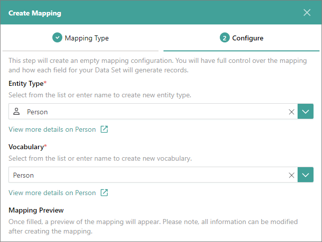
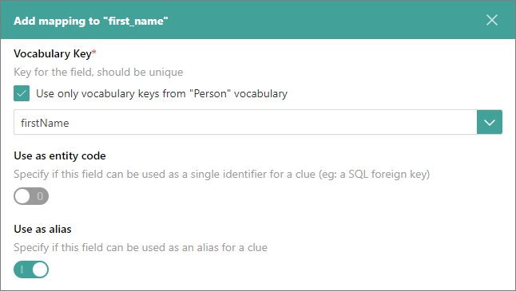

## On this page
{: .no_toc .text-delta }
1. TOC
{:toc}

Mapping is a semantic layer that allows CluedIn to understand the nature of data and process it to produce golden records.

**Note:** Mapping encompasses complex tasks, and CluedIn is committed to consistently enhancing the user experience associated with it. Nevertheless, it is crucial to grasp certain mapping concepts to leverage its full potential.

The process of creating a mapping consists of two parts:

1. [Choosing the mapping type](###choose-mapping-type)

1. [Configuring the mapping details](#configure-mapping-details) 

## Choose mapping type

Mapping type defines how you want to configure the mapping of original fields from the data set to the vocabulary keys in CluedIn. You can choose from the following mapping types:

- **Auto Mapping** – CluedIn automatically creates mapping for your data. This option provides a reliable mapping configuration. You can check the results of auto mapping and make changes if needed.

- **Manual Mapping** – CluedIn creates empty mapping configuration that you can modify as you want. This option is challenging and time-consuming because you have to create the configuration from scratch.

 - **Existing Mapping** – CluedIn uses the existing mapping configuration. This option is useful if you want to create mapping for the data set that has the exact same structure as the existing data sets.

**To choose the mapping type**

1. On the navigation pane, go to **Integrations** > **Data Sources**. Then, find and open the data set for which you need to create mapping.

1. Go to the **Map** tab, and then select **Map Data**.

    The **Create Mapping** pane opens, where you can choose the mapping type and configure the mapping details.

1. On the **Mapping Type** tab, choose the mapping type. Then, in the lower-right corner, select **Next**.

    The **Configure** tab opens, where you can provide other mapping details following the instructions from the next section.

## Configure mapping details

Depending on the selected mapping type, the actions required from you on the **Configure** tab may differ. To find relevant instructions for your chosen mapping type, refer to the needed section:

- [Manual mapping](#manual-mapping)

- [Auto mapping](#auto-mapping)

- [Existing mapping](#existing-mapping)

### Manual mapping

Manual mapping gives you full control over how each field for your data set will generate records.

**To configure manual mapping**

1. Choose the existing entity type or create a new one. If you create a new entity type, select an icon to visually represent the entity type.

1. Choose the existing vocabulary or create a new one.

    With manual mapping, the mapping preview is not available.

    

1. Select **Create Mapping**.

    An empty mapping configuration is created. Next, map the original fields to the vocabulary keys. You can map all fields at once or map fields one by one.

**To map all fields at once**

1. On the **Map** tab, select **Map All Fields**. 

1. In the pane that opens, review the suggested mapping.  You can edit the vocabulary key names if needed. Also, if you change the vocabulary key name, you can edit its data type.

1. In the lower-right corner, select **Add Property to Annotation**.

    The mapping is created. Next, [review the mapping details](/integration/review-mapping).

**To map fields one by one**

1. On the **Map** tab, select **Edit Mapping**.

1. In the **Maps to vocabulary key** column, expand the dropdown list, and then select **Add mapping**. In the pane that opens, do the following:

    1. Expand the dropdown list and select the vocabulary key to which the original field should be mapped.

    1. If you want to use the field as a primary unique identifier for the record, turn on the **Use as entity code** toggle.

    1. If you want to use the field as an alias for the records, turn on the **Use as alias** toggle.

        

    1. In the lower-right corner, select **Add Property to Annotation**.

1. Repeat step 2 for each field.

    The mapping is created. Next, [review the mapping details](/integration/review-mapping).

### Auto mapping

Auto mapping tries to detect unique codes and map original columns to the most appropriate vocabulary keys.

**To configure auto mapping**

1. Choose the existing entity type or create a new one. If you create a new entity type, select an icon to visually represent the entity type.

1. Choose the existing vocabulary or create a new one.

1. In the **Origin** section, review the property that was automatically selected to produce the primary unique identifier for the records (also known as entity origin code). If you don't want to use the selected property, turn off the **Use suggestion** toggle, and then choose the needed property when [reviewing the mapping details](/integration/review-mapping).

1. In the **Mapping Preview** section, review how the original fields will be mapped to the vocabulary keys in CluedIn. For more information, see [Mapping preview](#mapping-preview).

1. In the lower-right corner, select **Create Mapping**.

    The mapping is created. Next, [review the mapping details](/integration/review-mapping).

### Existing mapping

If you've already created a mapping for a data set and you have another data set with the same structure, you can save time by reusing the existing mapping.

**To configure existing mapping**

1. Select the existing mapping that you want to reuse. The name of the mapping consists of two parts: the mapping type and the data set for which the mapping was generated.

1. Select the existing data set that contains the same fields as in the current data set.

1. In the lower-right corner, select **Create Mapping**.

    The mapping is created. Next, [review the mapping details](/integration/review-mapping).