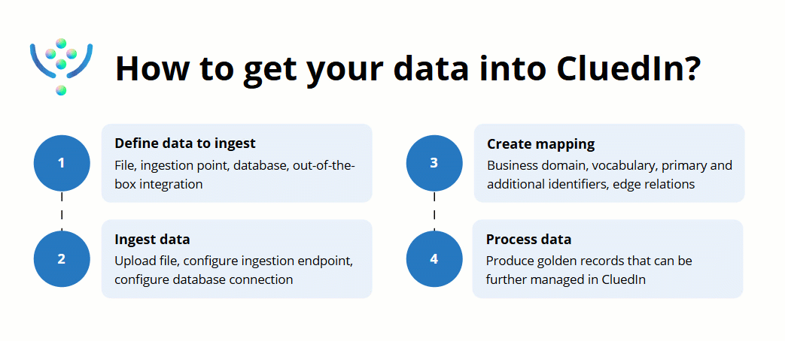

In this section, you will learn how to get your data from external sources into CluedIn.

All data you ingest into CluedIn is stored in **Integrations** > **Data Sources**. One of the main purposes of the **Data Sources** module is to provide you with the tools to create a semantic layer for your data so that CluedIn can understand it.

Each step is explained in detail in a separate article in this section:

1. [Define data to ingest](/integration/define-data-to-ingest) – explore all the ways you can ingest data into CluedIn and choose the one that works best for your needs.

1. Ingest data from [a file](/integration/file), [an endpoint](/integration/endpoint), or [a database](/integration/database) - find step-by-step instructions for ingesting data into CluedIn.

1. [Create mapping](/integration/create-mapping) - create a semantic layer for your data and [review the mapping details](/integration/review-mapping) to ensure that your records are produced and merged in the most effective way.

1. [Process data](/integration/process-data) - turn your data into golden records, making it searchable and ready to be cleaned, deduplicated, and streamed.

In addition to these fundamental steps, we encourage you to explore [additional operations on records](/integration/additional-operations-on-records) to discover tools for normalizing and improving the quality of data.

To ingest, map, and process the data, you need to have access to different modules in CluedIn. The following table contains a list of claims required to work with the **Data Sources** module.

| Section | Claim | Access level |
|--|--|--|
| Integration | All claims | at least Consulted |
| Management | Data Catalog | at least Informed |
| Management | Annotation | at least Informed |
| Consume | Export Targets | at least Informed |