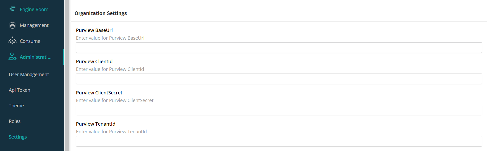
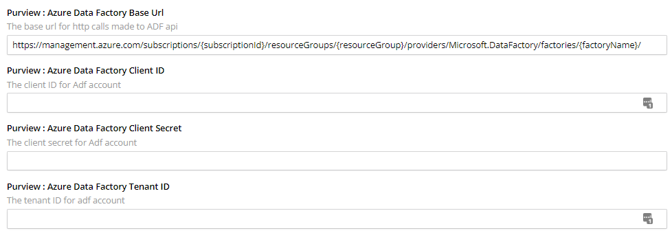

# Setup Microsoft Purview
Purview integration is enabled via CluedIn's settings page. When the fields are left empty or blank, no synchronization is performed with Microsoft Purview.

## Credentials
1. In CluedIn, navigate to the Administration > Settings page, and provide the [Microsoft Purview credentials](https://docs.microsoft.com/en-us/azure/purview/create-catalog-portal#open-the-microsoft-purview-governance-portal):
- Base URL
- Client ID
- Client Secret
- Tenant ID

Input Microsoft Purview credentials

## Minimum Permission Requirements

The following table lists the Purview roles[^permissions] CluedIn requires per integration feature. Roles assignments can be found under the "Role assignments" tab of each collection in purview.

| Integration Feature | Role | Collection Level |
| ---- | ------ | ------- |
| Polling Data Sources | Data Curator | Target Collection[^target-collection] |
| Synchronize CluedIn Vocabularies to Purview Glossary Terms | Data Curator | Target Collection[^target-collection] |
| Synchronize Data Sources | Data Curator | Target Collection[^target-collection] |
| Synchronize Data Sources | Data Reader | Root Collection[^root-collection] |
| Synchronize Purview Glossaries Terms To CluedIn Glossary Terms | Data Reader | Root Collection[^root-collection] |
| Synchronize Purview Glossary Terms To CluedIn Vocabularies | Data Reader | Root Collection[^root-collection] |
| Synchronize Streams | Data Curator | Target Collection[^target-collection] |
| Synchronize Streams | Data Reader | Root Collection[^root-collection] |
| Synchronize Crawlers And Enrichers | Data Curator | Target Collection[^target-collection] |

# Setup Azure Data Factory
## Credentials
Provide [Microsoft ADF Credentials](https://learn.microsoft.com/en-us/azure/data-factory/quickstart-create-data-factory) 
- Base URL, format: 
    > https://management.azure.com/subscriptions/{subscriptionId}/resourceGroups/{resourceGroup}/providers/Microsoft.DataFactory/factories/{factoryName}/
- Client ID
- Client Secret
- Tenant ID

## References
[^permissions]: [Microsoft Purview Catalog Permissions](https://learn.microsoft.com/en-us/azure/purview/catalog-permissions)
[^root-collection]: "Root Collection" refers to the top most collection of your Microsoft Purview instance.
[^target-collection]: "Target Collection" refers to the "Collection Name" specified in CluedIn's organization settings.