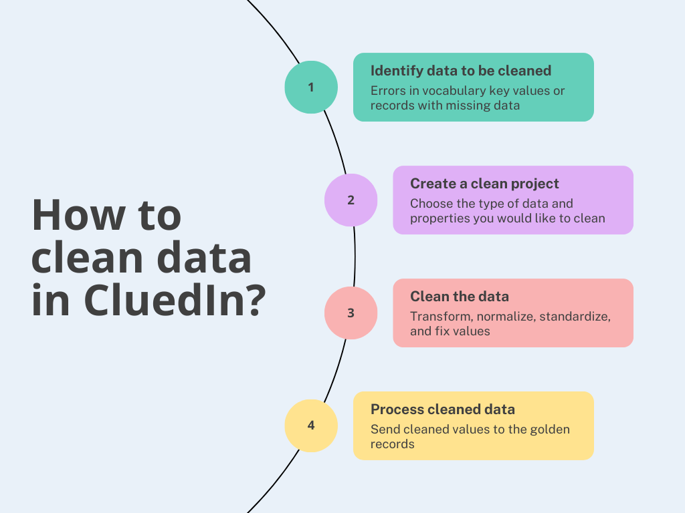

Data cleaning helps you identify and correct any issues in your data: normalize value representations, transform capitalization, modify values, and more. After you've cleaned your data, you can use it to gain valuable insights that help you make more informed decisions.

In this section, you will learn how to fix data quality issues through the use of clean projects. In addition, you will learn how to proactively prevent the same data quality issues by generating rules based on your actions in the clean project.

The following diagram shows the basic steps of cleaning the data in CluedIn.

This section covers the following areas:

- [Creating a clean project](/preparation/clean/create-clean-project) – discover different options that you can use to create a clean project.

- [Managing a clean project](/preparation/clean/manage-clean-project) – learn how to work with a clean project, fix data issues, and prevent the same issues from happening again.

- [Reference information about clean projects](/preparation/clean/clean-reference) – find information about clean project statuses and get an understanding of the clean project workflow.