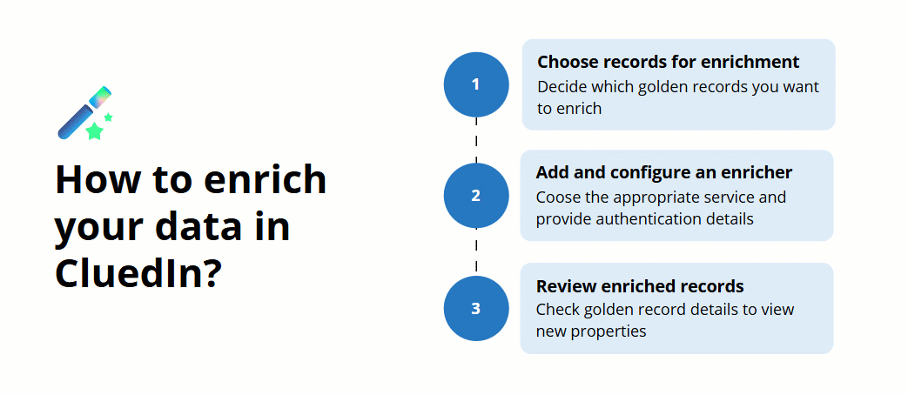

Enrichers allow you to enhance and improve the quality and completeness of your golden records by incorporating additional information from third-party sources.

The following diagram shows the basic steps of enriching the data in CluedIn.

This section covers the following areas:

- [Concept of enricher](/preparation/enricher/concept-of-enricher) – explore how an enricher works and where it fits in the data life cycle in CluedIn.

- [Adding an enricher](/preparation/enricher/add-enricher) – learn how to configure and manage an enricher.

- [Reference information about enrichers](/preparation/enricher/enricher-reference) – find information about built-in enrichers available in CluedIn.

- [Building custom enricher](/preparation/enricher/build-custom-enricher) – learn how to create custom enricher tailored to your specific needs.