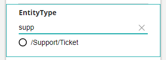
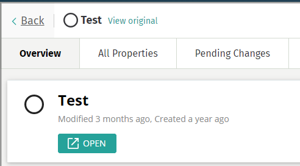
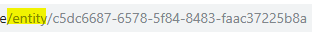
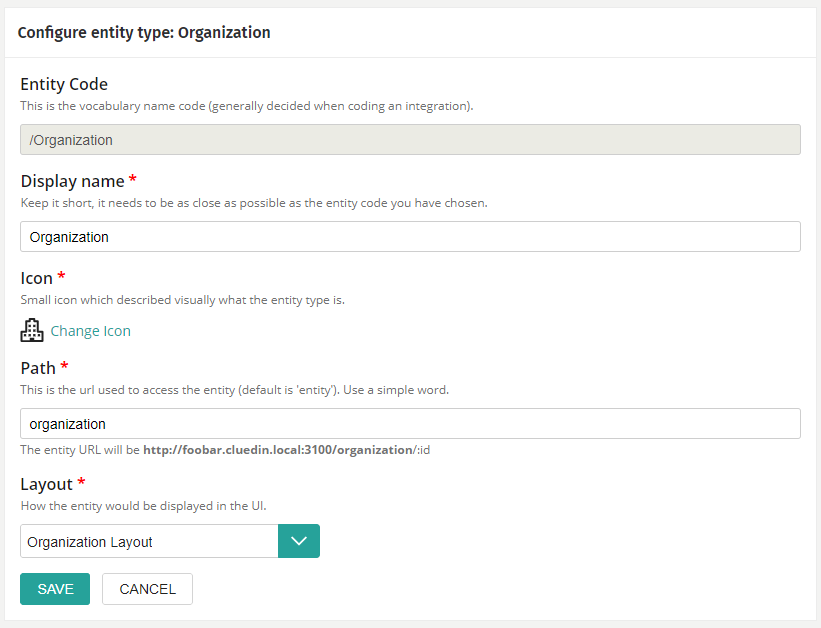

{: .fs-6 .fw-300 }
### Introduction

When CluedIn starts ingesting data, it will create 'entities' which has an `Entity Type`.

The entity type is a string which represent a type of Entity.

Ex: `/Organization`, `/Person`.

CluedIn ships with some pre-defined values for common Entity Type (document, file, organization...), however, you might want to have some very specific Entity Type that may not be configured by CluedIn.

It means the UI won't really understand what this Entity Type is and will treat it as a Generic Entity.

### Impacts on the UI

When you have an Entity Type that is not configured for the UI, you will see a 'Circle' as an Icon and the name displayed will the entity type value.

Here are some examples of how you might recognize an Entity 

Ex: Not recognized entity into search

Ex: Not recognized entity into the Entity detail page

Ex: Default Entity URL for the not recognized entity.

### How to configure?

Please go to the Settings, Entity Type Sections ([cluedin-url]/admin/settings/entitytype).

Type in the search the Entity Type you are after and click on the one.

> If the entity type is not showing, it means there are actually not Entities in CluedIn with that Entity Type.

You will not be able to setup the values correctly.

- Display Name is the name that will be used to mention the entity type.
- Icon is the icon used in several places in the UI so User can quickly see what kind of Entity it is.
- Path is the URL to access that specific type (please notice that it must be unique)
- Layout, the type of layout you can use (organization / person / document / discussion / default)

Ex: Organization Setup

> Currently CluedIn does not support custom layout, the rendering engine is not yet exposed to external people to be used. If you are interested by such a feature, please contact CluedIn.

