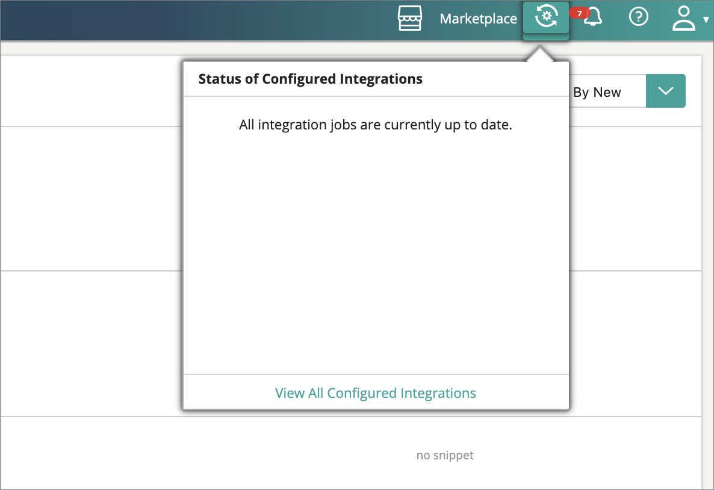

## On this page
{: .no_toc .text-delta }
1. TOC
{:toc}

The Engine Room in CluedIn provides a visual overview of the data processing pipeline—a dependency-based tree of processing steps that define how data flows through the system. Each step depends on previous ones, forming a processing tree that represents CluedIn’s internal data operations. 


The Engine Room serves as a visualization of this processing workflow. It provides statistics such as:

- The amount of data in each processing state.

- Error rates across processing stages.

- Performance and processing speed per step.

You can also use it to introduce new processing sub-workflows as needed.

## Monitoring data processing

If you’ve added an integration to your account, the Engine Room shows the current processing state of that data within the system. This helps you:

- Track the progress of data ingestion and enrichment.

- Identify potential bottlenecks or errors.

- Estimate infrastructure requirements for scaling.

By clicking on a processing step, you can view detailed metrics about that specific step—including processing speed, state, and error rate—helping you understand what is happening in CluedIn in real time.



## Accessing system statistics

It is often required to understand what is happening under the hood of CluedIn. A lot of this can be sourced from the many Adminstrator screens that come with CluedIn for the underlying systems. Due to complex security an infrastructure setups, many times you might find that you don't have access to these systems, but would still like to see some metrics and progress statistics. For this, we have our Statistics API which aggregates the statistics from across the different underlying stores.

The API exposes four main types of statistics:

- Processing

- Crawling

- Configuration

- Footprint

## Processing statistics

CluedIn uses a queuing system to manage operations. The processing flow can be visualized as a hierarchical tree of queues.

You can retrieve this process tree via the following endpoint:

```
{{url}}/api/queue/map
```

Sample response:

```json
{
	"CluedIn": {
		"Incoming": {
		"CluedIn.Core.Messages.Processing.ProcessBigClueCommand:CluedIn.Core_CluedIn": {},
		"CluedIn.Core.Messages.Processing.ProcessLowPriorityClueCommand:CluedIn.Core_CluedIn": {},
		"CluedIn.Core.Messages.Processing.ProcessPrioritizedClueCommand:CluedIn.Core_CluedIn": {},
		"CluedIn.Core.Messages.Processing.IProcessingCommand:CluedIn.Core_CluedIn_Clues": {
		"CluedIn.ExternalSearch.ExternalSearchCommand:CluedIn.ExternalSearch_CluedIn": {},
		"CluedIn.Core.Messages.Processing.SplitEntityCommand:CluedIn.Core_CluedIn": {},
		"CluedIn.Core.Messages.Processing.DeduplicateCommand:CluedIn.Core_CluedIn": {},
		"CluedIn.Core.Messages.Processing.ParentsProcessingCommand:CluedIn.Core_CluedIn_ParentIds": {},
		"CluedIn.Core.Messages.Processing.ProcessEdgesCommand:CluedIn.Core_CluedIn": {},
		"CluedIn.Core.Messages.Processing.ProcessVersionHistoryCommand:CluedIn.Core_CluedIn": {},
		"CluedIn.Core.Messages.Processing.SaveEntityCommand:CluedIn.Core_CluedIn": {},
		"CluedIn.Core.Messages.Processing.PercolateEntityUpdateCommand:CluedIn.Core_CluedIn": {},
		"CluedIn.Core.Messages.Processing.MergeEntitiesCommand:CluedIn.Core_CluedIn": {},
		"CluedIn.Core.Messages.Processing.DeduplicateEntityCommand:CluedIn.Core_CluedIn": {},
		"CluedIn.Core.Messages.Processing.DeleteEntityCommand:CluedIn.Core_CluedIn": {},
		"CluedIn.Core.Messages.Processing.PostProcessingEntityCommand:CluedIn.Core_CluedIn": {}
		},
		"Webhooks": {
		"CluedIn.Core.Messages.Processing.WebhookDataCommand:CluedIn.Core_CluedIn": {},
		"CluedIn.Core.Messages.Processing.ProcessWebHookClueCommand:CluedIn.Core_CluedIn": {}
		}
	},
	"Events": {
		"CluedIn.Core.Messages.Processing.AnonymiseDataCommand:CluedIn.Core_CluedIn": {},
		"CluedIn.Core.Messages.Processing.DeAnonymiseDataCommand:CluedIn.Core_CluedIn": {},
		"CluedIn.Core.Messages.Processing.Export.IExportCommand:CluedIn.Core_CluedIn": {},
		"CluedIn.Core.Messages.Processing.MeshDataCommand:CluedIn.Core_CluedIn": {},
		"CluedIn.Core.Messages.SendMailCommand:CluedIn.Core_CluedIn": {},
		"CluedIn.Core.Messages.AgentController.EnqueueAgentJobCommand:CluedIn.Core_CluedIn": {},
		"CluedIn.Core.Messages.Processing.RemoveDataCommand:CluedIn.Core_CluedIn": {},
		"CluedIn.Core.Messages.Processing.RemoveFromProcessingDataCommand:CluedIn.Core_CluedIn": {},
		"CluedIn.Core.Messages.Processing.ResyncEntityCommand:CluedIn.Core_CluedIn": {},
		"CluedIn.Core.Messages.WebApi.IWebApiCommand:CluedIn.Core_CluedIn": {},
		"CluedIn.Core.Messages.Processing.RefreshEntityBlobCommand:CluedIn.Core_CluedIn": {},
		"CluedIn.Core.Messages.Processing.Metrics.ArchiveMetricsValuesCommand:CluedIn.Core_CluedIn": {}
		},
	"Errors": {
		"CluedIn.Logging.Errors.ErrorPacket:CluedIn.Logging.Errors_CluedIn": {}
	},
	"Outgoing": {
		"CluedIn.WebHooks.Commands.OutgoingCustomWebHookCommand:CluedIn.WebHooks_CluedIn": {}
	},
	"Metrics": {
		"CluedIn.Core.Messages.Processing.Metrics.ProcessEntityMetricsCommand:CluedIn.Core_CluedIn": {},
		"CluedIn.Core.Messages.Processing.Metrics.ProcessGlobalMetricsCommand:CluedIn.Core_CluedIn": {}
		}
	}
}
```

Each queue includes its own statistics. You can query all statistics or an individual queue:

- `/api/queue/statistics`

- `{{url}}/api/queue/statistics?queueName=CluedIn.Core.Messages.Processing.Metrics.ArchiveMetricsValuesCommand:CluedIn.Core_CluedIn`

To include aggregated child statistics, append `expand=true`.

Sample response:

```json
{
	"Queues": {
	"memory": 17500,
	"message_stats": {
	"disk_reads": 0,
	"disk_reads_details": null,
	"disk_writes": 0,
	"disk_writes_details": null,
	"publish": 5,
	"publish_details": {
	"rate": 0.0
	},
	"publish_in": 0,
	"publish_in_details": null,
	"publish_out": 0,
	"publish_out_details": null,
	"ack": 5,
	"ack_details": {
	"rate": 0.0
	},
	"deliver_get": 6,
	"deliver_get_details": {
	"rate": 0.0
	},
	"confirm": 0,
	"confirm_details": null,
	"return_unroutable": 0,
	"return_unroutable_details": null,
	"redeliver": 1,
	"redeliver_details": {
	"rate": 0.0
	},
	"deliver": 6,
	"deliver_details": {
	"rate": 0.0
	},
	"deliver_no_ack": 0,
	"deliver_no_ack_details": {
	"rate": 0.0
	},
	"get": 0,
	"get_details": {
	"rate": 0.0
	},
	"get_no_ack": 0,
	"get_no_ack_details": {
	"rate": 0.0
	}
	},
	"reductions": 255588,
	"reductions_details": {
	"rate": 0.0
	},
	"messages": 0,
	"messages_details": {
	"rate": 0.0
	},
	"messages_ready": 0,
	"messages_ready_details": {
	"rate": 0.0
	},
	"messages_unacknowledged": 0,
	"messages_unacknowledged_details": {
	"rate": 0.0
	},
	"idle_since": "2019-12-21 7:32:15",
	"consumer_utilisation": null,
	"policy": null,
	"exclusive_consumer_tag": null,
	"consumers": 1,
	"recoverable_slaves": null,
	"state": "running",
	"garbage_collection": {
	"max_heap_size": 0,
	"min_bin_vheap_size": 46422,
	"min_heap_size": 233,
	"fullsweep_after": 65535,
	"minor_gcs": 34
	},
	"messages_ram": 0,
	"messages_ready_ram": 0,
	"messages_unacknowledged_ram": 0,
	"messages_persistent": 0,
	"message_bytes": 0,
	"message_bytes_ready": 0,
	"message_bytes_unacknowledged": 0,
	"message_bytes_ram": 0,
	"message_bytes_persistent": 0,
	"head_message_timestamp": null,
	"disk_reads": 0,
	"disk_writes": 0,
	"backing_queue_status": {
	"mode": "default",
	"q1": 0,
	"q2": 0,
	"delta": [
	"delta",
	0,
	0,
	0,
	0
	],
	"q3": 0,
	"q4": 0,
	"len": 0,
	"target_ram_count": "infinity",
	"next_seq_id": 5,
	"avg_ingress_rate": 5.5897681059900364E-190,
	"avg_egress_rate": 5.5897681059900364E-190,
	"avg_ack_ingress_rate": 5.5897681059900364E-190,
	"avg_ack_egress_rate": 1.2720273332920905E-189
	},
	"node": "rabbit@cluedin-dev",
	"exclusive": false,
	"auto_delete": false,
	"durable": true,
	"vhost": "/",
	"name": "CluedIn.Core.Messages.Processing.Metrics.ArchiveMetricsValuesCommand:CluedIn.Core_CluedIn"
	}
}
```

## Crawling statistics

Crawling statistics focus on data retrieval and mapping. These are especially useful when crawlers run via on-premise agents.

Metrics include:

- Number of tasks generated by the crawl (number of records to crawl)

- Number of completed tasks (number of records that successfully crawled)

- Number of failed tasks (number of records that failed to crawl)

- Crawl status

- (Optional) Estimated number of records

## Configuration

Configuration settings =are managed using YAML and .config files. While these are not editable via the UI, you can explore their current state through:

```
GET /api/configuration
```

This endpoint provides a read-only view of configuration parameters such as feature toggles and environment details—excluding any sensitive information like passwords or tokens. It’s particularly useful for debugging and verifying that runtime configurations match expected values.

## Footprint metrics

CluedIn exposes low-level system metrics to help administrators assess performance and resource utilization.
Use the following endpoints:

- Graph health: `api/graph/configuration`

- Search health: `api/search/health`

These endpoints provide insights into:

- Memory usage

- Disk space

- CPU load

- Component utilization

This data helps administrators decide whether additional infrastructure or resources are needed.