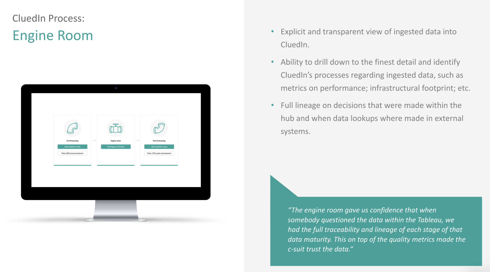

The processing pipeline in CluedIn can be described as a tree of different processing steps. Each processing step has dependencies on previous steps being run and hence you can conceptualise it as a dependency tree of processing steps. 



The Engine Room is a visualisation of this processing workflow. It will give you statistics on amount of data processing in a particular state, error rates and will even allow you to introduce new processing sub-workflows. 

If you have added an integration to your account, the Engine Room will be able to report on what state that data is in the overall process. It will also help you gauge how much infrastructure you will need to scale to the point where you can keep up with the number of processing servers required. 

You can click on any of the processing steps and you will see details as to the state and processing speed of that particular step. You can use this to gauge what is happening in CluedIn at any moment of processing. 


It is often required to understand what is happening under the hood of CluedIn. A lot of this can be sourced from the many Adminstrator screens that come with CluedIn for the underlying systems. Due to complex security an infrastructure setups, many times you might find that you don't have access to these systems, but would still like to see some metrics and progress statistics. For this, we have our Statistics API which aggregates the statistics from across the different underlying stores.

There are 4 types of statistics that we offer through this API:

Processing
Crawling
Configuration
Footprint
CluedIn uses a queuing system that operates the many different operations that CluedIn does on your data. This can be thought of as a Tree of processes. You can see that process tree below or by calling our {{url}}/api/queue/map endpoint.

```json
{
	"CluedIn": {
		"Incoming": {
		"CluedIn.Core.Messages.Processing.ProcessBigClueCommand:CluedIn.Core_CluedIn": {},
		"CluedIn.Core.Messages.Processing.ProcessLowPriorityClueCommand:CluedIn.Core_CluedIn": {},
		"CluedIn.Core.Messages.Processing.ProcessPrioritizedClueCommand:CluedIn.Core_CluedIn": {},
		"CluedIn.Core.Messages.Processing.IProcessingCommand:CluedIn.Core_CluedIn_Clues": {
		"CluedIn.ExternalSearch.ExternalSearchCommand:CluedIn.ExternalSearch_CluedIn": {},
		"CluedIn.Core.Messages.Processing.SplitEntityCommand:CluedIn.Core_CluedIn": {},
		"CluedIn.Core.Messages.Processing.DeduplicateCommand:CluedIn.Core_CluedIn": {},
		"CluedIn.Core.Messages.Processing.ParentsProcessingCommand:CluedIn.Core_CluedIn_ParentIds": {},
		"CluedIn.Core.Messages.Processing.ProcessEdgesCommand:CluedIn.Core_CluedIn": {},
		"CluedIn.Core.Messages.Processing.ProcessVersionHistoryCommand:CluedIn.Core_CluedIn": {},
		"CluedIn.Core.Messages.Processing.SaveEntityCommand:CluedIn.Core_CluedIn": {},
		"CluedIn.Core.Messages.Processing.PercolateEntityUpdateCommand:CluedIn.Core_CluedIn": {},
		"CluedIn.Core.Messages.Processing.MergeEntitiesCommand:CluedIn.Core_CluedIn": {},
		"CluedIn.Core.Messages.Processing.DeduplicateEntityCommand:CluedIn.Core_CluedIn": {},
		"CluedIn.Core.Messages.Processing.DeleteEntityCommand:CluedIn.Core_CluedIn": {},
		"CluedIn.Core.Messages.Processing.PostProcessingEntityCommand:CluedIn.Core_CluedIn": {}
		},
		"Webhooks": {
		"CluedIn.Core.Messages.Processing.WebhookDataCommand:CluedIn.Core_CluedIn": {},
		"CluedIn.Core.Messages.Processing.ProcessWebHookClueCommand:CluedIn.Core_CluedIn": {}
		}
	},
	"Events": {
		"CluedIn.Core.Messages.Processing.AnonymiseDataCommand:CluedIn.Core_CluedIn": {},
		"CluedIn.Core.Messages.Processing.DeAnonymiseDataCommand:CluedIn.Core_CluedIn": {},
		"CluedIn.Core.Messages.Processing.Export.IExportCommand:CluedIn.Core_CluedIn": {},
		"CluedIn.Core.Messages.Processing.MeshDataCommand:CluedIn.Core_CluedIn": {},
		"CluedIn.Core.Messages.SendMailCommand:CluedIn.Core_CluedIn": {},
		"CluedIn.Core.Messages.AgentController.EnqueueAgentJobCommand:CluedIn.Core_CluedIn": {},
		"CluedIn.Core.Messages.Processing.RemoveDataCommand:CluedIn.Core_CluedIn": {},
		"CluedIn.Core.Messages.Processing.RemoveFromProcessingDataCommand:CluedIn.Core_CluedIn": {},
		"CluedIn.Core.Messages.Processing.ResyncEntityCommand:CluedIn.Core_CluedIn": {},
		"CluedIn.Core.Messages.WebApi.IWebApiCommand:CluedIn.Core_CluedIn": {},
		"CluedIn.Core.Messages.Processing.RefreshEntityBlobCommand:CluedIn.Core_CluedIn": {},
		"CluedIn.Core.Messages.Processing.Metrics.ArchiveMetricsValuesCommand:CluedIn.Core_CluedIn": {}
		},
	"Errors": {
		"CluedIn.Logging.Errors.ErrorPacket:CluedIn.Logging.Errors_CluedIn": {}
	},
	"Outgoing": {
		"CluedIn.WebHooks.Commands.OutgoingCustomWebHookCommand:CluedIn.WebHooks_CluedIn": {}
	},
	"Metrics": {
		"CluedIn.Core.Messages.Processing.Metrics.ProcessEntityMetricsCommand:CluedIn.Core_CluedIn": {},
		"CluedIn.Core.Messages.Processing.Metrics.ProcessGlobalMetricsCommand:CluedIn.Core_CluedIn": {}
		}
	}
}
```

Each Queue will have its own statistics and you can either call /api/queue/statistics to get all statistics of all queues or you can get an individual queue by calling {{url}}/api/queue/statistics?queueName=CluedIn.Core.Messages.Processing.Metrics.ArchiveMetricsValuesCommand:CluedIn.Core_CluedIn

You can also add an "expand=true" which will give you the aggregate values of all child items or a parent (and child's children etc.)

It will respond with the following details. Comments are for guidance in the user interface

```json
{
	"Queues": {
	"memory": 17500,
	"message_stats": {
	"disk_reads": 0,
	"disk_reads_details": null,
	"disk_writes": 0,
	"disk_writes_details": null,
	"publish": 5,
	"publish_details": {
	"rate": 0.0
	},
	"publish_in": 0,
	"publish_in_details": null,
	"publish_out": 0,
	"publish_out_details": null,
	"ack": 5,
	"ack_details": {
	"rate": 0.0
	},
	"deliver_get": 6,
	"deliver_get_details": {
	"rate": 0.0
	},
	"confirm": 0,
	"confirm_details": null,
	"return_unroutable": 0,
	"return_unroutable_details": null,
	"redeliver": 1,
	"redeliver_details": {
	"rate": 0.0
	},
	"deliver": 6,
	"deliver_details": {
	"rate": 0.0
	},
	"deliver_no_ack": 0,
	"deliver_no_ack_details": {
	"rate": 0.0
	},
	"get": 0,
	"get_details": {
	"rate": 0.0
	},
	"get_no_ack": 0,
	"get_no_ack_details": {
	"rate": 0.0
	}
	},
	"reductions": 255588,
	"reductions_details": {
	"rate": 0.0
	},
	"messages": 0,
	"messages_details": {
	"rate": 0.0
	},
	"messages_ready": 0,
	"messages_ready_details": {
	"rate": 0.0
	},
	"messages_unacknowledged": 0,
	"messages_unacknowledged_details": {
	"rate": 0.0
	},
	"idle_since": "2019-12-21 7:32:15",
	"consumer_utilisation": null,
	"policy": null,
	"exclusive_consumer_tag": null,
	"consumers": 1,
	"recoverable_slaves": null,
	"state": "running",
	"garbage_collection": {
	"max_heap_size": 0,
	"min_bin_vheap_size": 46422,
	"min_heap_size": 233,
	"fullsweep_after": 65535,
	"minor_gcs": 34
	},
	"messages_ram": 0,
	"messages_ready_ram": 0,
	"messages_unacknowledged_ram": 0,
	"messages_persistent": 0,
	"message_bytes": 0,
	"message_bytes_ready": 0,
	"message_bytes_unacknowledged": 0,
	"message_bytes_ram": 0,
	"message_bytes_persistent": 0,
	"head_message_timestamp": null,
	"disk_reads": 0,
	"disk_writes": 0,
	"backing_queue_status": {
	"mode": "default",
	"q1": 0,
	"q2": 0,
	"delta": [
	"delta",
	0,
	0,
	0,
	0
	],
	"q3": 0,
	"q4": 0,
	"len": 0,
	"target_ram_count": "infinity",
	"next_seq_id": 5,
	"avg_ingress_rate": 5.5897681059900364E-190,
	"avg_egress_rate": 5.5897681059900364E-190,
	"avg_ack_ingress_rate": 5.5897681059900364E-190,
	"avg_ack_egress_rate": 1.2720273332920905E-189
	},
	"node": "rabbit@cluedin-dev",
	"exclusive": false,
	"auto_delete": false,
	"durable": true,
	"vhost": "/",
	"name": "CluedIn.Core.Messages.Processing.Metrics.ArchiveMetricsValuesCommand:CluedIn.Core_CluedIn"
	}
}
```

The Crawling statistics will report on the metrics for the fetching and mapping part of the process. It is often that Crawlers are run using Agents and these Agents may run on-premise and separate to the processing boxes.

The Crawling statstics will report on many things including:

	Number of Tasks generated by Crawl (number of records to crawl)
	Number of Completed Tasks (number of records that successfully crawled)
	Number of Failed Tasks (number of records that failed to crawl)
	Status
	Estimated Number of Records (optional)
	Configuration = [HttpGet] /api/configuration

Configuration is managed using Yaml and .Config files, however these are closed down from the User Interface. It is however very useful to explore the possible configuration options and also to be aware of the current state of the application. For example, we may want to know if a certain feature is enabled or not. The Configuration Endpoint exposes parts of the Configuration that are for read only access. We will not expose Secrets, Passwords, API Tokens or anything that exposes credentials. This is also useful for debugging and exploring potential issues. For example, you can configure CluedIn with many different parameters and features, but if there are settings that are against our recommended settings, we can expose this in the configuration user interface to alert the first places to potentially look. This is also important to validate if the configuration that has been set is actually in action in the running state of the application. All settings a read-only.

Footprint

Graph = api/graph/configuration
Search = api/search/health

It is valuable to know the running state of the CluedIn application. It is not as important for Data Stewards and Business Users to know this, but very much more adminstrators or systems owners that are not necessarily aware of how to operate the sub systems. For this, we expose some underlying metrics and statistics around memory, desk, cpu and utilisation. This will help you to understand if it might be necessary to increase the infrastructure of your CluedIn installation or potentially to dedicate more resources to a particular process. All values are read-only. For more advanced exploration, please use the underlying system adminstrator interfaces.