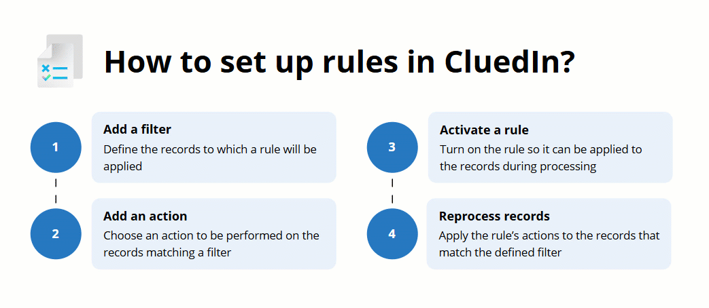

Rules enable you to establish business logic for managing your records within CluedIn. In this section, you will learn how to automate data transformation, capture data quality issues, and determine operational values with the help of different types of rules.

A rule consists of a filter and one or more associated actions. Filter tells CluedIn what records should be affected by the rule's action. The following diagram shows the basic steps of creating a rule in CluedIn.

This section covers the following areas:

- [Rule types](/management/rules/rule-types) – explore different types of rules to learn which one would be best for your specific needs.

- [Creating a rule](/management/rules/create-rule) – learn how to create a rule and apply it to the records.

- [Managing rules](/management/rules/manage-rules) – learn how to edit, deactivate, and delete a rule, as well how these actions affect your records.

- [Reference information about rule's actions](/management/rules/rules-reference) – find information about the actions associated with each type of rule.

