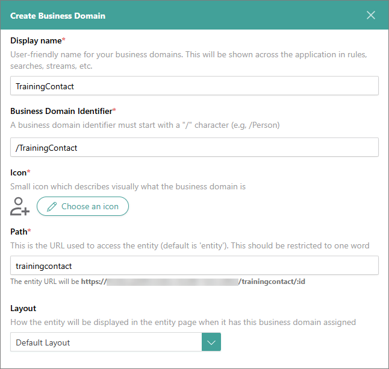

## On this page
{: .no_toc .text-delta }
- TOC
{:toc}

A business domain is a well-known business object that describes the semantic meaning of golden records. Business domains can represent physical objects, locations, interactions, individuals, and more.

In CluedIn, all golden records must have a business domain to ensure the systematic organization and optimization of data management processes. A well-named business domain is global (for example, Person, Organization, Car) and should not be changed across sources. In this article, you will learn how to create and manage business domains to enhance the efficiency and organization of golden records in CluedIn.

## Business domain details page

On the business domain details page, you can view relevant information about the business domain and take other actions to manage it.

**Data**

This tab contains all golden records that belong to the business domain.

**Vocabularies**

This tab contains all vocabularies that are associated with the business domain.

**Configuration**

This tab contains general information about the business domain, including:

- Display name – a user-friendly identifier of the business domain that is displayed throughout the system (for example, in rules, search, streams, and so on).

- business domain identifier – a string that represents the business domain in code (for example, in clues).

- Icon – a visual representation of the business domain that helps you quickly identify what kind of golden record it is.

- Path – a URL path of the business domain.

- Layout – a way in which information is arranged on the **Overview** tab of the golden records that belong to the business domain.

## Create a business domain

CluedIn ships with some pre-defined values for common business domains such as Document, File, Organization. However, you might want to have some specific business domains that may not be configured by CluedIn.

Depending on the selected [data modeling approach](/management/data-catalog/modeling-approaches), you can create a business domain in two ways:

- Automatically – this option is part of the data-first approach. When creating a mapping for a data set, you have the option to enter the name of a new business domain and select the icon. CluedIn will then automatically create the business domain. Once the mapping is created, you can then open the business domain and make any necessary adjustments.

- Manually – this option is part of the model-first approach, which assumes that you need to create a business domain before using it in the mapping for a data set. The following procedure outlines the steps to manually create a business domain.

**To create a business domain**

1. On the navigation pane, go to **Management** > **Business domains**.

1. Select **Create business domain**.

1. Enter the display name of the business domain. The **Business domain identifier** and the **Path** fields are filled in automatically based on the name that you entered.

1. Select the icon for the visual representation of the business domain.

1. Select the layout for arranging the information on the golden record overview page.

1. Select **Create**.

    

    The business domain opens, where you can view and manage business domain details.

## Manage a business domain

You can change the following elements of the business domain configuration: display name, icon, layout, and description. You cannot change the business domain identifier and path. Also, you cannot delete the business domain.

**To edit business domain configuration**

1. In the upper-right corner of the business domain page, select **Edit**.

1. Make the needed changes, and then select **Save**.