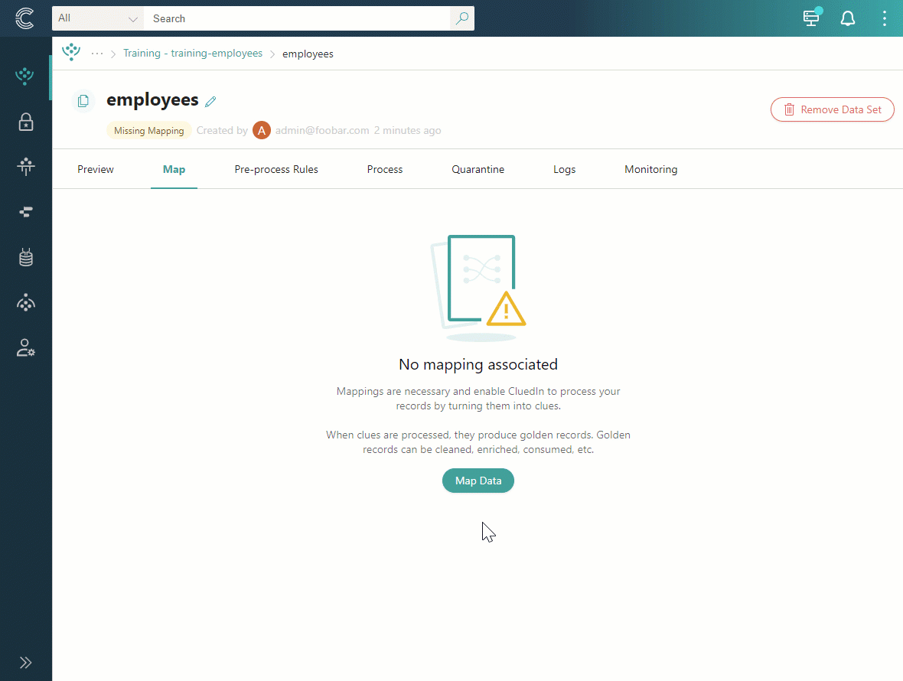
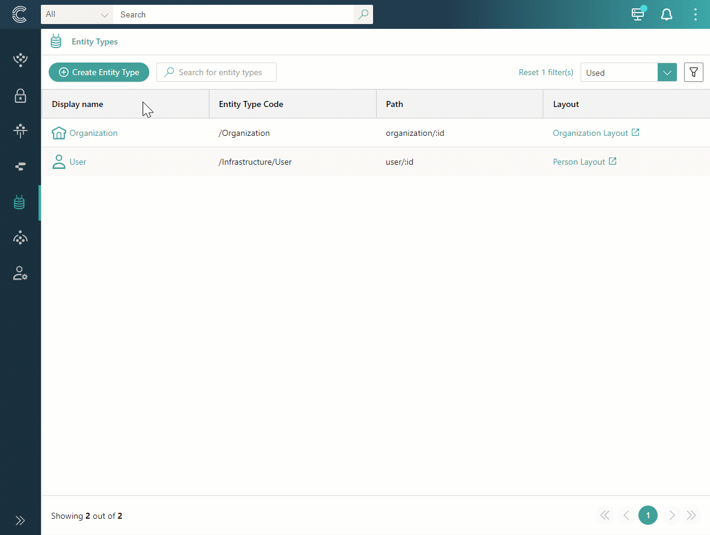
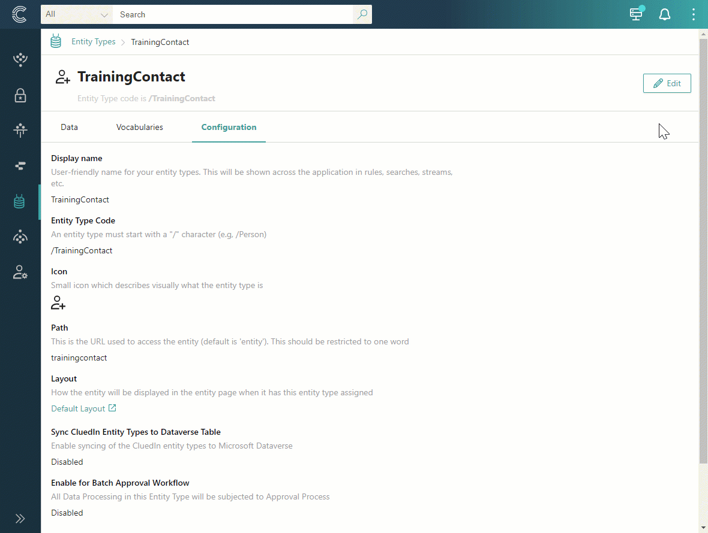

## On this page
{: .no_toc .text-delta }
- TOC
{:toc}

An entity type is a well-known business object that describes the semantic meaning of golden records. Entity types can represent physical objects, locations, interactions, individuals, and more.

In CluedIn, all golden records must have an entity type to ensure the systematic organization and optimization of data management processes. A well-named entity type is global (for example, Person, Organization, Car) and should not be changed across sources. In this article, you will learn how to create and manage entity types to enhance the efficiency and organization of golden records in CluedIn.

## Entity type details page

On the entity type details page, you can view relevant information about the entity type and take other actions to manage it.

**Data**

This tab contains all golden records that belong to the entity type.

**Vocabularies**

This tab contains all vocabularies that are associated with the entity type.

**Configuration**

This tab contains general information about the entity type, including:

- Display name – a user-friendly identifier of the entity type that is displayed throughout the system (for example, in rules, search, streams, and so on).

- Entity type code – a string that represents the entity type in code (for example, in clues).

- Icon – a visual representation of the entity type that helps you quickly identify what kind of golden record it is.

- Path – a URL path of the entity type.

- Layout – a way in which information is arranged on the **Overview** tab of the golden records that belong to the entity type.

## Create an entity type

CluedIn ships with some pre-defined values for common entity types such as Document, File, Organization. However, you might want to have some specific entity types that may not be configured by CluedIn.

Depending on the selected [data modeling approach](/management/data-catalog/modeling-approaches), you can create an entity type in two ways:

- Automatically – this option is part of the data-first approach. When creating a mapping for a data set, you have the option to enter the name of a new entity type and select the icon. CluedIn will then automatically suggest the entity type. Once the mapping is created, you can then open the entity type and make any necessary adjustments.

    

- Manually – this option is part of the model-first approach, which assumes that you need to create an entity type before using it in the mapping for a data set. The following procedure outlines the steps to manually create an entity type.

**To create an entity type**

1. On the navigation pane, go to **Management** > **Entity types**.

1. Select **Create entity type**.

1. Enter the display name of the entity type. The **Entity type code** and the **Path** fields are filled in automatically based on the name that you entered.

1. Select the icon for the visual representation of the entity type.

1. Select the layout for arranging the information on the golden record overview page.

1. Select **Create**.

    

    The entity type opens, where you can view and manage entity type details.

## Manage an entity type

You can change the following elements of the entity type configuration: display name, icon, layout, and description. You cannot change the entity type code and path. Also, you cannot delete the entity type.

**To edit entity type configuration**

1. In the upper-right corner of the entity type page, select **Edit**.

1. Make the needed changes, and then select **Save**.

    