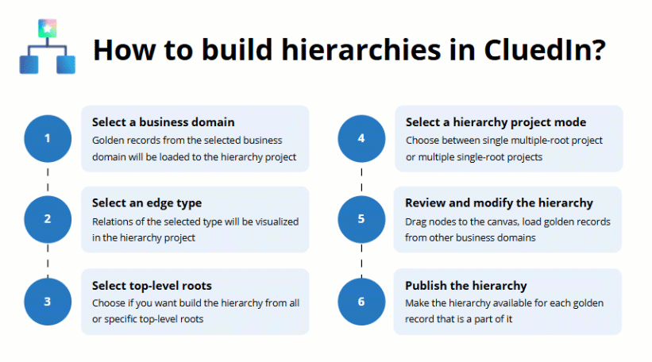

Hierarchy Builder helps you organize, visualize, and manage relations between golden records within and across different business domains.

This section covers the following topics:

- [Concept of hierarchy](/management/hierarchy-builder/concept-of-hierarchy) – explore hierarchies through an example of Organization-Project-Employee hierarchy.

- [Create a hierarchy](/management/hierarchy-builder/create-a-hierarchy) – learn about various options for creating a hierarchy.

- [Work in a hierarchy project](/management/hierarchy-builder/work-in-a-hierarchy-project) – learn how to modify a hierarchy, load golden records of other business domains into the hierarchy, and use various tools to make working in the hierarchy project more convenient.

- [Manage hierarchies](/management/hierarchy-builder/manage-hierarchies) – learn how to clone, export, and delete a hierarchy.

**Useful links:**

- [How to build an organizational hierarchy](/kb/how-to-build-an-organizational-hierarchy)