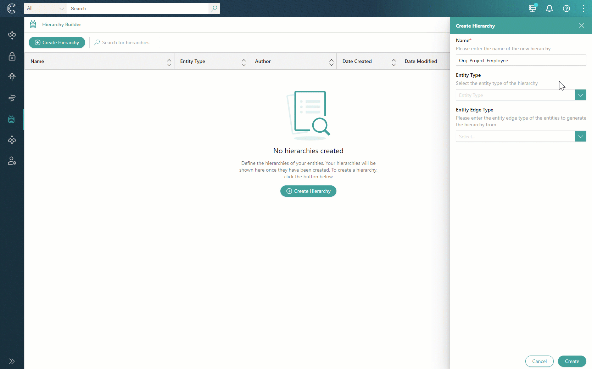

Let's explore the concept of hierarchy through an example of Organization-Project-Employee relations. How can we visualize those relations in a hierarchy?

To begin, we need to create a hierarchy for the /Organization business domain. Because some organizations might be connected with others through parent-child relations, we select the corresponding edge type (/Parent). For convenience, we create multiple single-root projects, where each top-level root has its own hierarchy. As a result, two hierarchy projects are generated. We are going to use one of them to illustrate project and employee relations within an organization.

Now, we need to visualize the relations between projects within organizations. However, as for now, only organizations are available in the hierarchy project. To load more golden records from other business domains, we need to edit the hierarchy properties and remove the /Organization business domain. Now, all golden records are available for selection, so we can load golden records that are connected to the organization by the specific type of relation (/PartOf).

The next step is to add the employees who work on specific projects. To do that, we can load golden records that are connected to projects by the specific type of relation (/WorksFor).

As a result, we leveraged the existing relations between golden records to visualize the connections between employees and projects within organizations. Following this approach, you can build complex hierarchies to discover hidden value from any data source.