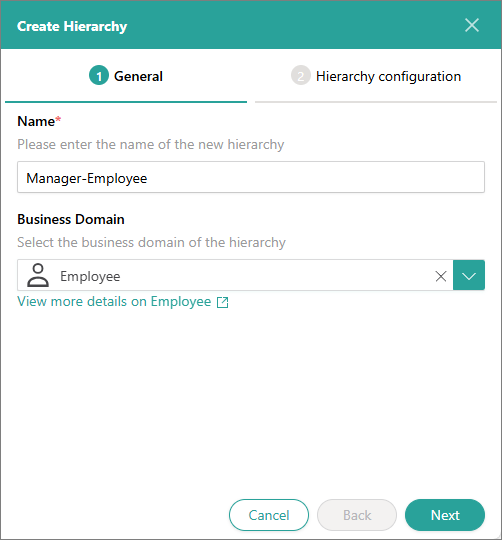
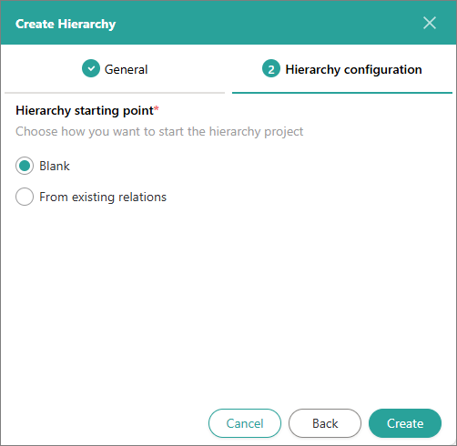
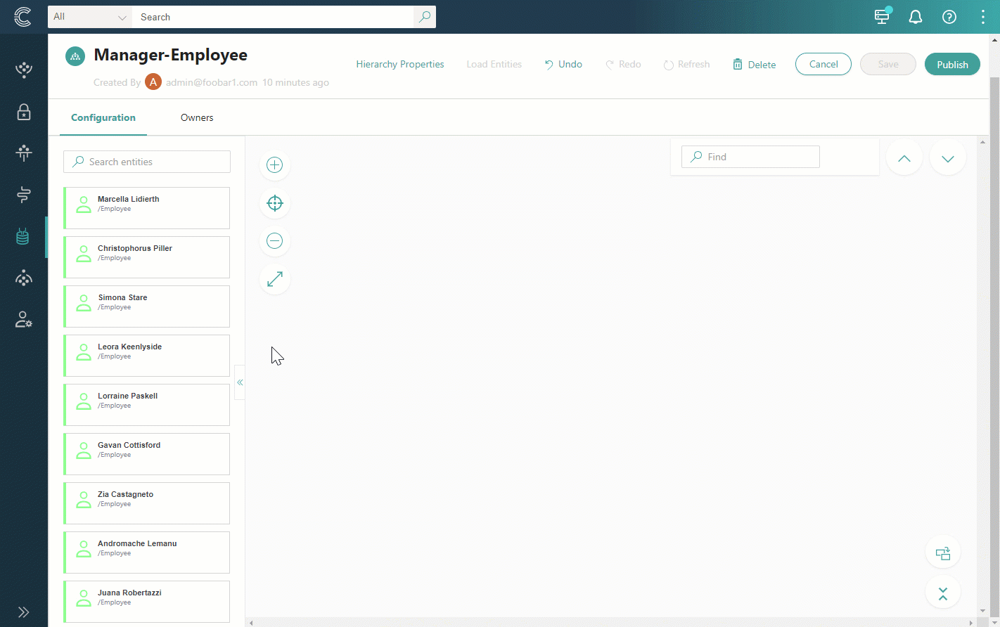
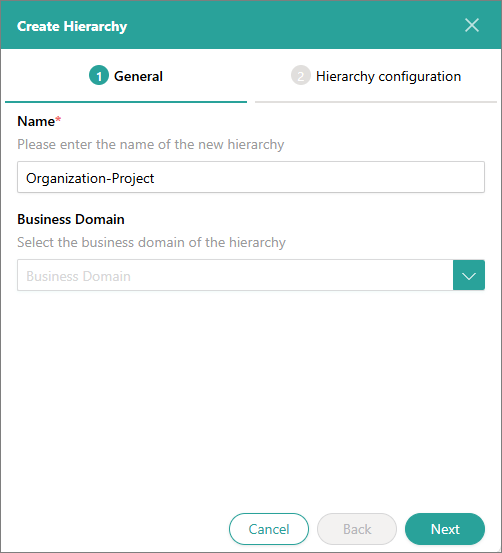
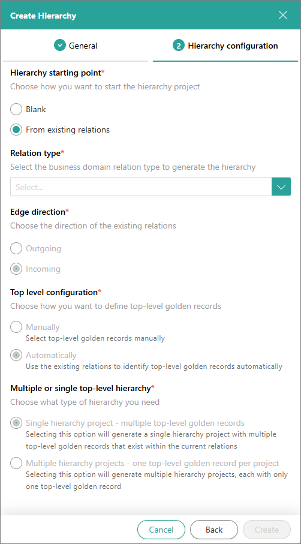
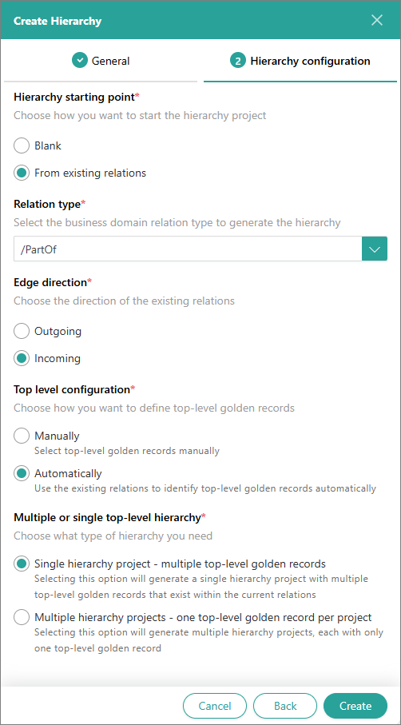

## On this page
{: .no_toc .text-delta }
- TOC
{:toc}

In this article, you will learn about various options for creating a hierarchy.

Key terms:

- Node – an individual golden record within a hierarchy. Nodes are the building blocks of hierarchies, and they can be linked together to form parent-child relationships, creating a structured view of data.

- Top-level root – the highest node in the hierarchy. This node acts as the primary parent or the starting point from which all other nodes branch out.

There are several ways to create a hierarchy:

- [Create a hierarchy manually](#create-a-hierarchy-manually) – choose this option if you want to build a hierarchy from scratch by dragging golden records to the project canvas.

- [Create a hierarchy based on relations](#create-a-hierarchy-based-on-relations) – choose this option if you want to leverage the existing relations between golden records and visualize them in the hierarchy.

{: .important }
After you save a hierarchy project, the hierarchy remains static. If any changes are made to the relations or edges outside of the hierarchy project, these changes do not become reflected in the hierarchy.

## Create a hierarchy manually

Creating a hierarchy manually gives you the possibility to build it from scratch, regardless of any existing relations between golden records.

**To create a hierarchy manually**

1. On the navigation pane, go to **Management** > **Hierarchy Builder**.

1. In the upper-left corner of the **Hierarchy Builder** page, select **Create Hierarchy**.

    The **Create Hierarchy** pane opens on the right side of the page.

1. On the **General** tab of the **Create Hierarchy** pane, do the following:

    1. Enter the name of the hierarchy. To make it easier to identify the hierarchy, consider using concepts that define the relations between the elements in the hierarchy (for example, Manager-Employee).

    1. (Optional) Select the business domain of golden records that will be loaded to the hierarchy project. If you don't select the business domain, all golden records will be loaded to the hierarchy project.

    1. Select **Next**.

        

1. On the **Hierarchy configuration** tab, do the following:

    1. In **Hierarchy starting point**, select **Blank**.

    1. Select **Create**.

       

1. Build the hierarchy by dragging the golden records from the left pane to the project canvas.

    

    You can load golden records of other entity types and add them to the hierarchy as well. To learn more, see [Work in a hierarchy project](/management/hierarchy-builder/work-in-a-hierarchy-project).

1. To save your changes, in the upper-right corner of the page, select **Save**.

    Now, when you go the **Hierarchies** tab of any golden record from the hierarchy, you can view the created hierarchy.

    {: .important }
    After you save the hierarchy project, the hierarchy remains static. If any changes are made to the relations or edges outside of the hierarchy project, these changes do not become reflected in the hierarchy.

1. To create actual edges between the entities as you have designed in the project, in the upper-right corner of the page, select **Publish**. Then, confirm that you want to publish the hierarchy.

    Now, when you go to any golden record from the hierarchy, you can view the following:

    - **Relations** tab – displays the relations between the golden record and other elements of the hierarchy.

    - **History** tab – displays records about new relations added to the golden record.

## Create a hierarchy based on relations

Sometimes your data has natural hierarchies that are represented as relations. You can leverage such relations and create hierarchies automatically.

**To create a hierarchy based on relations**

1. On the navigation pane, go to **Management** > **Hierarchy Builder**.

1. In the upper-left corner of the **Hierarchy Builder** page, select **Create Hierarchy**.

    The **Create Hierarchy** pane opens on the right side of the page.

1. On the **General** tab of the **Create Hierarchy** pane, do the following:

    1. Enter the name of the hierarchy. To make it easier to identify the hierarchy, consider using concepts that define the relations between the elements in the hierarchy (for example, Organization-Project).

    1. Select the business domain of golden records that will be loaded to the hierarchy project. If you don't select the business domain, all golden records will be loaded to the hierarchy project.

    1. Select **Next**.

    

1. On the **Hierarchy configuration** tab, in **Hierarchy starting point**, select **From existing relations**.

    

1. In **Relation type**, select the edge type that represents relations between golden records that will be loaded to the hierarchy project. The edge types available depend on the business domain selected on the **General** tab.

1. In **Edge direction**, review the way in which hierarchy relations between golden records will be generated. The edge direction is selected automatically based on the edge type selected in the previous step.

1. In **Top level configuration**, select how you want to define top-level roots:

    - **Manually** – you will need to define the top-level roots manually.

    - **Automatically** – top-level roots will be identified automatically based on the existing relations sets between the golden records that will be loaded to the hierarchy project.

1. In **Multiple or single top-level hierarchy**, select the option for generating the hierarchy in case of multiple top-level roots:

    - **Single hierarchy project** – all hierarchies from top-level roots will be generated in one hierarchy project.

    - **Multiple hierarchy projects** – each hierarchy from a top-level root will be generated in a separate hierarchy project.

1. Select **Create**.

    

    The number of hierarchy projects that are created depends on the selected **Multiple hierarchy projects** option. In case of **Single hierarchy project**, the hierarchy project opens right away, and you can review and modify it as needed. In case of **Multiple hierarchy project**, you need to open each project to review and modify it as needed. You can load golden records of other entity types and add them to the hierarchy as well. To learn more, see [Work in a hierarchy project](/management/hierarchy-builder/work-in-a-hierarchy-project).

1. Modify the created hierarchy as needed. Then, in the upper-right corner of the page, select **Save**.

    Now, when you go the **Hierarchies** tab of any golden record from the hierarchy, you can view the created hierarchy.

    {: .important }
    After you save the hierarchy project, the hierarchy remains static. If any changes are made to the relations or edges outside of the hierarchy project, these changes do not become reflected in the hierarchy.

1. To create actual edges between the entities as you have designed in the project, select **Publish** in the upper-right corner of the page. Then, confirm that you want to publish the hierarchy.

    Now, when you go to any golden record from the hierarchy, you can view the following:

    - **Relations** tab – displays the relations between the golden record and other elements of the hierarchy.

    - **History** tab – displays records about new relations added to the golden record.