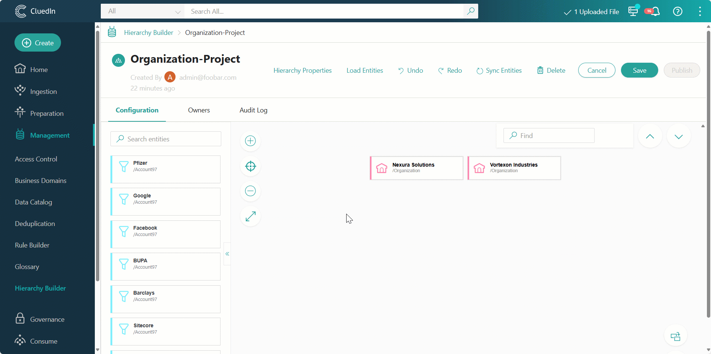
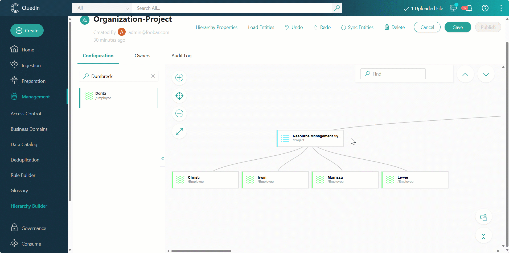
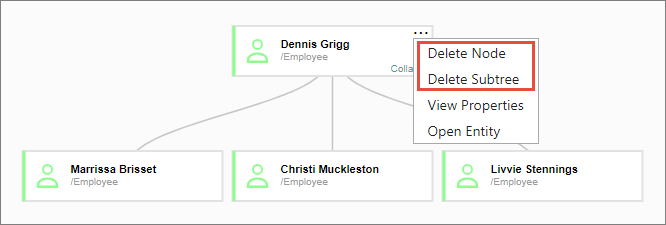
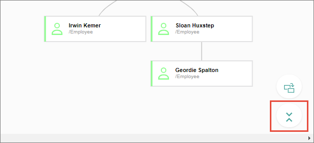
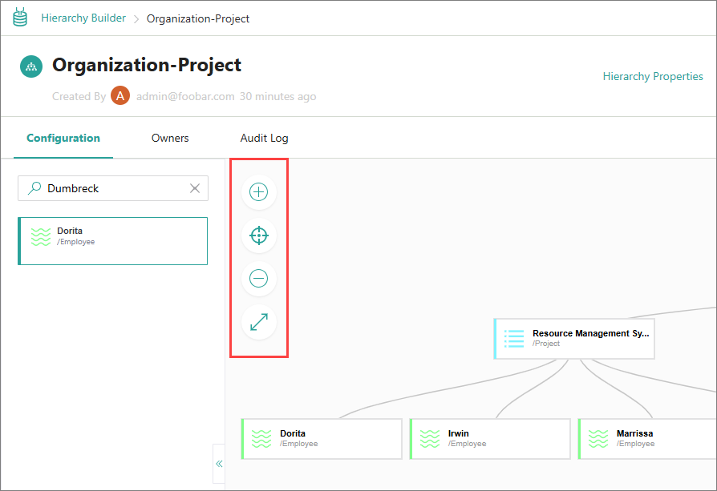

## On this page
{: .no_toc .text-delta }
- TOC
{:toc}

In this article, you will learn how to do the following:

- Load golden records connected by different types of relations into a hierarchy project.

- Modify the hierarchy.

- Use various tools to make working with the hierarchy more convenient.

## Load golden records

After you create a hierarchy, you can load golden records that are connected by various types of relations so that these relations are automatically visualized in the hierarchy. Note that the types of relations available for selection depend on the business domain used in the hierarchy project.

If you selected a business domain when creating the hierarchy, only the types of relations associated with the golden records of that business domain are available for selection. If you want to explore all types of relations, you can modify the hierarchy properties and remove the business domain. This way all golden records will be loaded to the project, and you can select any type of relation that you want.

**To load golden records**

1. In the hierarchy project, select **Load Entities**.

   The **Load entities** pane opens on the right hand of the screen.

1. In **Relation type**, select the edge type that represents relations between golden records that will be loaded to the hierarchy project.

1. In **Edge direction**, select the way in which hierarchy relations between golden records will be generated. The edge direction is selected automatically based on the edge type used when creating the hierarchy.

1. In the **Preview entities** section, review the golden records that will be loaded to the hierarchy project.

1. Select **Load Entities**.

    

    The golden records are added to the hierarchy project canvas in a way that shows their relationships to other golden records. You can load as many golden records as you want.

1. Review the generated hierarchy and modify it if needed.

1. To save your changes, select **Save** in the upper-right corner of the page.

1. To create the actual relations between golden records as you have designed in the hierarchy project, select **Publish** in the upper-right corner of the page. Then, confirm that you want to publish the hierarchy. As a result, these relations will be available on the **Relations** tab of golden records.

## Modify a hierarchy

While working in a hierarchy project, you can replace nodes or delete a node or a subtree as needed.

**To replace nodes**

1. In the lower-right corner of the page, select the button to turn on the **Replace on drop** mode.

1. In the left pane, find a replacement node and then drag it to the place of the node that you want to replace.

1. After replacing all nodes, turn off the **Replace on drop** mode by clicking the corresponding button.

    

    The node that you replaced is still available in the left pane, so you can drag it to the canvas again if needed.

**To delete a node or subtree**

- Hover over a node, open the three-dot menu, and then select the needed option:

    - **Delete Node** – the node as well as all of its child nodes will be deleted.

    - **Delete Subtree** – all child nodes will be deleted, but the parent node will remain intact.

        

        The nodes are deleted from the hierarchy. However, they are still available in the left pane, so you can drag them to the canvas again if needed.

If you accidentally replaced or deleted a node, you can revert the changes using the **Undo** action. To bring the changes back, use the **Redo** action.

## Use hierarchy tools

While working in a hierarchy project, you can adjust the hierarchy view using various tools.

**To adjust the hierarchy view**

- To collapse all levels of the hierarchy, in the lower-right corner, select the **Collapse All** button. All subtrees will be collapsed to the top-level parent node.

    

- To expand all levels of the hierarchy, in the lower-right corner, select the **Expand All** button. All subtrees will be expanded.

- To collapse a subtree of a node, hover over the node, and then select **Collapse**.

- To expand a subtree of a node, hover over the node, and then select **Expand**.

- To navigate the hierarchy canvas, use the **Zoom In**, **Zoom Out**, **Focus**, and **Full Screen** buttons.

    