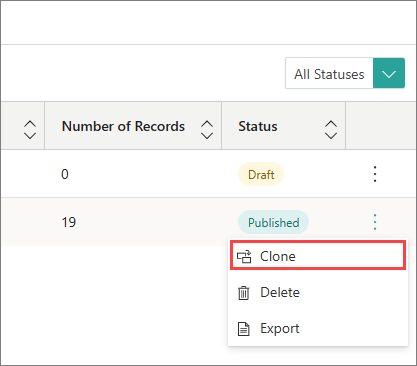
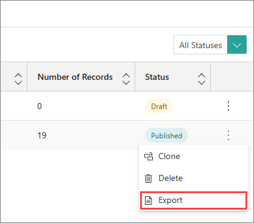
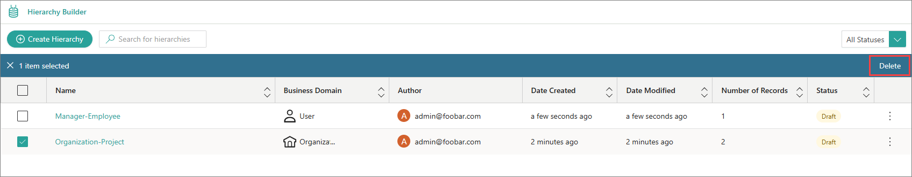

## On this page
{: .no_toc .text-delta }
- TOC
{:toc}

In this article, you will learn how to manage hierarchies in order to keep them well-organized.

## Clone a hierarchy

If you want to reuse the configuration of an existing hierarchy project, you can clone it.

**To clone a hierarchy**

1. On the navigation pane, go to **Management** > **Hierarchy Builder**.

1. Find the hierarchy that you want to clone. In the right corner of the row, open the three-dot menu, and then select **Clone**.

1. Enter the name of the new hierarchy project.

1. Select **Clone**.

    

    Now, you can edit the cloned hierarchy project.

## Export a hierarchy

If you want to validate leaf nodes, you can export the hierarchy to a comma-separated values (CSV) file. The file will contain the following columns:

- Id – node ID.

- Name – node name.

- ParentId – ID of the parent node.

- Level – node level in the hierarchy.

- IsLeaf – false if the node has child nodes; true if the node does not have child nodes.

**To export a hierarchy**

1. On the navigation pane, go to **Management** > **Hierarchy Builder**.

1. Find the hierarchy that you want to export. In the right corner of the row, open the three-dot menu, and then select **Export**.

    

    The hierarchy in the CSV format is downloaded to your computer.

## Delete a hierarchy

If you no longer need a hierarchy, you can delete it. The hierarchy is also deleted from the golden record page.

**To delete a hierarchy**

1. On the navigation pane, go to **Management** > **Hierarchy Builder**.

1. Find the hierarchy that you want to delete, and then do one of the following:

    - In the right corner of the row, open the three-dot menu, and then select **Delete**.

    - Select the checkbox next to the hierarchy, and then select **Delete**.

        

1. Confirm that you want to delete the hierarchy.

    Alternatively, you can open the hierarchy project, and then select **Delete**.