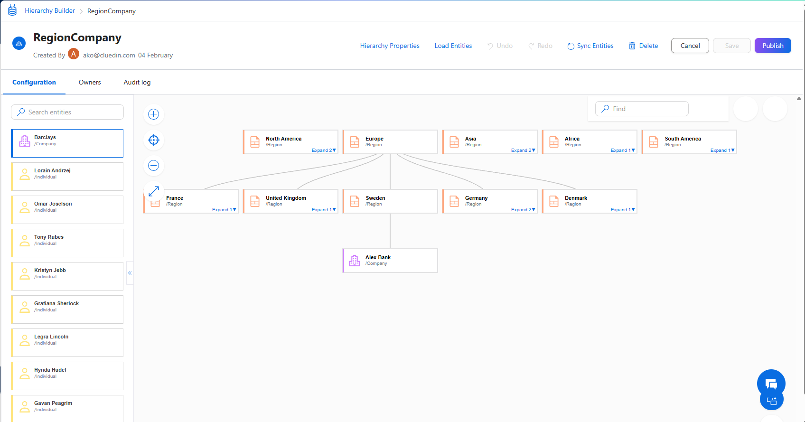
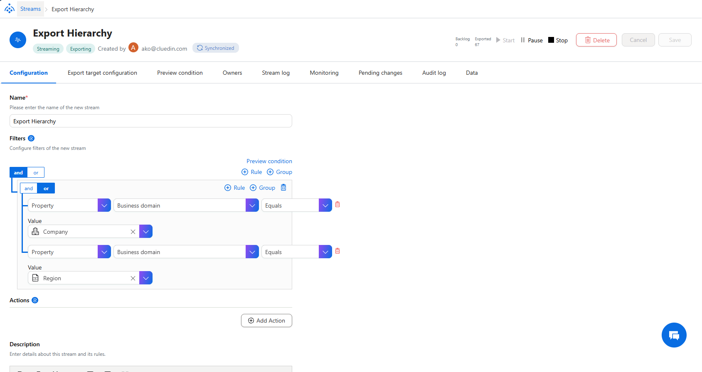
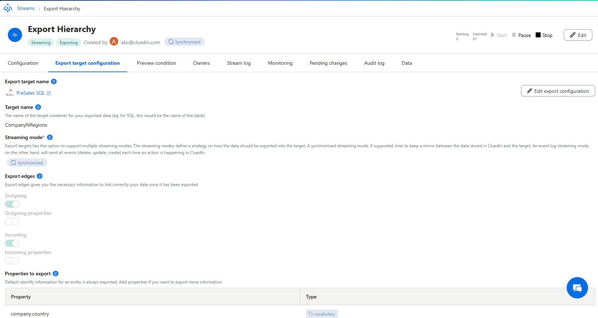

## On this page
{: .no_toc .text-delta }
- TOC
{:toc}

In this article, you will learn how to manage hierarchies in order to keep them well-organized.

## Clone a hierarchy

If you want to reuse the configuration of an existing hierarchy project, you can clone it.

**To clone a hierarchy**

1. On the navigation pane, go to **Management** > **Hierarchy Builder**.

1. Find the hierarchy that you want to clone. In the right corner of the row, open the three-dot menu, and then select **Clone**.

1. Enter the name of the new hierarchy project.

1. Select **Clone**.

    

    Now, you can edit the cloned hierarchy project.

## Export a hierarchy

If you want to validate leaf nodes, you can export the hierarchy to a comma-separated values (CSV) file. The file will contain the following columns:

- Id – node ID.

- Name – node name.

- ParentId – ID of the parent node.

- Level – node level in the hierarchy.

- IsLeaf – false if the node has child nodes; true if the node does not have child nodes.

**To export a hierarchy**

1. On the navigation pane, go to **Management** > **Hierarchy Builder**.

1. Find the hierarchy that you want to export. In the right corner of the row, open the three-dot menu, and then select **Export**.

    

    The hierarchy in the CSV format is downloaded to your computer.

## Delete a hierarchy

If you no longer need a hierarchy, you can delete it. The hierarchy is also deleted from the golden record page.

**To delete a hierarchy**

1. On the navigation pane, go to **Management** > **Hierarchy Builder**.

1. Find the hierarchy that you want to delete, and then do one of the following:

    - In the right corner of the row, open the three-dot menu, and then select **Delete**.

    - Select the checkbox next to the hierarchy, and then select **Delete**.

        

1. Confirm that you want to delete the hierarchy.

    Alternatively, you can open the hierarchy project, and then select **Delete**.

## Using Created Hierarchy in your BI Reports

Since you made the hierarchy of your choosing (also multi-domain), you are asking yourself a question: How can I use it to build my drill-down reports?

Well, let's imagine a scenario. In this picture below, we have built the hierarchy involve Business Domain /Region, and the business Domain /Companies, attached this each of the regions.

Note: This hierarchy would need to be published in order to expose the relationships as we usually expect, in format of /HRCHY_<hierarchyName> (example: /HRCHY_RegionCompany)

The next step would be to export the data related to the hierarchy using the CluedIn Stream in a configuration similar to the following:

Note: It is not important which properties you are exporting, as the following script is working with auto-generated columns. It is crucial that you export Outgoing Edges, Incoming Edges are optional.

When the data is being exported, depending on how you defined the target table, you will get the 3 tables in the following format:

- <TargetTable>
- <TargetTable>Codes
- <TargetTable>OutgoingEdges

Now the SQL script to get the parent/child/level format of the table, it would look like this:

    ;WITH ParentChild AS
    (
        SELECT
            Child.Id                AS Id,
            Child.OriginEntityCode  AS OriginEntityCode,
            Parent.Id               AS ParentId,
            Parent.OriginEntityCode AS ParentOriginEntityCode
        FROM dbo.CompanyNRegionsOutgoingEdges E
        JOIN dbo.CompanyNRegions Parent
            ON Parent.Id = E.EntityId
        JOIN dbo.CompanyNRegionsCodes CC
            ON CC.Code = E.ToCode
        JOIN dbo.CompanyNRegions Child
            ON Child.Id = CC.EntityId
        WHERE E.EdgeType = '/HRCHY_RegionCompany'
    ),
    Roots AS
    (
        SELECT N.Id, N.OriginEntityCode
        FROM dbo.CompanyNRegions N
        WHERE NOT EXISTS (SELECT 1 FROM ParentChild pc WHERE pc.Id = N.Id)
    ),
    CTE AS
    (
        SELECT
            R.Id,
            R.OriginEntityCode,
            NULLIF(R.Id, R.Id) AS ParentId,                         -- typed NULL
            NULLIF(R.OriginEntityCode, R.OriginEntityCode) AS ParentOriginEntityCode, -- typed NULL
            0 AS [Level],
            CAST('|' + CONVERT(varchar(36), R.Id) + '|' AS varchar(max)) AS [Path]
        FROM Roots R
    
        UNION ALL
    
        SELECT
            pc.Id,
            pc.OriginEntityCode,
            pc.ParentId,
            pc.ParentOriginEntityCode,
            c.[Level] + 1,
            c.[Path] + CONVERT(varchar(36), pc.Id) + '|'
        FROM CTE c
        JOIN ParentChild pc
            ON pc.ParentId = c.Id
        WHERE CHARINDEX('|' + CONVERT(varchar(36), pc.Id) + '|', c.[Path]) = 0  -- cycle guard
    )
    SELECT
        Id, OriginEntityCode, ParentId, ParentOriginEntityCode, [Level]
    FROM CTE
    ORDER BY [Level], OriginEntityCode
    OPTION (MAXRECURSION 32767);

In your case, you would need to replace any occurence of `CompanyNRegions` with your `<TargetTable>` and `/HRCHY_RegionCompany` with your `/HRCHY_<HierarchyName>`
