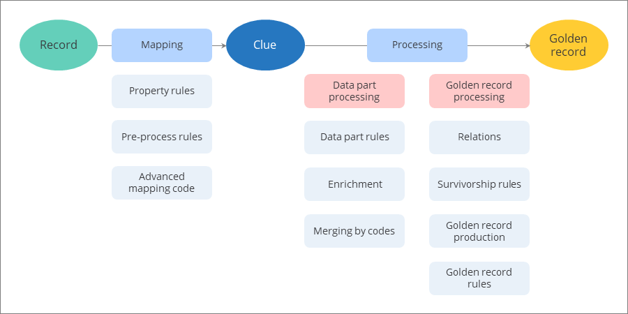

## On this page
{: .no_toc .text-delta }
- TOC
{:toc}

In this article, you will learn about the stages your data goes through to become a golden record. Understanding this process helps you assess the accuracy, reliability, and overall quality of your data, enabling better decision-making and more efficient usage of resources within the system.

<iframe src="https://player.vimeo.com/video/901195235?h=c9d9e0acf6&amp;badge=0&amp;autopause=0&amp;player_id=0&amp;app_id=58479" frameborder="0" allow="autoplay; fullscreen; picture-in-picture" title="Data life cycle"></iframe>

## Data life cycle overview

When you ingest the data into CluedIn—either from [a file](), [an endpoint](/integration/endpoint), [a database](/integration/database), or an integration—it enters the first stage of the life cycle. A **record** represents the data in its basic, raw format as it was in the source system.

When you create the [mapping](/integration/create-mapping), the record becomes a **clue**. It is an object model that CluedIn generates for your records. Essentially, mapping provides a semantic layer that allows CluedIn to understand the nature of your data. For more information, see the [Clue reference](/key-terms-and-features/clue-reference) article.

When you [process](/integration/process-data) the data set, the clue becomes a **golden record**. It is a consolidated representation of a data subject, derived from multiple sources.

The following diagram illustrates the transition from an ingested record to a golden record, including various actions that take place along the way.

## From record to clue

The goal of mapping is to create the clues in the format that you set up. After you create the mapping, you can modify or improve the records by using the following options:

- [Property rules](/integration/additional-operations-on-records/property-rules) – to improve the quality of mapped records by normalizing and transforming property values.

- [Pre-process rules](/integration/additional-operations-on-records/preprocess-rules) – to apply changes to mapped records. For example, add tags or aliases to the records or send the records to quarantine.

- [Advanced mapping code](/integration/additional-operations-on-records/advanced-mapping-code) – to introduce changes to the clues programmatically. You can perform similar actions as with property and pre-process rules but you gain greater flexibility to apply complex conditions.

The clues reflect all changes that you introduce to the mapped records.

## From clue to golden record

To become a golden record, the clue has to go through processing, which consists of two steps: data part processing and golden record processing. On this stage, the actions are applied across all data sources in CluedIn. This means that the system analyzes the existing golden records and determines whether the current record should create a new golden record or become a part of another golden record.

During **data part processing**, CluedIn analyzes the clue and turns it into a data part by applying the semantic layer. One clue always produces one data part. Often, data parts have the same vocabulary keys as the corresponding clues. However, there might be cases when the vocabulary keys are different due to vocabulary key mapping in the data catalogue.

The data part processing step involves the following actions:

- Applying data part rules – to modify the values in data parts that come from different sources. Data part rules are mostly used for normalization and transformation of values on the vocabulary key level.

- Triggering the enrichment – to improve the clues by providing additional details from external services.

- Merging identical clues by codes – to reduce the number of duplicates in the system by merging clues that have identical entity origin codes or entity codes. For more information, see [Codes](/integration/review-mapping#codes).

During **golden record processing**, CluedIn analyzed a data part and determines whether it will produce a new golden record or aggregate into the existing golden record. During this step, the following actions take place:

- Establishing [relations](/integration/review-mapping#relationships) between golden records – to indicate how golden records are related or interact with each other.

- Applying survivorship rules – to determine which values from the data parts contribute to the golden record.

- Producing the golden record – to create a new golden record from the data part or aggregate the data part into the existing golden record.

- Applying golden record rules – to facilitate easy identification and retrieval of golden records within the system (for example, by adding tags). For more information about rules, see [Rule types](/management/rules/rule-types).

The golden records can then be [cleaned](/preparation/clean), deduplicated, and streamed. As a result, you'll get accurate and reliable master data that you can use for collaboration, reporting, decision-making, and optimizing your business processes.​