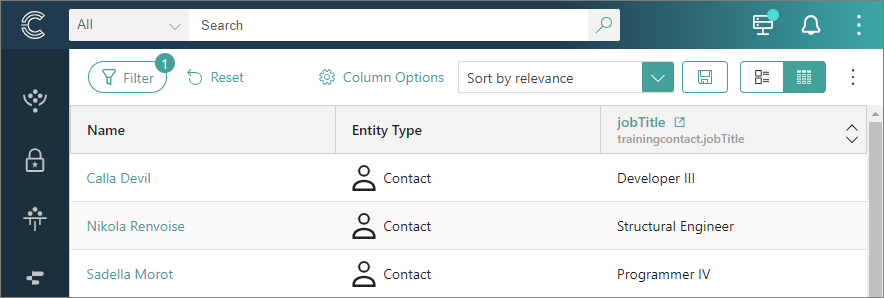
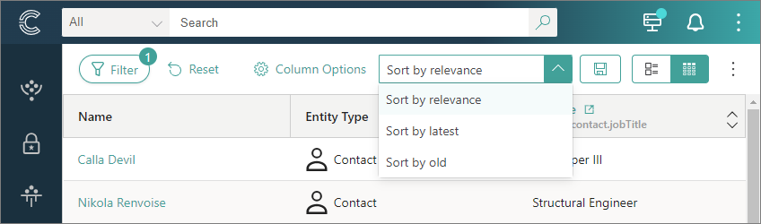
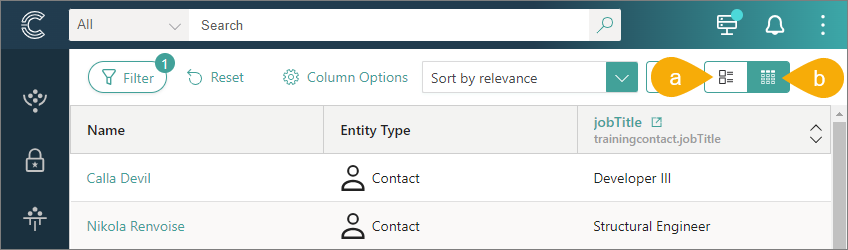
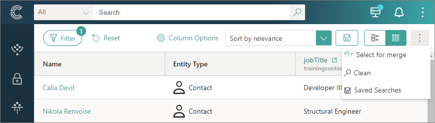

## On this page
{: .no_toc .text-delta }
- TOC
{:toc}

CluedIn allows you to search over all golden records in the platform. You can enter a keyword in the search box, and CluedIn will return all relevant results. You can also use [filters](/key-terms-and-features/filters) to precisely define the golden records you're looking for based on various criteria. In this article, you will learn how to use the search capabilities and customize the search results page to better suit your specific needs.

<iframe src="https://player.vimeo.com/video/1001999733?badge=0&amp;autopause=0&amp;player_id=0&amp;app_id=58479" frameborder="0" allow="autoplay; fullscreen; picture-in-picture; clipboard-write" title="Search capabilities in CluedIn"></iframe>

## Search results page

By default, the search results page displays golden records in the tabular view in the following columns: Name, Entity Type, and Description. You can customize the search results page to focus on the information that is important to you.

### Add columns

If you want to see other properties or vocabulary keys, you can add the needed columns to the search results page.

**To add columns to the search results page**

1. On the search results page, select **Column Options**.

1. Select **Add columns**, and then choose the type of column that you want to add to the search results page:

    - **Entity Property** – this option allows you to select the following properties: Date Created, Discovery Date, or Date Modified. After you choose the needed properties, select **Save Selection**.

    - **Vocabulary** – this option allows you to find and select any vocabulary keys. The following steps will guide you through the procedure of adding vocabulary keys to the search results page.

1. In the search field, enter the name of the vocabulary and start the search. Then, select the needed vocabulary keys.

    To limit the search results, use filters. You can choose to view the vocabulary keys of a specific data type or classification, or vocabulary from specific integrations.

1. After you chose the needed vocabulary keys, select **Add Vocabulary Columns**.

    The columns are added to the search results page.

    

### Reorder columns

If you want to improve the organization of information on the search results page, you can change the order of columns.

**To reorder columns on the search results page**

1. On the search results page, select **Column Options**.

1. Select the row and drag it to a new position in the list.

    You changes are immediately applied to the search results page. After you reorder the columns, close the **Column Options** pane.

### Sort records

By default, the golden records on the search results page are sorted by relevance. This means that CluedIn prioritizes golden records that are most likely to match your search query closely. Sorting by relevance ensures that the most pertinent results are displayed at the top of the page, facilitating efficient data retrieval.

In addition to sorting by relevance, CluedIn provides two alternative sorting options:

- Sorting by new – choosing this option arranges golden records in descending order of their creation or modification date, with the most recently added or updated records appearing at the top.

- Sorting by old – choosing this option arranges golden records in ascending order of their creation or modification date, with the oldest records appearing at the top.

**To sort records**

- In the upper-right corner of the search results page, expand the sorting dropdown menu, and then select the needed sorting option.

    

    The new sorting is applied to the search results.

### Change page view

CluedIn provides two page view options:

- **Tile view** (a) – presents records in a visual grid-like format. In this view, records are arranged in rectangular tiles, each representing a specific record.

- **Tabular view** (b) – presents records in a structured table format. In this view, records are arranged in rows and columns, resembling a spreadsheet or database table.

To change the page view, simply select the needed page view option.

## Saved searches

Saved searches help you quickly retrieve a set of golden records that meet specific filter criteria. You can share the search with everybody else in the organization or just keep it to yourself.

**To save a search**

1. In the upper-right corner of the search results page, select the save icon.

1. Enter the name of the search.

1. If you want to make this search available to everybody in your organization, turn on the toggle next to **Shared**.

1. Select **Save**.

    

    The search is saved in CluedIn. Now, you can use it when you need to quickly find a specific set of records or when you want to [clean](/preparation/clean) those records.

**To retrieve a saved search**

1. In the upper-right corner of the search results page, open the three-dot menu, and then select  **Saved Searches**.

    

    The **Saved Searches** pane opens, containing your own saved searches and shared saved searches.

1. Find and select the needed saved search.

    The golden records matching the saved search filters are displayed on the page.