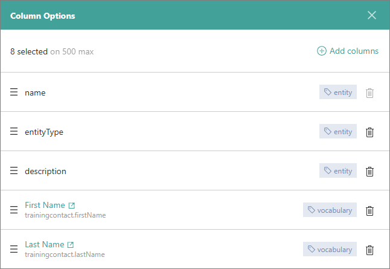
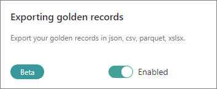

## On this page
{: .no_toc .text-delta }
- TOC
{:toc}

In this article, you will learn how to use the search capabilities in CluedIn to efficiently find the golden records you need.

<iframe src="https://player.vimeo.com/video/1001999733?badge=0&amp;autopause=0&amp;player_id=0&amp;app_id=58479" frameborder="0" allow="autoplay; fullscreen; picture-in-picture; clipboard-write" title="Search capabilities in CluedIn"></iframe>

You can search through all golden records in CluedIn—just enter a keyword in the search box, and CluedIn will return all relevant results. Use [filters](/key-terms-and-features/filters) to precisely define the golden records you're looking for based on various criteria.

## Search box

The search box is the starting point of your search for golden records. This is where you can enter a key word to start the search. Additionally, this is where you can quickly retrieve your recent searches and saved searches by clicking in the search box.

The **Recent Searches** section displays up to 5 of your previous searches. To run a recent search, select it from the list.

The **Saved Searches** section displays up to 7 saved searches. It contains a toggle to switch between your private saved searches and shared saved searches. In the screenshot above, the toggle is turned on to show private saved searches (**My Saved Searches**). Turning the toggle off will show public saved searches (**Shared Saved Searches**). To run a saved search, select it from the list. If you cannot find the saved search, select **View all saved searches**, and then look for the needed search in the **Saved Searches** pane. You can find more information in the article in [Saved searches](#saved-searches).

In the search box, you can also select a business domain in which you want to search for golden records. To do this, expand the dropdown list and select the needed business domain.

The **Business Domains** dropdown list displays up to 8 business domains that contain the biggest number of golden records. You can also view the number of golden records per business domain. After you select a business domain, enter a keyword, and start to search, CluedIn will display only those golden records that match the keyword and belong to the selected business domain.

## Search results page

By default, the search results page displays golden records in the tabular view in the following columns: **Name**, **Business Domain**, and **Description**. You can customize the search results page to focus on the information that is important to you. In this section, you will find different customization options.

### Add columns

If you want to view other golden record properties or vocabulary keys, you can add the corresponding columns to the search results page.

**To add columns to the search results page**

1. On the search results page, select **Column Options**.

    The **Column Options** pane opens where you can view the columns that are currently displayed on the search results page.

1. Select **Add columns**, and then choose the type of column that you want to add to the search results page:

    - **Entity Property** – to select the following golden record properties: **Date Created**, **Discovery Date**, or **Date Modified**.

    - **Vocabulary** – to find and select any vocabulary keys.

1. Depending on the type of column that you selected, do one of the following:

    - For **Entity Property**, select the checkboxes next to the needed properties, and then select **Save Selection**.

        

    - For **Vocabulary**, do the following:

        1. In the **Vocabulary Keys** section, find the vocabulary that contains the vocabulary keys that you want to add to the search result page. By default, this section displays the vocabularies that are used in golden records. To limit the search results, use filters. You can choose to view the vocabularies that are associated with a specific business domain or the vocabularies from a specific integration.

            If you want to add all vocabulary keys from a specific vocabulary, select the checkbox next to the vocabulary name. If you want to add specific vocabulary keys, expand the vocabulary and select the checkboxes next to the needed vocabulary keys.

        1. Move the vocabulary keys to the **Selected Vocabulary Keys** section using the arrow pointing to the right.

            If you decide that you do not want to add a specific vocabulary or vocabulary key, you can move it back to the **Vocabulary Keys** section. To do this, select the checkbox next to the needed element in the **Selected Vocabulary Keys** section, and then use the arrow pointing to the left.

        1. After you move all the needed vocabulary keys to the **Selected Vocabulary Keys** section, select **Add Vocabulary Columns**.

            

    The columns are added to the search results page. You can close the **Column Options** pane.

### Manage columns

If you want to improve the organization of information on the search results page, you can change the order of columns or remove columns.

**To manage columns on the search results page**

1. On the search results page, select **Column Options**.

    The **Column Options** pane opens where you can view the columns that are currently displayed on the search results page.

    

1. To reorder columns, select the row and drag it to a new position in the list.

1. To remove a column, select the delete icon in the corresponding row.

    Your changes are immediately applied to the search results page. After you reorder or delete the columns, close the **Column Options** pane.

### Sort search results

By default, the golden records on the search results page are sorted by relevance. This means that CluedIn prioritizes golden records that are most likely to match your search query closely. Sorting by relevance ensures that the most pertinent results are displayed at the top of the page.

In addition to sorting by relevance, CluedIn provides two alternative sorting options:

- **Sorting by latest** – to arrange golden records in descending order of their creation or modification date, with the most recently added or updated records appearing at the top.

- **Sorting by old** – to arrange golden records in ascending order of their creation or modification date, with the oldest records appearing at the top.

**To sort the search results**

- In the upper-right corner of the search results page, expand the sorting dropdown menu, and then select the needed sorting option.

    

    The new sorting is applied to the search results.

### Change page view

CluedIn provides two page view options:

- **Tile view** – presents golden records in a visual grid-like format. In this view, golden records are arranged in rectangular tiles, each representing a specific golden record.

    

- **Tabular view** – presents golden records in a structured table format. In this view, golden records are arranged in rows and columns, resembling a spreadsheet or database table.

    

**To change the page view**

- In the upper-right corner of the search results page, select the needed page view option: **Tile view** (a) or **Tabular view** (b).

    

    The new view is applied to the search results page.

## Saved searches

Saved searches help you quickly retrieve a set of golden records that meet specific filter criteria. Once you define the filters and add the needed vocabulary keys to the search page, you can save the current search configuration for future use. Next time when you need to review a specific set of golden records and their vocabulary keys, you can quickly open a saved search instead of configuring the search from scratch. You can share the saved search with everybody else in the organization or just keep it to yourself.

**To save a search**

1. In the upper-right corner of the search results page, select the save icon.

    

1. Enter the name of the search.

1. If you want to make this search available to everybody in your organization, turn on the toggle next to **Shared**.

1. Select **Save**.

    

    The search is saved in CluedIn. Now, you can use it when you need to quickly find a specific set of golden records or when you want to [clean](/preparation/clean) those golden records.

**To retrieve a saved search**

1. Do one of the following:

    - Click anywhere in the search box, and then use the toggle to define which saved searches you want to access: your private saved searches (**My Saved Searches**) or public saved searches (**Shared Saved Searches**). If you cannot find the needed saved search, select **View all saved searches**.

    - In the upper-right corner of the search results page, open the three-dot menu, and then select **Saved Searches**.

        

        The **Saved Searches** pane opens, containing your private saved searches and shared saved searches.

1. Find and select the needed saved search.

    The golden records matching the saved search filters are displayed on the search results page.

## Export search results

After performing a search, you can export your results in one of the following formats: JSON, CSV, XLSX, or Parquet.

**Prerequisites**

- Go to **Administration** > **Feature flags**, and then enable the **Exporting golden records** feature.

**To export search results**

1. In the upper-right corner of the search results page, open the three-dot menu, and then select **Export**.

    

1. In **Export Name**, enter the name of the export file.

1. In **Exporting Format**, select the file format you want to use for exporting search results.

1. In **Filters**, review the search filters that define which golden records will be exported.

1. In **Columns**, review the columns that will be exported. These columns are currently displayed on the search results page. If you want to change the columns, you can add, remove, or reorder the columns as described in [Manage columns](#manage-columns). 

    

1. Select **Export**. After the file for export is prepared, you will receive a notification.

1. In the notification, select **View**. The **Exported Files** page opens, where you can find the files available for download.

    

    To view the search filters that define golden records in a file, hover over the value in the **Filter Type** column.

1. To download the file, select the download button next to the file name or the file name itself.

    The exported file is downloaded to your computer.
