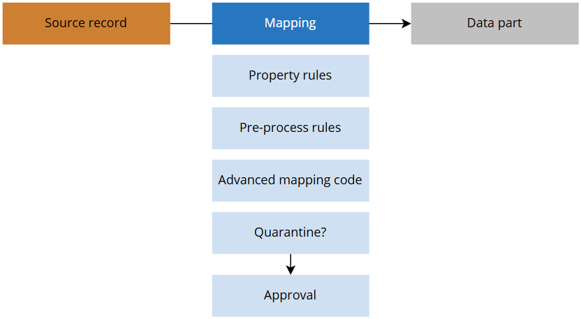
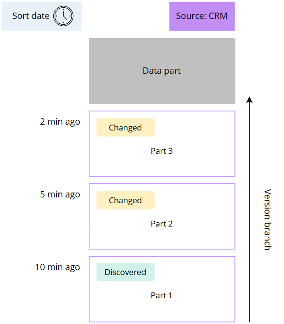
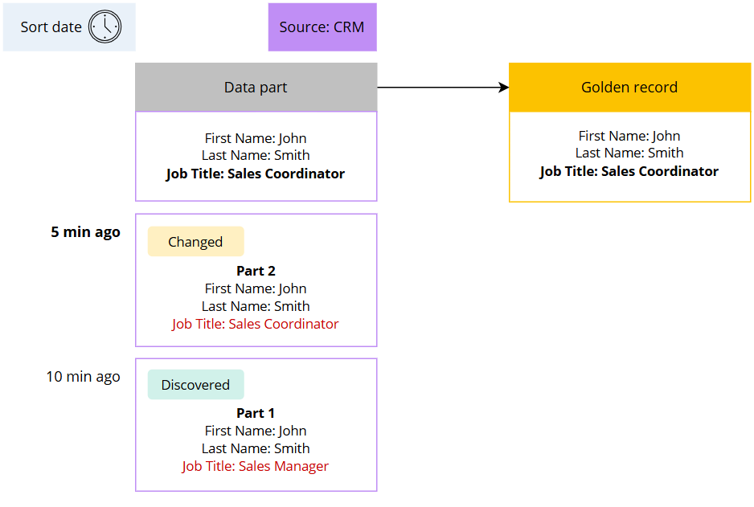
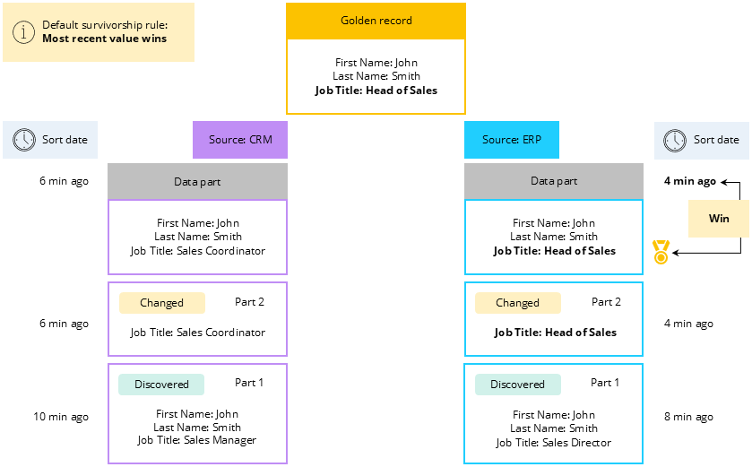
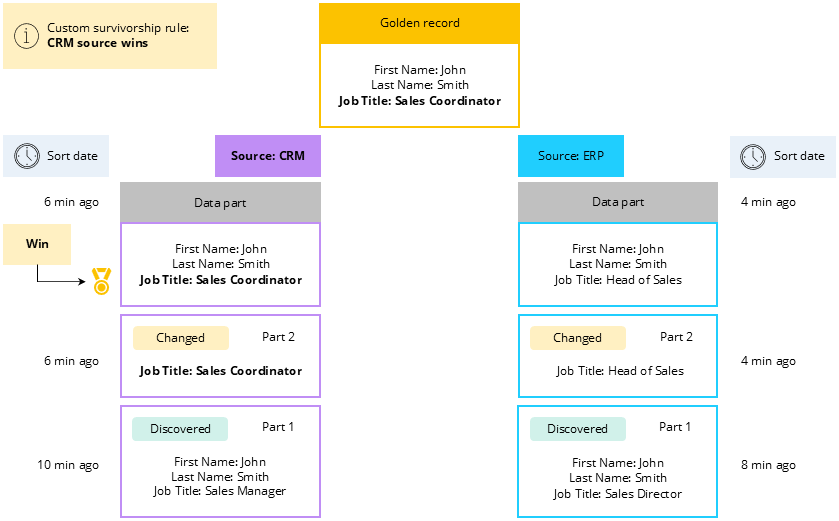

## On this page
{: .no_toc .text-delta }
- TOC
{:toc}

In this article, you will learn what a golden record is, how it is generated, and how you can control the sources contributing to a golden record.

<iframe src="https://player.vimeo.com/video/1036777568?badge=0&amp;autopause=0&amp;player_id=0&amp;app_id=58479" frameborder="0" allow="autoplay; fullscreen; picture-in-picture" title="What is a golden record in CluedIn"></iframe>

A golden record is an **accurate and consolidated representation of a data subject**, such as an organization or an employee, derived from multiple sources. It provides a 360-degree view of a data subject, facilitating a deeper understanding of its current state and the reasons behind it.

A golden record is created through a process of data integration, enrichment, cleaning, deduplication, and manual data entry. Each step in the process is registered as a separate element called a _data part_. A golden record is usually **made up of multiple data parts**. The purpose of creating a golden record is to provide a single source of truth, ensuring data consistency, improving data quality, and enabling better decision-making. A golden record serves as a reliable reference point that can be used by different systems, departments, or stakeholders within the organization.

Golden records in CluedIn are stored for **performance reasons**, but essentially, they are a **projection** of all the sources and rules that you have created. That is why golden records adapt based on the changes that are applied within CluedIn. This makes golden records very **agile**—you can easily **revert changes** and **re-shape your golden records at any point in time**.

## Concept of golden record

A golden record is a **multi-level graph**. A graph structure consists of nodes (discrete objects) that can be connected by relations. Even though this concept can be a bit hard to comprehend at first, once you understand it, you'll appreciate the great flexibility that it gives you.

Golden records can have 2 types of relations:

- [Linking similar records together](#linking-similar-records-together).

- [Linking golden records together](#linking-golden-records-together).

### Linking similar records together

In CluedIn, similar records are grouped together under the same banner called **golden record**. Generally, the golden record is composed of records from multiple sources.

For example, suppose we have a golden record that is composed of 2 records from different sources: one record from CRM and the other record from ERP. These distinct nodes are referred to as **data parts**.
 

The more sources you add, the bigger your golden record model becomes.

Since the golden record is a projection of the sources, adding or removing a source is not an issue. This is what gives great flexibility of golden records in CluedIn.

### Linking golden records together

We always say that _a golden record is a graph of a graph_. What it means is that when the golden record is being produced, CluedIn has the ability to link golden records together using **edges**. An edge is simply a relation. You can define an edge using rules or during the mapping. When you define an edge, CluedIn can connect golden records together as shown in the example. 

So, when we say that a golden record is a graph of a graph, it is because at the end, the entire view of the models is as follows.

## Golden record step by step

To make the golden record generation process easier to understand, we'll start with the simplified explanation that does not include various types of rules. We’ll focus on the records and use the concepts of bronze, silver, and golden layers from the medallion architecture for visual assistance.

| Medallion architecture term | CluedIn term | Definition |
|--|--|--|
| Bronze layer | Source record | This is a record in its basic, raw format as it was in the source system. |
| Silver layer | Data part | This is a mapped record with all of the pre-processing rules and changes applied to it. |
| Golden layer | Golden record | This is a record that you can trust, usually formed by aggregating data parts to the existing golden record.  |

Generally, a new record is associated with the bronze layer. This is the record that comes from a specific source—it may come from a file, an Azure Data Factory pipeline, or a database. We call this record a **source record**.

The process of generating a golden record spans from source records, through data parts, to the golden record. Next, we’ll describe each step that the record goes through to become a new golden record or aggregate into the existing golden record.

### Source record (bronze)

A source record is a raw record that has been ingested into CluedIn from a source system. It is generally stored in JSON format. Such record has not been modified in any way. You can see source records on the **Preview** tab of the data set.

### Data part (silver)

When records appear in CluedIn, you need to add a semantic layer to transform them into a format that CluedIn can understand. This process is called [mapping](/playbooks/data-ingestion-playbook/concept-of-mapping). Once all the steps of the mapping process have been performed, you get what we call a **data part**. Essentially, a data part is an aggregation of all changes to the record coming from a single source after it has been mapped.

During the mapping process, the source records can go through multiple steps:

- Changes to the values of mapped records via [property rules](/integration/additional-operations-on-records/property-rules).

- Changes to the mapped records via [pre-process rules](/integration/additional-operations-on-records/preprocess-rules).

- Changes to mapped records via [advanced mapping code](/integration/additional-operations-on-records/advanced-mapping-code).

- If the mapped record gets into the [quarantine](/integration/additional-operations-on-records/quarantine), it should be approved to get to the next stage.

All in all, a data part is a record in a format that CluedIn can understand and that has already gone through multiple processes to ensure it is valid and ready for the production of a golden record.

### Golden record (golden)

When you [process](/integration/process-data) the data set, CluedIn checks if the data part can be associated with the existing golden record. If the data part can be associated with the existing golden record—they share the same [identifiers](/key-terms-and-features/entity-codes)—then it is **aggregated to the existing golden record**. In this case, the golden record is re-processed. If the data part cannot be associated with the existing golden record, then a **new golden record is created**.

**What happens when golden record is re-processed?**

When a new data part is added to the existing golden record, CluedIn incorporates all of its properties into the golden record. However, conflicts can arise between new and existing data parts when the values for the same property differ. We describe the scenarios of handling different values for the same property later in [this article](#building-a-golden-record).

**How can you re-shape a golden record?**

Depending on the projects and processes that are running in CluedIn—[clean projects](/preparation/clean), [deduplication projects](/management/deduplication), [enrichers](/preparation/enricher), manual modifications, data ingestion—the golden record can be changed. For example, if you create a clean project and it affects a golden record, a new data part is added to that golden record. Similarly, if you have an enricher that affects a golden record, a new data parts with the properties from third-party source is added to the golden record. If you are not satisfied with the changes made to a golden record by a specific data part, you can simply delete such data part.

Whenever a new data part or changes to an existing data part appear in CluedIn, they are ordered by the sort date. The **sort date** is determined by selecting the first available date among modified, created, and discovery dates:

- If there is a modified date, then this date is used as the sort date.

- If there is no modified date, but there is a created date, then this date is used as the sort date.

- If there is no modified or created date, then the discovery date is used as the sort date. The discovery date is always present in the data part as it is the date when the data part was created in CluedIn.

The sort date is important because CluedIn uses it by default to determine the winning value for each specific data part, as well as the winning value between different data parts. We’ll explain the specifics of this mechanism in the following sections.

## Building a golden record

In CluedIn, we track the **lineage of source records** with the help of **version branches**. Each source has its own version branch that consists of parts. Whenever the source record is changed, a new part is added to the corresponding version branch. This way you can track the changes of values per source. The parts within a version branch are ordered by sort date. The values from the part with the **most recent sort date** are used in the **data part** that can contribute to the golden record.

To explain how a golden record is built, we'll start from the way CluedIn handles changes in source records for a golden record with just one source. Then, we’ll move on to discussing a golden record built from multiple sources.

### One source

Let's consider a simple example of a golden record that is formed by one data part from CRM. Whenever the source record is changed, a new part appears in the version branch of the corresponding source. In case of conflicting values for the same property—in our case, Job Title—CluedIn takes the value from the part with the most recent sort date and uses this value in a data part. 

### Multiple sources

Now, let's consider an example of a golden record formed from multiple sources. In this case, each source has its own version branch, and each version branch behaves the same way as described in the section above. However, if there is a property that has different values in each source, then how does CluedIn determine which value should be used in the golden record? The answer is by applying a **default survivorship rule**.

The default survivorship rule is CluedIn's mechanism for determining the winning value among conflicting values from different sources. According to this rule, **manually added changes** are prioritized; otherwise, the **most recent value** wins.

To explain how CluedIn determines the winning value among data parts, we'll use an example of a golden record that is formed from two data parts: one from CRM and the other one from ERP. Each data part has its own version branch that contains a collection of parts. From the section above, you already know how the winning value is defined for a data part. Now, let's find out how CluedIn defines the winner between data parts.

In our example, each data part has a different value for the same property—Job Title. To determine the winning value, CluedIn defines the **winner between version branches**. It is important to emphasize that CluedIn does not evaluate each part from the version branch individually. CluedIn only evaluates the values from each data part. The value from the data part with the most recent sort date wins and is used in the golden record. 

The following gif animates the previous diagram, illustrating how the golden record is changed according to default survivorship rule.

If the default survivorship rule is not suitable for you, you can **set up your own strategy** for defining the winning value using [survivorship rules](/management/rules/rule-types#survivorship-rules). For example, you can create a **custom survivorship rule** to prioritize a specific source for determining the value for a specific property. Suppose you want CRM to be the source of truth for the Job Title property. In this case, even though the value from ERP is the most recent one, the golden record uses the value from CRM as defined by the custom survivorship rule.

The following gif animates the previous diagram, illustrating how the golden record is changed according to custom survivorship rule.

## Golden record page

In CluedIn, you can find a golden record using [search](/key-terms-and-features/search). The golden record page contains several tabs where you can find all relevant information about a golden record:

- Overview – here you can view general information about a golden record, such as entity properties, vocabularies, sources, and more.

- Properties – here you can view all properties that the golden record has as well as add new properties.

- Relations – here you can view which golden records the current golden record is related to.

- Pending changes

- [History](/key-terms-and-features/golden-records/history) – here you can view all data parts (versions of clues that make up a data part) of a golden record as well as all outgoing relations (edges) of a golden record.

- Explain log – here you can view detailed information about the operations performed on a golden record and its data parts.

- Topology – here you can view the visualization of data parts that form a golden record.

- Hierarchy – here you can view the hierarchy projects that the current golden record is a part of.