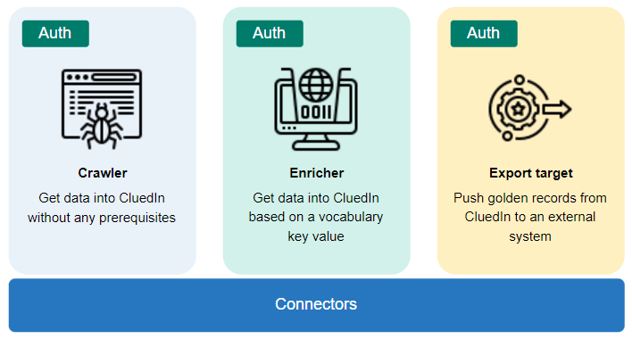

In this article, you will learn about the differences and similarities between the following types of connectors in CluedIn—a crawler, an enricher, and an export target.

All connectors link CluedIn with an external system, yet each one has a distinct purpose.

- **Crawler** – pulls data from an external source into CluedIn. A crawler does not require any vocabulary key value to get the data. As soon as you get access to the crawler, the data starts to get into CluedIn.

- **Enricher** – pulls additional data from an external source into CluedIn based on the specified vocabulary key value. For example, if you don't have a VAT number, you can't use the VAT enricher. For more information, see [Enricher](/preparation/enricher).

- **Export target** – pushes golden records from CluedIn to an external system. For more information, see [Export targets](/consume/export-targets).

All of these connectors are similar in that they require access to an external system. At the same time, they are different based on their purpose and prerequisites. Whether it's an SQL crawler, SQL enricher, or SQL export target, each connector performs a unique function, even when using the same technology.