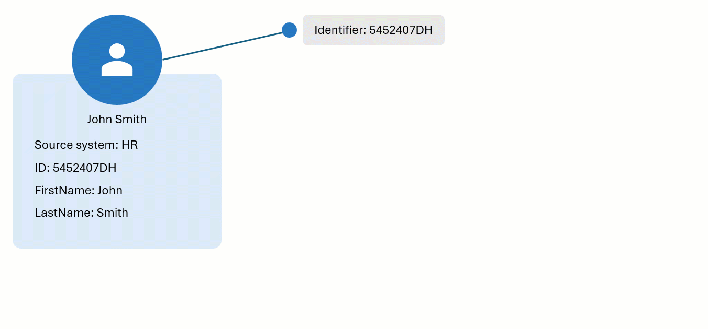
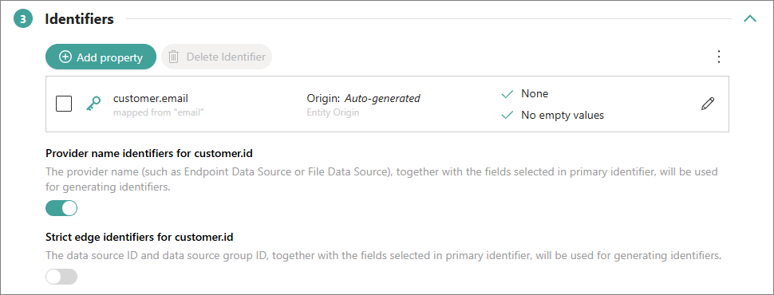

## On this page
{: .no_toc .text-delta }
- TOC
{:toc}

An **identifier** (previously known as **code**) is a mechanism that CluedIn uses to define the **uniqueness** of a golden record. During processing, if two clues share the **same identifier**, they are **merged** into a single golden record. This ensures that data from different sources is unified under a consistent, unique identifier.

**Example**

Let’s explore the concept of identifiers in CluedIn through an example. We have a golden record—John Smith—that originates from the HR system. One of the identifiers for this golden record is created using the ID. Now, a new record from the CRM system appears in CluedIn, and one of its identifiers matches the code of the golden record from the HR system. As a result, the new CRM record is merged with the existing HR record, integrating any new properties from the CRM record into the existing golden record.



To find all the identifiers that uniquely represent a golden record in the system, go to the golden record page, and select **View Identifiers**.


The identifiers are divided into two sections:

- [Primary identifier](#primary-identifier) – this is the **primary unique identifier** of a golden record in CluedIn.

- [Identifiers](#identifiers) – this section contains all identifiers associated with a golden record.

For more information, see the **Identifiers** section in our [Review mapping](/integration/review-mapping#identifiers) article.

## Primary identifier

A primary identifier (previously knows as entity origin code) is a **primary unique identifier** of a record in CluedIn. The required details for producing the primary identifier are established when the mapping for a data set is created. To find these details, go to the **Map** tab of the data set and select **Edit mapping**. On the **Map entity** tab, you'll find the **Primary Identifier** section, which contains the required details for producing the primary identifier.


The primary identifier is made up from the [business domain](/key-terms-and-features/entity-type) (1), the [origin](/key-terms-and-features/origin) (2), and the value of the property that was selected for producing the primary identifier (3). This combination allows achieving absolute uniqueness across any data source that you interact with. 


There might be cases when the property for producing the primary identifier is empty or you don't have any property suitable for defining uniqueness. In the following sections, we'll explore different ways for defining uniqueness.

### Empty value in primary identifier

If the property that you selected in your mapping for producing the primary identifier has an empty value, then this empty value will be converted to a **hash code** that will try to represent uniqueness. Please note that even if the hash code is a good fallback option, you need to consider if it is viable for your source of data. For data sets that have many empty values or are incomplete, it can lead to unwanted merges.

Consider the following example, where the hash code will be `e7c4d00573302d3b1432fd14d89e5dd0dc68a0ea`. 

```
{
  firstName: "Robert",
  lastName: "Smith"
}
```

Hash codes are case sensitive. So, with the same properties as in the example above, but all values in lower case, the hash code will be `479b8ebe1612297996532b9abeeb9feee4ed4569`.

```
{
  firstName: "robert",
  lastName: "smith"
}
```

### Auto-generated key in primary identifier

If your records do not have a property suitable for defining uniqueness, you can select the auto-generated option for producing the primary identifier in mapping. As a result, CluedIn will generate unique primary identifiers for the records using hash codes as documented above.

**When not to use auto-generated keys?**

If you are using hash codes, remember that when the **record is changed**, the **value of the identifier will change** as well. It means that you should **avoid using auto-generated keys when you edit a data set**.

In CluedIn, we offer you the possibility to edit the source data. This is a great option as it can lead to much faster and better results in your golden records. However, if you use the **auto-generated key** to produce the primary identifier, each time you change the value, it will generate a different identifier.

For example, let's say you have some rules to capitalize firstName and lastName. Let's assume we have 2 records.

```
[{
  firstName: "Robert",
  lastName: "Smith"
}, {
  firstName: "robert",
  lastName: "smith"
}]
```
If we add a rule to capitalize firstName and lastName, the records will be changed as in the example below.

```
[{
  firstName: "Robert",
  lastName: "Smith"
}, {
  firstName: "Robert",
  lastName: "Smith"
}]
```

If you use the auto-generated key to produce the primary identifier, these two records will use the same hash code `e7c4d00573302d3b1432fd14d89e5dd0dc68a0ea`, so they will **merge**. However, **if you have already processed the data, it can lead to duplication**. Let's trace this process step-by-step.

1. Upload the following JSON:


    ```
    [{
      firstName: "Robert",
      lastName: "Smith"
    }, {
      firstName: "robert",
      lastName: "smith"
    }]
    ```

2. Map the data with **Auto-generated** key to produce the primary identifier.

3. Process the data.

4. Switch to edit mode for the data set.

5. Apply changes to the data set, such as capitalize firstName and lastName.

6. Re-process the data.

As a result, you will have 2 golden records because you have changed the primary identifier of the golden record that had lowercase values.

When you process the records for the first time in step 3, you send 2 different codes:

1\. `e7c4d00573302d3b1432fd14d89e5dd0dc68a0ea`, the hash code with values capitalized.

2\. `479b8ebe1612297996532b9abeeb9feee4ed4569`, the hash code with values in lowercase.

When you process the records for the second time in step 6, you send the same code 2 times:

3\. `e7c4d00573302d3b1432fd14d89e5dd0dc68a0ea`, the hash code with values capitalized.

4\. `e7c4d00573302d3b1432fd14d89e5dd0dc68a0ea`, identical hash code for the record that initially was in lowercase but has been capitalized in edit mode.

The records with codes 1, 3, and 4 will merge together. And the record with code 2 will remain as a separate golden record.

{:.important}
If you want to edit your records in the source, do not use auto-generated key for producing the primary identifier.

### Compound key (MDM code) in primary identifier

If you do not want to use an auto-generated key to produce the primary identifier, you can use a compound key. A compound key is built by concatenating different attributes to ensure uniqueness. It is commonly referred to as the MMDM code.

For example, an MDM code can combine multiple attributes for a customer.

```
- firstName
- lastName
- line 1
- city
- country
- date of birth
```

If you go with the MDM code, make sure you **normalize the values** by either creating a computed column for your data set or by adding a bit of glue code in using [advanced mapping](/integration/additional-operations-on-records/advanced-mapping-code). Our CluedIn experts can assist you with this task. Normalizing the MDM code is important because it will prevent scenarios where editing values changes the primary identifier, leading to undesired effects.

### Lack of options to define uniqueness

**What to do if there is no way to define uniqueness?**

If you have no way to define uniqueness for your records, generate a GUID using [advanced mapping](/integration/additional-operations-on-records/advanced-mapping-code) or a pre-process rule. However, **each time you process** the records, **duplicates** will be created. So, use this option for **one-time only** ingestion.

**What to if there is no way to define uniqueness and you need to re-process data multiple times?**

If this is your case, the only way is to fix the issue on the source level. You can modify the source of data to set up some kind of uniqueness. For example, if you have a SQL table, you can add a unique identifier for each row.

## Identifiers

In addition to primary identifier, identifiers (previously known as entity codes) can uniquely represents a record in CluedIn. The required details for producing the identifiers are established when the mapping for a data set is created. To find these details, go to the **Map** tab of the data set and select **Edit mapping**. On the **Map entity** tab, you'll find the **Identifiers** section, which contains the required details for producing the identifiers.



If a data set contains additional columns that can serve as unique identifiers besides the ones used for producing the primary identifier, then these columns can also be used to produce additional identifiers. For example, if the primary identifier is produced using the ID, then the additional identifier could be produced using the email. The identifiers are made up from the [business domain](/key-terms-and-features/entity-type), [origin](/key-terms-and-features/origin), and the value from the column that was selected for producing the identifiers.

In the **Identifiers** section, you can instruct CluedIn to produce additional codes:

- **Provider name identifiers** – identifiers that are built form the business domain, provider name (for example, File Data Source), and the value from the column that was selected for producing the primary identifier.

- **Strict edge identifiers** – identifiers that are built from the business domain, data source group ID/data source ID/data set ID, and the value from the column that was selected for producing the primary identifier.

**What happens if the value of am identifier is empty?**

The value will be ignored and no identifier will be added. An identifier is not a required element and using a hash code would be unnecessary as you have already defined uniqueness with the primary identifier.

**Is it bad if I have no identifiers defined?**

No, it can happen regularly, generally when the source records cannot be trusted or are unknown. When in doubt, it is better not to add extra identifier and rely on deduplication projects to find duplicates.

## FAQ

**How to make sure that the identifiers will blend across different data sources?**

Since an identifier will only merge with another identifier if they are identical, how can you merge records across different systems if the origin is different? One of the ways to achieve it is through the GUID.

If a record has an identifier that is a GUID/UUID, you can set the origin as CluedIn because no matter the system, the identifier should be unique. However, this is not applicable if you are using deterministic GUIDS. If you're wondering whether you use deterministic GUIDs, conducting preliminary analysis on the data can help. Check if many GUIDs overlap in a certain sequence, such as the first chunk of the GUID being replicated many times. This is a strong indicator that you are using deterministic GUIDs. Random GUIDs are so unique that the chance of them being the same is close to impossible.

You could even determine that the business domain can be generic as well. You will have to craft these special identifiers in your clues (for example, something like `/Generic#CluedIn:<GUID>`). You will need to make sure your edges support the same mechanism. In doing this, you are instructing CluedIn that no matter the business domain, no matter the origin of the data, this record can be uniquely identified by just the GUID.

**What if a record doesn't have a unique reference to construct an identifier?** 

Often you will find that you need to merge or link records across systems that don't have IDs but rather require fuzzy merging to be able to link records. In this case, we often suggest creating a composite identifier constructed from a combination of column or property values that guarantee uniqueness. For example, if you have a Transaction record, you might find that a combination of the Transaction Date, Product, Location, and Store will guarantee uniqueness. It is best to calculate a "Hash" of these values combined, which means that we can calculate an identifier from this.

**What if a key is not ready for producing an identifier?**

Sometimes keys for identifiers are not ready to be made into a unique primary identifier. For example, your data might include default or fallback values when a real value is not present. Imagine you have an EmployeeId column, and when a value is missing, placeholders like "NONE", "", or "N/A" are used. These are not valid identifiers for the EmployeeId. However, the important aspect is that you cannot handle all permutations of these placeholders upfront. Therefore, you should create identifiers with the intention that these values are unique. You can fix and clean up such values later.

## Useful resources

- [Origin](/key-terms-and-features/origin)