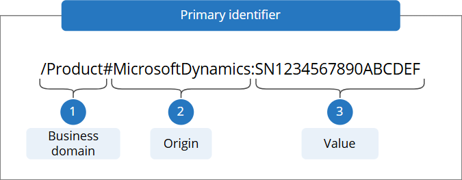
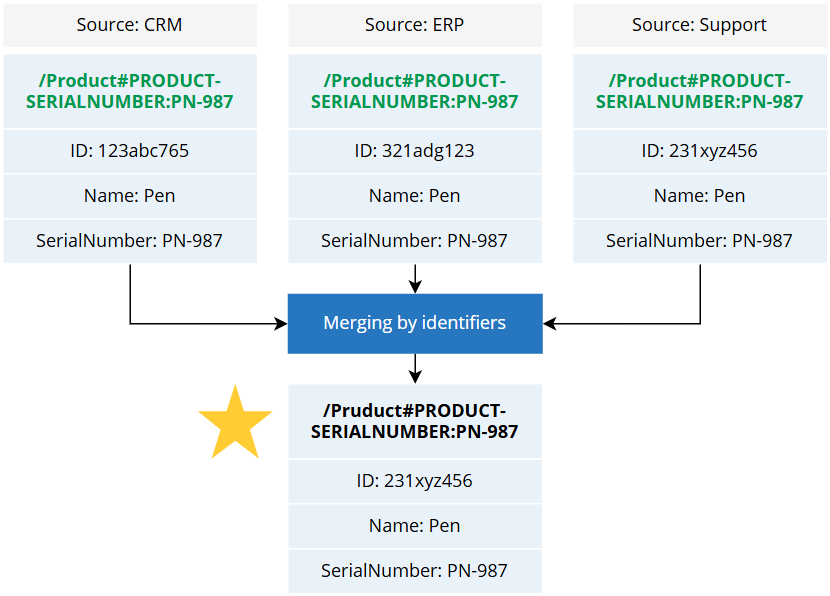

## On this page
{: .no_toc .text-delta }
- TOC
{:toc}

Generally, the origin determines the **source of a golden record**. So, when you map your data, the origin will be automatically set to the name of the data source, for example, `MicrosoftDynamics`, `Oracle`, `Hubspot`, or `MsSQLDatabase5651651`. However, you can change the origin during mapping if needed.

As mentioned in our [Identifiers](/key-terms-and-features/entity-codes) reference article, the origin is used in the primary identifier and the identifiers.

In this article, we'll explain the usage of the origin in two important processes in CluedIn:

- [Merging records by identifiers](#merging-records-by-identifiers)

- [Linking golden records](#linking-golden-records)

## Merging records by identifiers

Since the origin is used in the primary identifier and the identifiers, it plays a role in merging—when 2 identifiers are identical, the records will merge together.

To understand the role of origin in merging, suppose you have an attribute that you can _safely rely on to merge records across source systems_. Let's say this attribute is a `SerialNumber` that is used in your CRM, ERP, and Support systems. As the serial number is unique and cross-system, you can use it to merge together _all golden records that have the same serial number_. Of course, you can achieve this using our UI; however, there is a faster way to do this via merging by identifiers.

Let's consider the example of three records, each coming from a different source system—CRM, ERP, and Support. For each data source, we select the `Serial Number` to produce the primary identifier. The following table shows the identifiers that will be produced by default.

| Source | Business domain | Origin | Primary identifier |
|--|--|--|--|
| CRM | Product | crm | `/Product#crm:[SERIAL NUMBER VALUE]` |
| ERP | Product | erp | `/Product#erp:[SERIAL NUMBER VALUE]` |
| Support System | Product | support | `/Product#support:[SERIAL NUMBER VALUE]` |

Even if the serial number is the same, the records will not merge together as the origin of each record is different.

So, how would you use the serial number to merge records together? The answer is by producing an **identifier that shares the same origin**, for example, `PRODUCT-SERIALNUMBER`. As a result, the identifier for each record will share the same business domain, origin, and the value of serial number as shown in the following table.

| Source | Business domain | Origin | Primary identifier |
|--|--|--|--|
| CRM | Product | PRODUCT-SERIALNUMBER | `/Product#PRODUCT-SERIALNUMBER:[SERIAL NUMBER VALUE]` |
| ERP | Product | PRODUCT-SERIALNUMBER | `/Product#PRODUCT-SERIALNUMBER:[SERIAL NUMBER VALUE]` |
| Support System | Product | PRODUCT-SERIALNUMBER | `/Product#PRODUCT-SERIALNUMBER:[SERIAL NUMBER VALUE]` |

Since the origin is shared among different sources, each time the same serial number for a product is sent to CluedIn, it will be merged.

## Linking golden records

Origin can be used to link golden records together to **create relationship**. You can link golden records using identifiers, rules, or manually in the UI. To create a relationship using identifiers, you need to know the **origin of target golden records**. These are the golden records to which you want to link current records.

Suppose you have Contact records that contain the `companyID` property, and you know that you have Company records with this `ID`. To establish a link between Contact and Company, you need to define the "to" relationship by setting up the following:

- Business domain: `/Company`
- Origin: `[ORIGIN-OF-COMPANY-RECORDS]`
- Value: `Company ID`

The **combination of those 3 values** needs to **match one of the identifiers of target records**.

To make the process of linking golden records easier, you can use the recommendation for defining the origin that we provided in [Merging by identifiers](#merging-records-by-identifiers). Essentially, the method of **shared origin** that you use for merging by identifiers can also be used to facilitate the process of linking golden records. This way you do not have to rely on the source system and instead use the origin that you defined for related data.

## Useful resources

- [Business domain](/key-terms-and-features/entity-type)

- [Identifiers](/key-terms-and-features/entity-codes)

- [Review mapping](/integration/review-mapping)