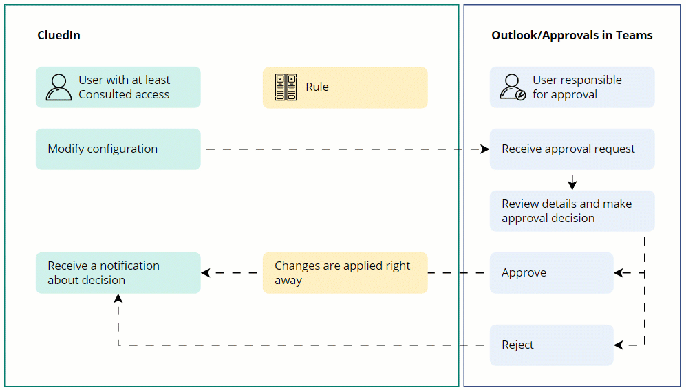

Let's explore the concept of approvals in CluedIn using an example of rule modification.

A user with at least Consulted claim access level to the Rule Builder claim can modify any rule. However, to ensure transparency and accuracy, the changes are not applied right away. Instead, an approval request is sent to the responsible users. When one of the responsible users approves changes, a notification in CluedIn is sent to the user who made the changes, and the changes are applied to the rule.

**Who are the users responsible for approval?**

- In case of modifying an existing element, the responsible users are the owners that can be found on the **Owners** tab of the element. Since both users and roles can be the owners, all users with the corresponding roles are considered responsible users.

- In case of creating a new element, the responsible users are those users who have the same or higher claim access level as the user who created the element.

**Is there a connection between external approvals and internal CluedIn change requests?**

When you modify an element in CluedIn, both an internal change request and an external approval request are sent to the owners. The request that is processed first determines the outcome for the element. For example, if an owner approves the internal change request in CluedIn, the element is updated accordingly. However, if another owner rejects the external approval request in Outlook, this rejection is ignored because the element has already been updated. Essentially, the first processed request is applied to the element, and any subsequent request is ignored.