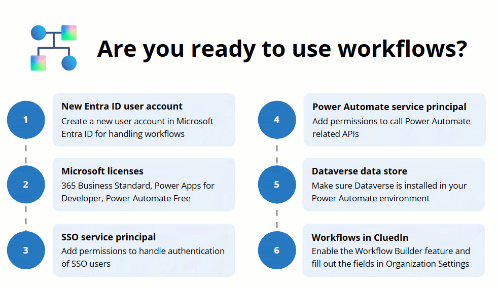

## On this page
{: .no_toc .text-delta }
- TOC
{:toc}

To set up the workflows feature in CluedIn, you need to fulfill several prerequisites in both Azure and CluedIn.

## Azure prerequisites

You need to prepare the following user accounts:

- A new user in Microsoft Entra ID for handling Power Automate workflows. For more information on how to create a new user, see [Microsoft documentation](https://learn.microsoft.com/en-us/entra/fundamentals/how-to-create-delete-users#create-a-new-user).

    

    This user must have the following licenses:

    - Microsoft 365 Business Standard – having this license allows sending approval requests to Outlook and the Approval app in Teams.

    - Microsoft Power Apps for Developer

    - Microsoft Power Automate Free

    

    For more information on how to add a license, see [Microsoft documentation](https://learn.microsoft.com/en-us/entra/fundamentals/license-users-groups).

- An SSO service principal for authenticating SSO users with permissions to accept requests from the following URIs:

    - _https://{cluedin-domain}_/admin/workflow/workflow-builder

    - _https://{cluedin-domain}_/admin/workflow/approvals

    

    Also, in the **Implicit grant and hybrid flows** section, select both **Access tokens** and **ID tokens**.

    

- A Power Automate service principal with permissions for authenticating the Power Automate widget. You need to add the following permissions:

    - **Azure Service Management**: user_impersonation, Delegated.

    - **Dynamics CRM / Dataverse**: user_impersonation, Delegated.

    - **Microsoft Graph**: User.ReadBasic.All, Delegated and Application.

    - **Power Automate**: Flows.Manage.All and Flows.Read.All, User.

    

    For more information about API permissions, see [Microsoft documentation](https://learn.microsoft.com/en-us/entra/identity-platform/quickstart-configure-app-access-web-apis).

    {:.important}
    Instead of creating a Power Automate service principal, you can add the required API permissions to the SSO service principal.

## CluedIn prerequisites

To make the workflows available in CluedIn, you need to fulfill several prerequisites:

1. Go to **Administration** > **Feature Flags**, and then enable the **Workflow Builder** feature.

    

    As a result, the **Workflows** module appears on the navigation pane.

1. Go to **Administration** > **Settings**. Scroll down to the **Workflows** section and complete the following fields:

    - **Client Username** – an email of a Microsoft Entra ID user for handling workflows. You can find this value in the **User principal name** field of a Microsoft Entra ID user.

    - **Client Password** – a password of a Microsoft Entra ID user account used to handle workflows on behalf of users.

    - **Client ID** – an ID of the service principal used for authenticating SSO users.

    - **Azure Tenant ID** – an ID of the Azure tenant that contains the service principal that handles the Power Automate widget.

    - **Power Automate Environment ID** – an ID of the Power Automate environment. You can find it on the home page of the target Power Automate environment.

    - **Power Automate Widget Client ID** – a client ID or a service principal ID of the Power Automate widget. This can be the same as **Client ID** above.

    - **CluedIn Connector** – name of the custom connector that allows communication between CluedIn and Power Automate. By default, it is _CluedIn_, and you don't need to change it.

    - **Approvals for creating items** – enabling this control means that when a user creates an element in CluedIn (for example, a vocabulary, a vocabulary key, or a rule), an approval request is sent to other users with the same or higher claim access level to the feature. For example, if a Data Governance Administrator creates a vocabulary, the approval request is sent to other users with the same role. If you don't enable this control, the approval requests will be sent only in case of modifications of the existing elements.

1. Select **Register CluedIn Connector**.

    Now, you can [create workflows](/Documentation/Workflows/Create-and-manage-workflows) to automate certain approval processes. 
