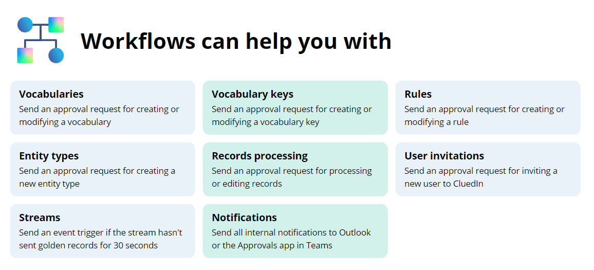
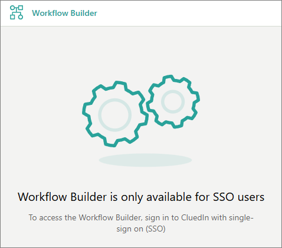
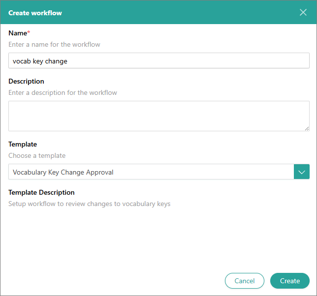
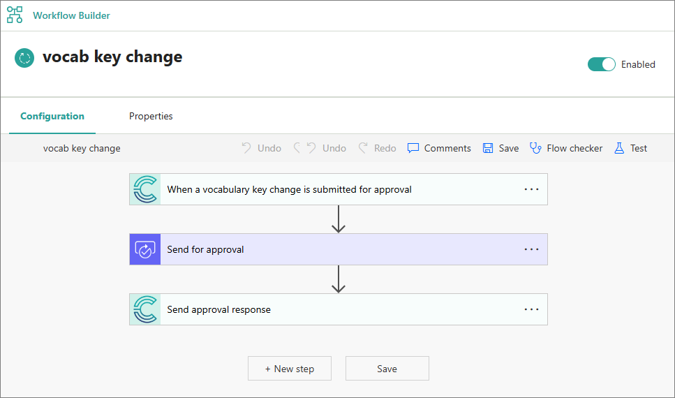
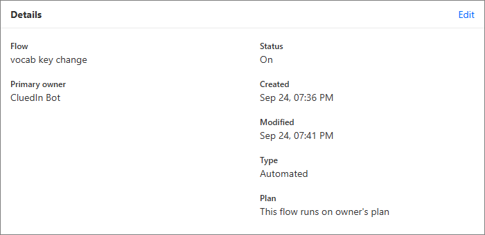
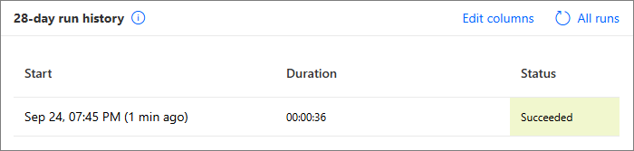

## On this page
{: .no_toc .text-delta }
- TOC
{:toc}

{:.important}
To use the **Workflow** module in CluedIn, you need to configure [Power Automate integration](/microsoft-integration/power-automate).

In this article, you will learn how to create workflows for automating certain approval processes. With workflows, you can easily streamline and track such processes as modifying vocabularies, inviting users, creating rules, and more.

## Workflow templates

Currently, you can automate the approval process for certain actions in CluedIn. The following table provides the description of such actions along with the name of the workflow templates.

| Action in CluedIn | Workflow template | Description |
|--|--|--|
| A stream being idle | Stream Idle Event | If the stream has not streamed golden records for 30 seconds, the idle stream event is triggered. |
| Vocabulary creation* | Vocabulary Change Approval | If somebody tries to create a new vocabulary, an approval request is sent to the users with the same or higher claim access level. |
| Vocabulary modification | Vocabulary Change Approval | If somebody tries to make changes to the vocabulary, an approval request is sent to the owners of the vocabulary. |
| Vocabulary key creation* | Vocabulary Key Change Approval | If somebody tries to create a new vocabulary key, an approval request is sent to the users with the same or higher claim access level. |
| Vocabulary key modification | Vocabulary Key Change Approval | If somebody tries to make changes to the vocabulary key, an approval request is sent to the owners of the vocabulary key. |
| Processing new records** | Batched Clues Approval | If somebody tries to process new records, an approval request is sent to the users with the same or higher claim access level.
| Editing a property in the record** | Batched Clues Approval | If somebody tries to edit a property in the record, an approval request is sent to the users with the same or higher claim access level.
| Rule creation* | Processing Rule Change Approval | If somebody tries to create a new rule, an approval request is sent to the users with the same or higher claim access level. |
| Rule modification | Processing Rule Change Approval | If somebody tries to make changes to the rule, an approval request is sent to the owners of the rule. |
| Business domain creation* | Entity Type Change Approval | If somebody tries to create a new business domain, an approval request is sent to the users with the same or higher claim access level. |
| Receiving internal CluedIn notifications | Notification | If somebody receives an internal notification in CluedIn, the same notification is sent to the external systems such as Outlook or the Approval app in Teams. |
| Inviting a new user to CluedIn | User Invite Approval | If somebody tries to add a new user to CluedIn, an approval request is sent to the users with the same or higher claim access level. |

_* The approval requests for these actions are sent only if the **Approvals for creating items** option is enabled in [workflow settings](/microsoft-integration/power-automate/configuration-guides)._

_* *The approval requests for this action are sent only if the [business domain](/management/entity-type) of the records has the **Batch approval workflow** option enabled._

{:.important}
One action can be used only in one workflow. For example, if you created a workflow with the Vocabulary Change Approval action, you can't select this action in another workflow.

If you don't create a workflow to automate the approval process for a specific action, no external approval requests will be sent to the users. However, the internal approval process is still in place, so the responsible users will receive change requests in CluedIn.

## Create a workflow

If you want to automate the approval process for actions mentioned in the previous section, create a corresponding workflow.

Only SSO users can create workflows in CluedIn. If you see the following message when trying to create a workflow, it means you are not signed in as an SSO user and will not be able to set up a workflow.

**To create a workflow**

1. On the navigation pane, go to **Workflow** > **Workflow Builder**.

1. Select **Create Workflow**.

1. Enter the name of the workflow.

1. Select the template for a workflow. The name of the template corresponds to the action that triggers the approval flow.

1. Select **Create**.

    

    Creating a workflow might take some time because it is being sent to Power Automate. After the workflow is created, you can view it in the Power Automate widget in CluedIn.

1. Review the workflow steps. In all workflows, except for Notification and Stream Idle Event, each step is configured automatically. However, if needed, you can modify the **Send for approval** step, which contains approval request title and details. We do not recommend modifying the **Send approval response** step.

    In the Notification and Stream Idle Event workflows, you need to add and configure an action to send a notification to the desired external system.

1. Turn on the toggle next to the workflow status to enable it.

    

    Now, when the action that triggers the workflow is executed, the approval request is sent to the responsible users in Outlook or Approvals app in Teams.

## View workflow details

After the workflow is created, it is displayed in the Power Automate widget in CluedIn. Each workflow contains two tabs:

- **Configuration** – here, you can view the flow steps: the action that triggers the flow, the approval action that sends the approval request, and the approval response action that sends the response back to CluedIn.

- **Properties** – here, you can view the flow details in the following sections:

    - **Details** – find the name, status, and creation and modification dates. You can also add or edit the workflow description by selecting **Edit**.

        

    - **28-day run history** – find the flow run history from the last 28 days. To view the details of a specific flow run, select it from the **Start** column. You can view the specific action that triggered the flow and the response that came back to CluedIn.

        