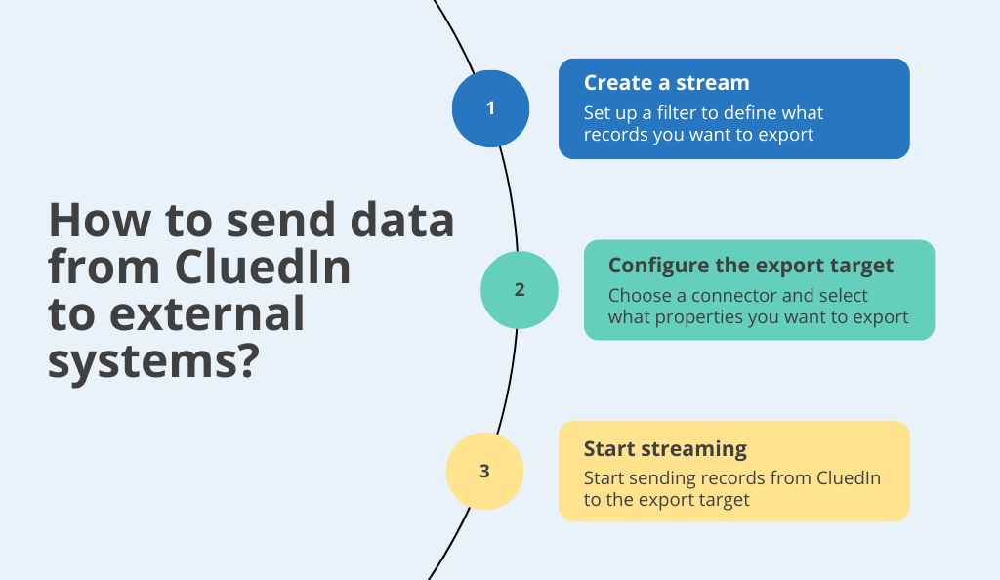

When you have the ready-to-use data in CluedIn, you can send it to any external system where the data can be used for executing various business tasks.

The following diagram shows the basic steps of sending the records from CluedIn to an external system.

When you start the stream, all records matching the stream's filters will be sent to the external system (target). If new records appear in CluedIn and they match the stream's filters, they will be automatically sent to the target. In addition to that, if you make any changes to the records in CluedIn—for example, fix some values by running a [clean project](/preparation/clean)—these changes will be automatically made in the corresponding records stored within the target.

This section covers the following areas:

- [Creating a stream](/consume/streams/create-a-stream) – learn how to create a stream, configure the export target for the stream, and define which golden records and specific properties to send to an external system.

- [Managing streams](/consume/streams/manage-streams) – learn how to edit a stream and work with the stream controls, as well how these actions affect the stream.

- [Reference information about streams](/consume/streams/stream-reference) – find information about stream statuses and other stream indicators.