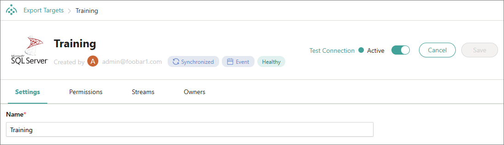
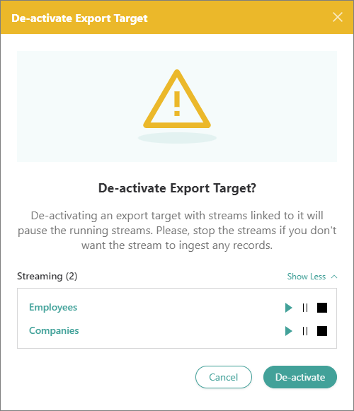

## On this page
{: .no_toc .text-delta }
1. TOC
{:toc}

Export targets are used for connecting with an integration point (also referred to as target), enabling CluedIn to send records to it using a [stream](/consume/streams). Examples of integration points include the following:

- Business intelligence tools

- Data warehouse dimension tables

- Machine learning platforms

- Custom applications

- Databases

Here are two examples of how to build a new Export Target:

- [SQL Server](https://github.com/CluedIn-io/CluedIn.Connector.SqlServer)

- [Snowflake](https://github.com/CluedIn-io/CluedIn.Connector.Snowflake)

See the full list of public implementations of CluedIn Export Targets [here](https://github.com/CluedIn-io?q=connector).

In this article, you will learn how to configure and manage an export target that can receive records sent from CluedIn.

## Configure an export target

You can configure a predefined export target provided with CluedIn (such as SQL Server Connector or Azure Event Hub Connector). You can also write a custom connector using the CluedIn NuGet package; however, it requires C# knowledge and the actual external service.

**To configure an export target**

1. On the navigation pane, go to **Consume** > **Export Targets**. Then, select **Add Export Target**.

    The **Add Export Target** pane opens, where you can select and configure the needed export target.

1. On the **Choose target** tab, select the external system you want to establish a connection with. Then, select **Next**.

1. On the **Configure** tab, enter the connection details. The list of fields that you need to complete depends on the selected export target. For example, for the Microsoft SQL Server export target, you need to provide the Host, Database Name, Username, and Password.

1. Test the connection to make sure it works, and then select **Add**.

1. On the export target details page, turn on the status toggle to activate the export target so that it can receive the records sent from CluedIn.

    You configured the export target. Now, it can be attached to the stream.

## Manage an export target

On the export target details page, you can do the following:

- Test the connection to the export target.

    

- View the streaming modes supported by the export target:

    - **Synchronized** – the records in the export target mirror the records in CluedIn.

    - **Event** – the records in the export target are written as events (for example, Create, Insert, Update, Delete) each time an action occurs in CluedIn.

- Activate and deactivate the export target. When activating or deactivating the export target, you can view the streams linked to it as well as start, pause, or stop the needed streams.

    

- Review the export target health checks.

    CluedIn periodically checks the connection to the export target. If, for example, somebody has changed the password for the user connecting to the export target, the status health check would change to **Unhealthy**, letting you know that you need to check on the export target. After the issue is fixed, the status will go back to **Healthy** again. The **Partially Healthy** status indicates that some pods are reporting healthy and others are reporting unhealthy (for example, if there is a network issue where one pod is struggling to connect but the other pods can still connect).

- Edit the connection details.
