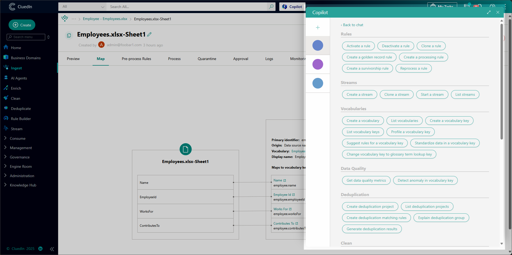
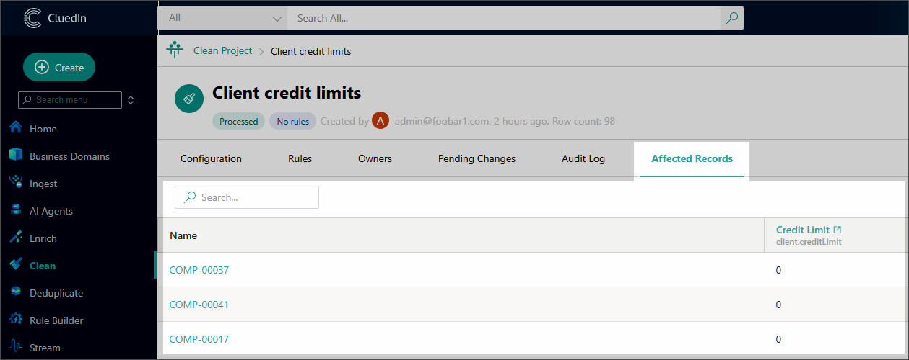

## On this page
{: .no_toc .text-delta }
- TOC
{:toc}

{:.important}

This article outlines new features and improvements in CluedIn 2025.09.

<iframe src="https://player.vimeo.com/video/1117475628?badge=0&amp;autopause=0&amp;player_id=0&amp;app_id=58479" frameborder="0" allow="autoplay; fullscreen; picture-in-picture; clipboard-write;" title="What&#039;s new in CluedIn 2025.09"></iframe>

**Presentation:** <a href="../../../assets/other/release/What's new in CluedIn 2025.09.pptx" download>Download PPT</a>

The following sections contain brief description of new features and links to related articles.

## AI agents
You can now take the manual effort out of data quality with **AI-powered agents** that handle routine, time-consuming tasks for you, including:

- Detecting duplicate records.
- Identifying and fixing data quality issues.
- Suggesting and creating data quality rules.

Two built-in agents are available out of the box, and you can also create custom agents tailored to your needs. Our AI agents work with all popular LLMs including OpenAI, so you can choose between free options or more advanced paid models.

For more information, see [AI agents](/management/ai-agents).

## Copilot upgrade
The upgraded **CluedIn Copilot** takes automation even further, handling most master data management and data quality tasks that previously required manual work.

Available actions include:
- Data mapping.
- Detecting and flagging invalid values.
- Fixing formatting and enrichment issues.
- Generating rules from natural language.

You can now launch entire workflows from a single prompt.

## Tag monitoring
The new **Tag Monitoring module** is now available under **Governance**. With this module, you can:
- Monitor in near real-time how the quality of your data evolves.
- Track tag usage trends and identify recurring data quality issues.

The module shows:
- A full list of tags used across the system.
- Details about the golden records tagged.
- Statistics on tag usage over time.

The module doesn't just provide insight, it empowers action. You can use our new AI agents to fix tagged records automatically and at scale.

The Home page also features the **Top tags by golden record count** chart. It displays the top 5 most used tags based on the number of records flagged with them, making it easy to uncover recurring data issues at a glance.

For more information, see [Tag monitoring](/governance/tag-monitoring).

## Relations Explorer upgrade

The redesigned **Relations Explorer** on the golden record page gives you a deeper, clearer view of your data connections. You can now:

- Filter data by direction (incoming, outgoing, or both), business domain, and relation type.
- Search for golden records by name.
- Load and explore multiple levels of golden records.
- View detailed information about a record or its relations.

For more information, see [Golden record relations](/key-terms-and-features/golden-records/golden-record-relations).

## Rule Builder: logging and affected records

The rule details page now includes two new tabs for greater visibility and oversight:

- **Log** – displays any issues that occur while a rule is processing the data, helping you quickly spot and resolve problems.

- **Affected Records** – shows all golden records that were changed by the rule, helping you track and review the updates.

    

## Clean module: affected records
Every clean project now includes the new **Affected Records** tab, which shows all golden records changed as part of the clean project—helping you track and review the impact of your cleanup.

## Schema protection for ingestion endpoints
You can now use the new **Schema Protection** feature to ensure that incoming data matches the expected structure:

*   When enabled, CluedIn automatically validates incoming records against the defined schema and field mappings.

*   Records that don’t conform are moved to quarantine, giving you full visibility to review and resolve the issues.

For example, you expect employee data, but company data slips through—schema protection will catch it and send it to quarantine.

Schema protection can be enabled from the **Process** tab of any dataset imported through an ingestion endpoint.

For more information, see [Schema protection](/integration/endpoint#schema-protection).

## Improved navigation experience
The **new navigation menu** makes it faster and easier to reach the areas you use most:
- Frequently used modules (such as Home, Business Domains, and so on) are now pinned to the top for one-click access.

    
- Each such module includes a submenu for instant navigation to the exact page you need.

    
- Modules that you haven't used yet feature onboarding videos to help you get started. You can revisit the videos anytime on the [documentation portal](/quick-feature-tour).

    
