## On this page
{: .no_toc .text-delta }
- TOC
{:toc}

{:.important}

This article outlines new features and improvements in CluedIn 2026.01.

<iframe src="https://player.vimeo.com/video/1152230392?badge=0&amp;autopause=0&amp;player_id=0&amp;app_id=58479" frameborder="0" allow="autoplay; fullscreen; picture-in-picture; clipboard-write;" title="What&#039;s new in CluedIn 2026.01"></iframe>

**Presentation:** <a href="../../../assets/other/release/2026.01-release.pptx" download>Download PPT</a>

The following sections contain brief descriptions of new features and links to related articles.

# 2026.01 release overview

The **2026.01 release** focuses on simplifying the CluedIn user experience for data stewards by improving core workflows and reducing everyday friction.
This release introduces a refreshed UI and navigation, along with major usability improvements to Search, Golden Records, and Explain Logs. Editing data, managing relations, and understanding how golden records are created is now faster and more intuitive, with consistent filtering and in-place editing across key areas of the product.

## General UI/UX improvements
Based on ongoing user feedback, this release introduces a series of UI and UX improvements focused on making CluedIn easier to navigate, clearer to understand, and more efficient to use in day-to-day data stewardship work.

### New Theme: Radiant

We’ve introduced a new default theme, **Radiant**, to improve visual clarity and consistency across the platform. The updated color palette and contrast enhance readability, particularly on data-dense screens, making it easier for users to work comfortably for longer periods of time.

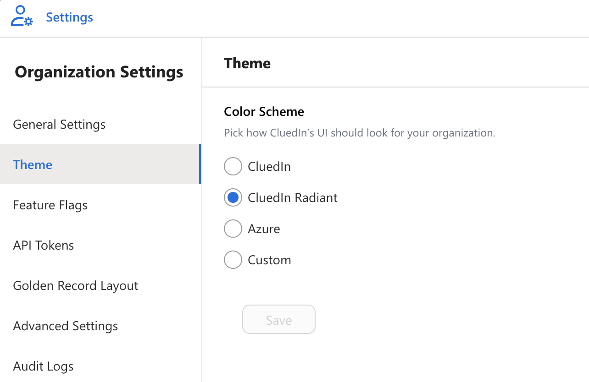

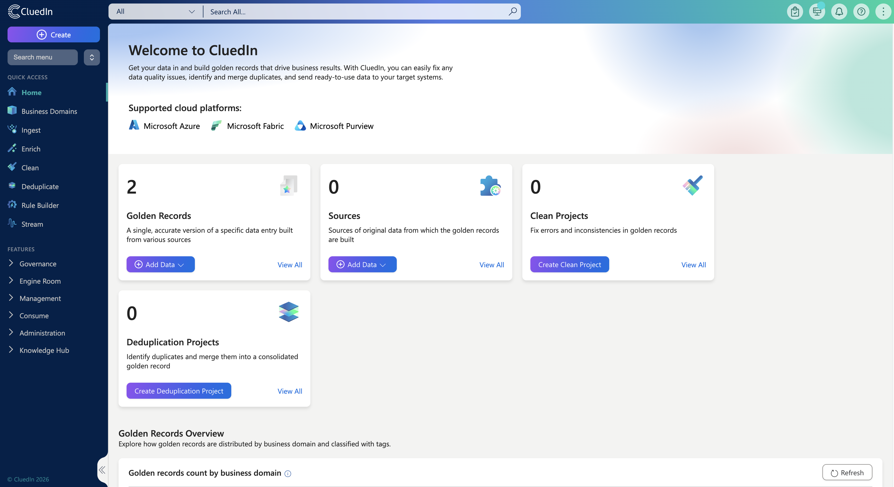

### New Main Menu

The main navigation has been redesigned to make it easier to find and access key areas of the platform. Related functionality is now grouped more logically, and the new menu provides **quick access to commonly used areas**, reducing the time it takes for users to move between tasks and workflows.

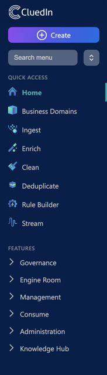

### New Administration Menu

As the platform has grown, administrative settings had become spread across multiple areas. To address this, we’ve consolidated administration into a clearer structure.
-   **Organization settings**  
    All organization-level configuration is now available on a single page with sub-navigation.

    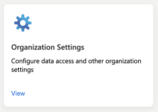
    
-   **User settings**  
    All user-specific preferences and settings are now located on one dedicated page.

    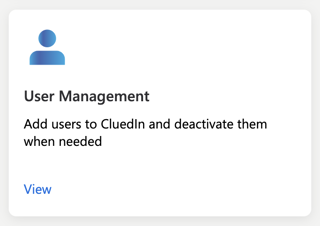

### Role-Based Menu Visibility

Menu items can now be hidden according to each user’s access, showing only the functionality available to them. This creates a more streamlined experience, improves clarity around permissions, and helps users navigate their role with confidence.

 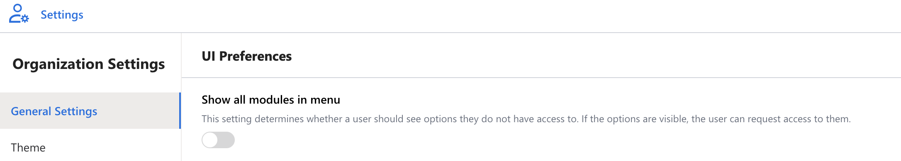

### Performance Improvement - Dataset Loading

This release introduces performance enhancements to the Dataset loading experience, optimised for large and complex datasets. The result is faster page loads and more seamless interactions when accessing and reviewing data.

## Global Audit Logs

A centralized view of system activity, allowing users to track changes to rules, deduplication configurations, and dataset removals from a single page. This makes it easier to understand what has changed over time and to support auditing and troubleshooting needs.

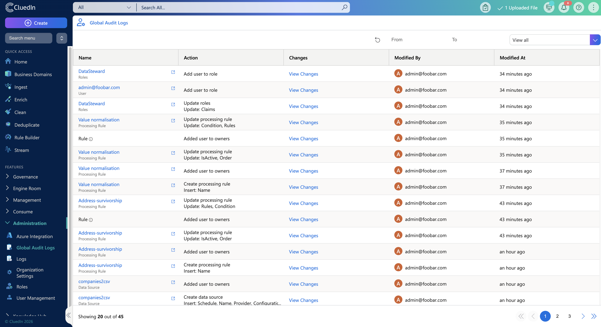

## New Features

### New Data Source Delete Workflow

Managing data sources previously required multiple repetitive steps, especially when working with larger or grouped sources. Based on user feedback, we’ve introduced a new deletion workflow that allows entire data sources or groups to be removed in a single action, provided the user has the required permissions. This reduces operational effort while maintaining control and safety.

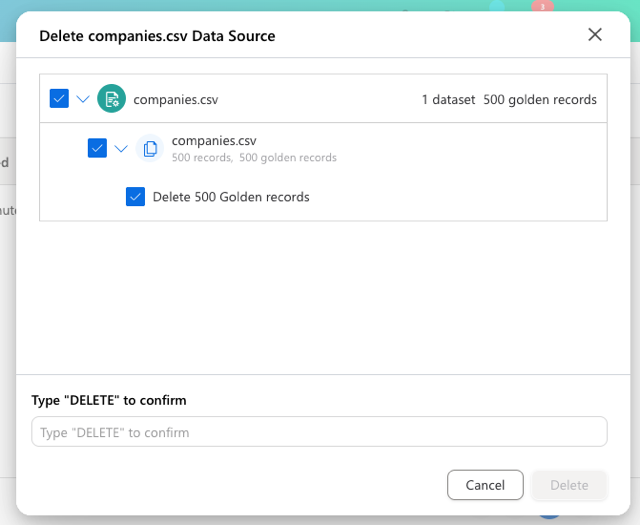

### Over-Merging Protection

To help prevent incorrect data consolidation, we’ve introduced **Over-Merging Protection**. This feature is designed to safeguard against unintentionally merging records that represent different real-world entities, a common risk in large and complex datasets.
Over-Merging Protection adds additional checks and constraints during the merge process, ensuring that only records that truly belong together are combined into a single Golden Record. This helps data stewards maintain trust in their master data, reduces the risk of data corruption, and makes merge decisions more transparent and controlled — especially in high-volume or automated matching scenarios.

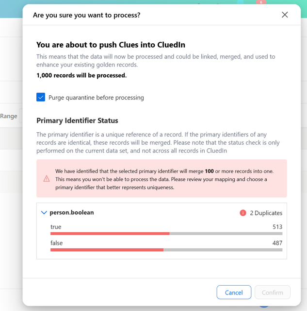

You can set the thresholds that make the over-merging protection step in with the **Allowed Entity Operations** organization settings

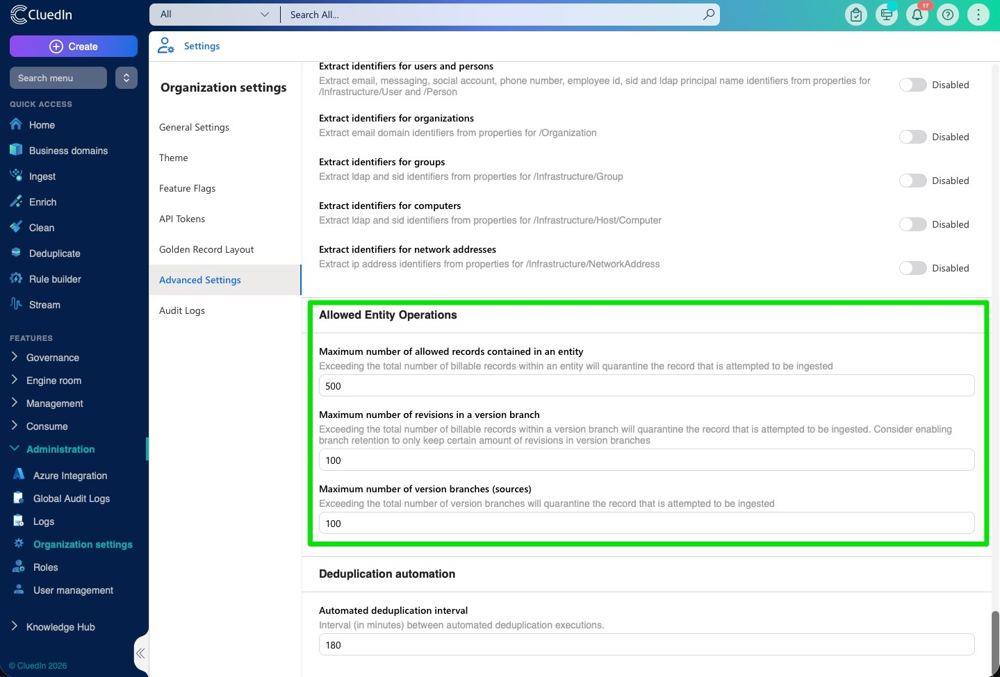

### New Golden Record Experience

The Golden Record experience has been redesigned with a set of new dedicated pages.The Golden Record sits at the core of the data steward experience. These changes were made to reduce complexity and make it easier to understand, validate, and manage records throughout their lifecycle.

#### New Overview Page
The new Overview Page provides immediate context when opening a Golden Record. By surfacing key information upfront, users can quickly understand the state of a record without navigating through multiple tabs.

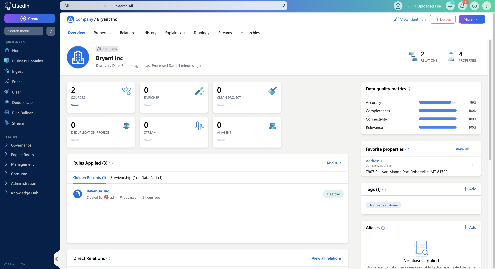
 
#### New Property Page
The new Property Page centralises all editable attributes in one place, making it easier to update information quickly, maintain consistency, and stay focused while editing.
    
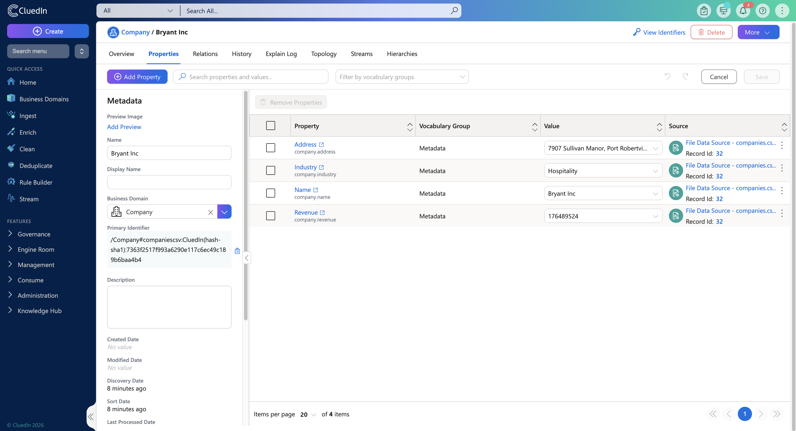

#### New Relation Page

Understanding relationships between records is essential for data quality and lineage. The redesigned Relation Page makes it easier to explore and manage these connections by allowing users to add and edit relations directly within the Relations tab. Advanced filtering aligned with the Global Search experience helps users quickly find relevant relationships, even in complex datasets.

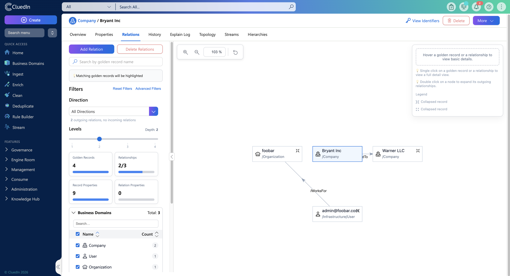
    
#### New Simplified Explain Log Page
The Explain Log is a critical tool for understanding how Golden Records are created, but it was often difficult to interpret. The simplified Explain Log focuses on the most relevant information, reducing noise and making it easier to validate outcomes, understand rule execution, and troubleshoot issues.
    
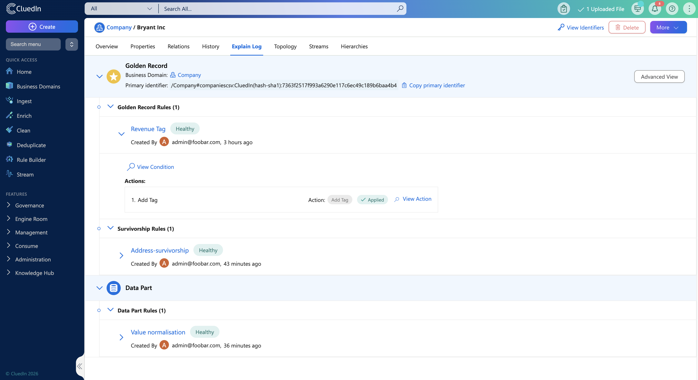

### New Search Page UX

The Search page has been redesigned to better support data stewards, delivering a more efficient and intuitive experience. Filters are now always visible in a left-hand panel, allowing quick access to filtering and key record information when working with Golden Records. Advanced filters have been simplified, and recent searches are automatically saved, making it easy to return to previous queries.

Vocabulary key values can also be edited directly from the Search page. With inline editing for text, boolean, and reference data values, users can quickly refine Golden Records without interrupting their workflow.

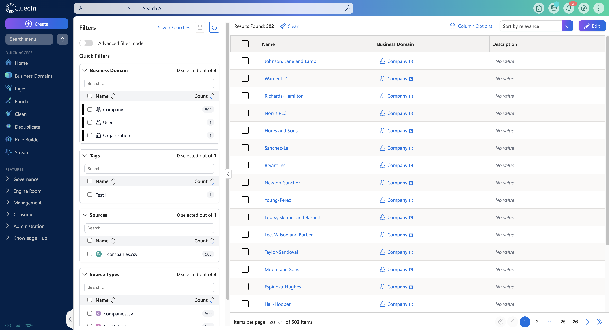

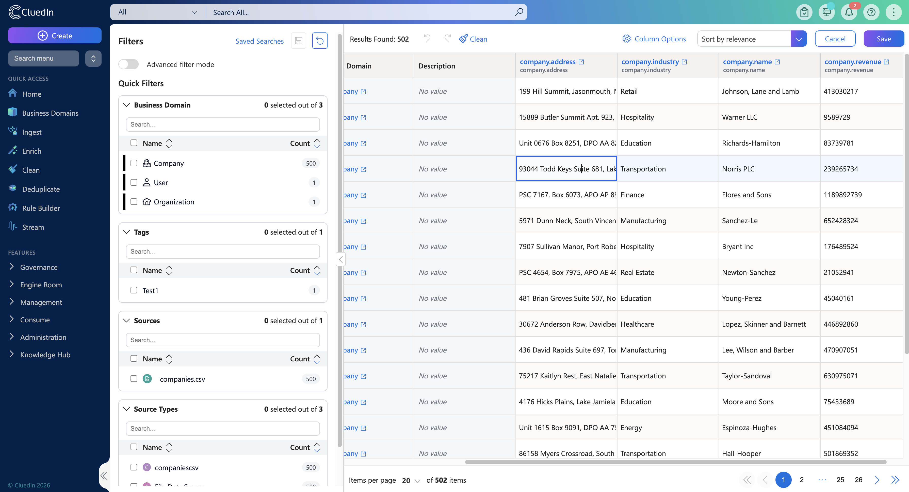

## AI Job Builder Updates

### Profile Data Source

A new **Profile** data source type has been added to the **AI Job Builder**.
This data source is designed for AI skills that operate on aggregated or profile-level data rather than processing entities row by row, enabling more efficient execution for rule- and analysis-based jobs.
Typical use cases include:
*   Fix Data Quality Issues With Rules
    
*   Create Data Validation Rules

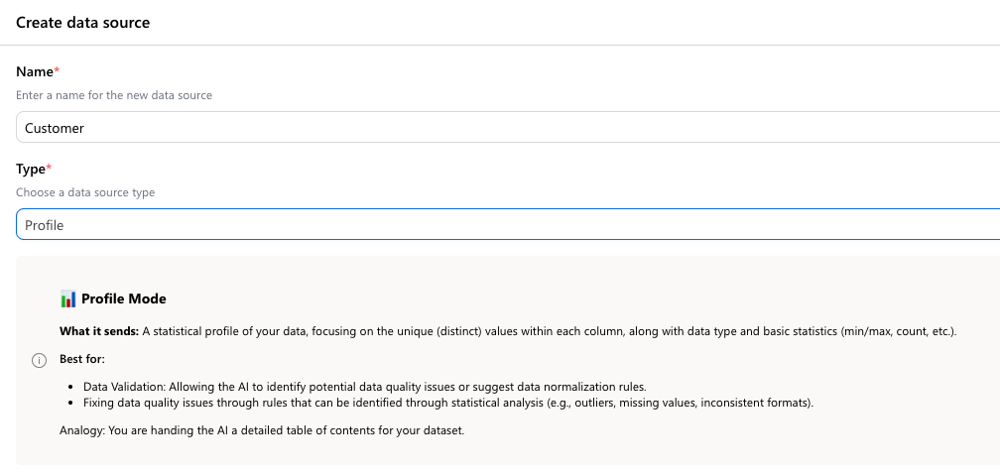
    
## New AI Skills

Two new AI skills have been added to support automated job creation and data enrichment.

### Create AI Jobs

This skill analyses the provided data and automatically creates additional AI Jobs using other available AI skills where appropriate, reducing the need for manual job setup.
For example, based on detected data characteristics, it may create jobs to:
*   Generate data validation rules
    
*   Fix data quality issues
    
When using this skill:
*   Enable **Sampling** when working with a **Query** data source, or
    
*   Use the **Profile** data source available in the **AI Job Builder**   

### Enrich Data

This skill uses AI to enrich existing data by filling in missing or incomplete values, helping improve overall data completeness.

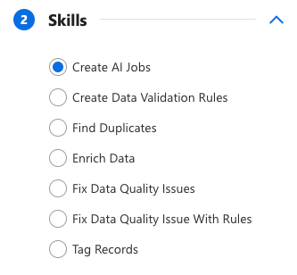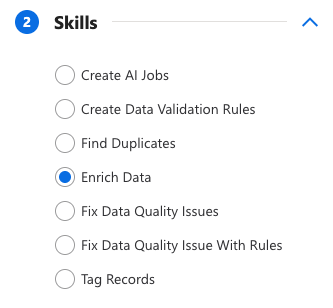