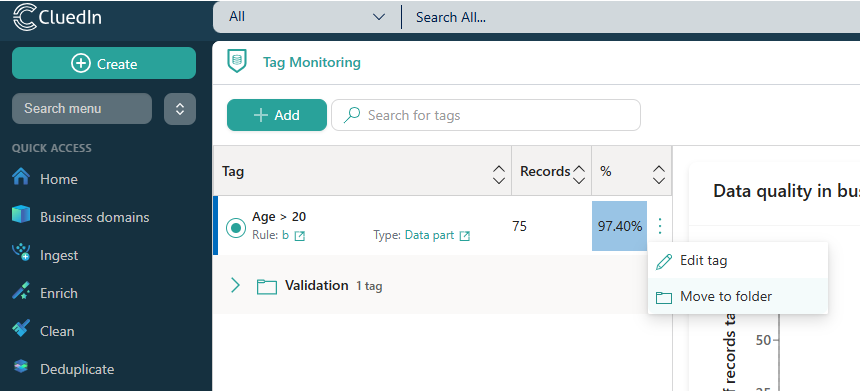
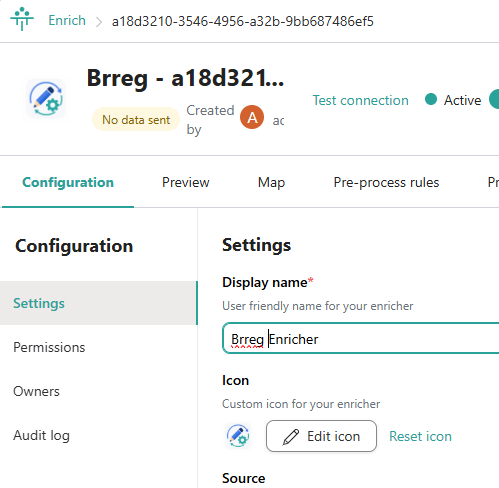
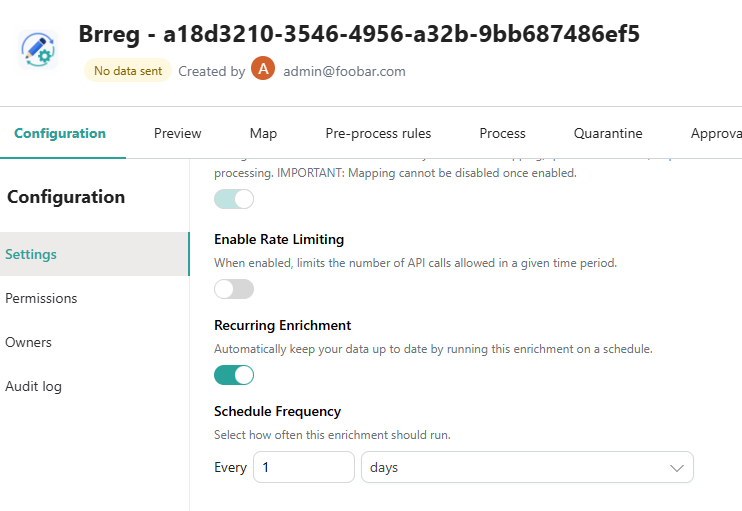
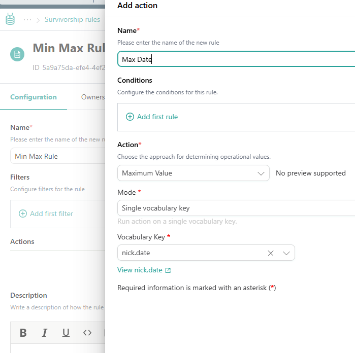
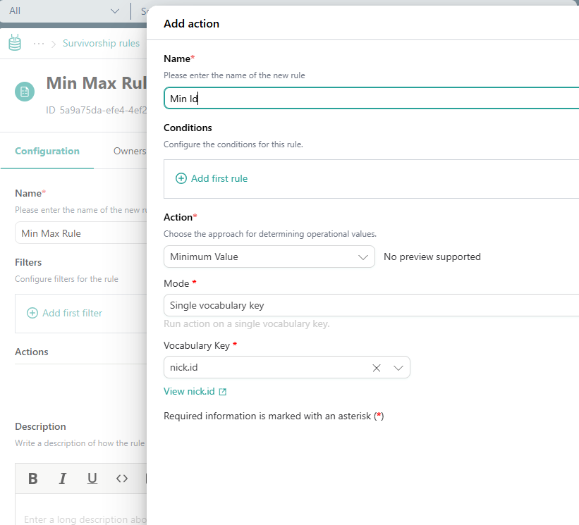
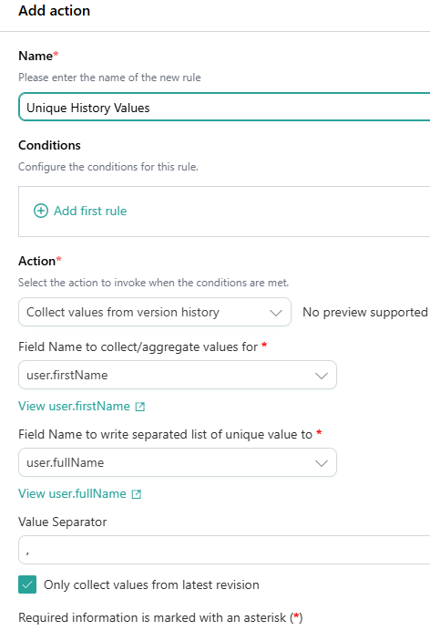
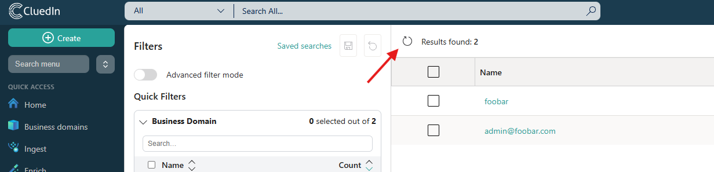

## On this page
{: .no_toc .text-delta }
- TOC
{:toc}

{:.important}

This article outlines new features and improvements in CluedIn 2026.02.

The following sections contain brief descriptions of new features and links to related articles.

# 2026.02 release overview

The **2026.02 release** is a smaller more focused release with a focus on stability and resolving issues. Taht being said we still found time to include some small features to improve the flexibility and UX of CluedIn.

### Datasource Stability/Performance improvements

This release delivers a significant investment in the stability, resilience, and performance of the CluedIn MicroServices platform. Processing pipelines have been made more reliable through improvements to ingestion, mapping, dataset processing, delete workflows, reducing failures, automatically recovering from stuck submissions and improving overall operational resilience. Performance has been enhanced by reducing memory consumption during ingestion and data source processing, optimizing expensive API operations, dataset retrieval and improving Elasticsearch validation and index management. Additional platform hardening includes more robust service startup and configuration, improved RabbitMQ error handling, better health monitoring, and increased reliability across workers, mappings, and background processing. 

Overall, these changes reduce operational overhead while providing a more stable and performant processing platform.

### Tag Monitoring Folders

Tag Monitoring now supports folders, making it easier to organize and manage large collections of monitored tags. By grouping related tags into a logical folder structure, users can keep monitoring configurations well organized, navigate more efficiently, and maintain a cleaner workspace as the number of monitored tags grows.

### Enricher Improvements

Enrichers are now more customizable and easier to manage, with support for custom icons and flexible user-defined scheduling. Custom icons make it easier to visually distinguish enrichers throughout the platform, while configurable schedules allow enrichment jobs to run automatically at times that best suit your organization's workflows, reducing manual effort and improving operational efficiency.

### New Survivorship Actions

You can now add a survivorship rule action to choose the Min/Max value. This can be useful if you are tracking an ID for example. This works nicely with the new "Auto Increment" rule action.

### New Rule Actions

#### Unique values (Collect Values From Version History)
Golden record rules can now collect unique values from a record's version history and populate another vocabulary key, with a configurable delimiter.

#### Auto incrementing values
You can add an action to add an auto incrementing number to each record. We do not guarantee that the numbers will be consecutive but they will be unique at the time of generation. You can also optionally set a min and max value to this auto incrementing value.

### Refresh Actions

Most list views across CluedIn can now be refreshed on demand, giving users immediate access to the latest data without leaving the page. This reduces unnecessary navigation, keeps information up to date, and provides a smoother, more efficient experience when monitoring changes or ongoing processes.

