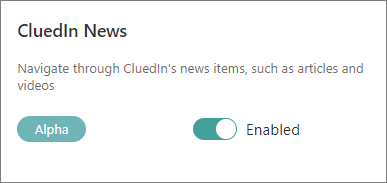

## On this page
{: .no_toc .text-delta }
- TOC
{:toc}

This article outlines new features and improvements in CluedIn 2024.12.

<iframe src="https://player.vimeo.com/video/1022433226?badge=0&amp;autopause=0&amp;player_id=0&amp;app_id=58479" frameborder="0" allow="autoplay; fullscreen; picture-in-picture; clipboard-write" title="What's new in CluedIn 2024.12">

## New home dashboard

New, interactive home dashboard provides quick and simple access to the most important elements in your master data management project. It consists of 4 parts:

- **Cards** with the information about golden records, sources, clean projects, deduplication projects, and streams. Each card contains the number of corresponding items, link to the relevant area of the application, and link to documentation.

- **Charts** that provide a comprehensive view over all of your business domains used for organizing golden records. Just hover over an element on the chart, and you’ll see the number of golden records belonging to a specific business domain.

- **Statistics** on billable records, users, business domains, vocabularies, and vocabulary keys.

- **Useful links** to documentation and resources, where you can find help and guidance on various activities in CluedIn.

To access new home dashboard, turn on the corresponding feature [flag](/feature-flags).

## Access control

Access control gives you fine-grained control over who can view specific golden records and vocabulary keys. Together with source control (previously, global security filter), access control helps you configure reliable and secure access to data in CluedIn. For more information, see:

- [Data access](/administration/user-access/data-access) – here, you'll find details about the combination of source control and access control.

- [Access control](/management/access-control) – here, you'll find instructions on how to create and configure an access control policy.

## Role access status

Role access status provides better visibility and transparency of the feature access that each role has. Now, you can see which actions are governed by each specific claim, and whether a role has access to a particular action. For more information, see:

- [Roles](/administration/roles) – here, you'll find a list of all CluedIn roles and an explanation of claims and access levels.

- [Feature access](/administration/user-access/feature-access) – here, you'll learn about the main settings that define access to CluedIn features: roles and ownership.

- [Claims](/administration/roles/claims) – here, you'll find detailed explanation of each claim used in CluedIn. 

To view role access status, turn on the corresponding feature flag.

## Exporting golden records

After performing a search, you can now export your results in one of the following formats: JSON, CSV, XLSX, or Parquet. For more information, see [Export search results](/key-terms-and-features/search#export-search-results).

To access the golden records export feature, turn on the corresponding feature flag.

## Workflows

New **Workflow** module is designed to help you streamline and track approvals and notifications for specific activities in CluedIn. When a change requires approval, an approval request is automatically sent to the responsible users via Outlook or the Approvals app in Teams, where they can approve or reject a change. However, keep in mind that the approvals and notifications that are sent outside of CluedIn are intended only for SSO users.

To access workflows, turn on the corresponding feature flag.

For more information on how to configure and use workflows, see [Workflows](/workflows).

## Deleting data parts and golden records

Previously, you could delete data parts by data source, which resulted in removing those data parts from every golden record where they were used. Now, you can delete individual data parts from a specific golden record. For more information, see [Delete individual data parts](/golden-records/delete-data-parts-from-golden-records).

In addition, now you can also delete a golden record. However, keep in mind that deleting golden records is permanent and irreversible, so carefully consider which golden records you want to delete. For more information, see [Delete golden records](/golden-records/delete-golden-records).

## History of golden record relations

Now, you can view all outgoing relations for a golden record on the **History** tab. Here, you can view edge properties, filter edges by type or property, easily find edge details, or delete an edge if you no longer need it.

## Data set filters and operations

Data set filters and operations help you analyze uploaded data and make changes to it on the **Preview** tab of the data set. This is useful when you want to prepare your data for processing by fixing some data quality issues or editing the contents of the cell.

To access data set filters and operations, turn on the corresponding feature flag.

For more information, see [Data set filters and operations](/integration/additional-operations-on-records/preview#data-set-filters-and-operations).

## New export targets

Azure Data Lake, OneLake, and Dataverse have been added to the list of predefined export targets. In addition, now you can add a user-friendly name to the export target. This way it will be easier to identify it in the list of export targets. For more information, see:

- [Azure Data Lake connector](/consume/export-targets/adl-connector) – here, you'll find the prerequisites and instructions for configuring the Azure Data Lake connector.

- [OneLake connector](/consume/export-targets/onelake-connectorr) – here, you'll find the prerequisites and instructions for configuring the OneLake connector.

## Knowledge hub

Knowledge hub is a place where you can quickly find helpful resources and documentation. It consists of 3 parts:

- **Documentation** – here, you can find links to the most important articles for each CluedIn module. To get access to documentation, turn on the **Knowledge Hub** feature flag.

    

- **Articles** – here, you'll find our news and articles with insights and industry best practices.

- **Videos** – here, you'll find webinars, events, and discussions on various topics.

    To get access to articles and videos, turn on the **CluedIn News** feature flag.

    

## Help panel

Help panel is a place where you can quickly report any issues you encounter while using CluedIn, as well as let us know about your ideas for improvements and new features.

