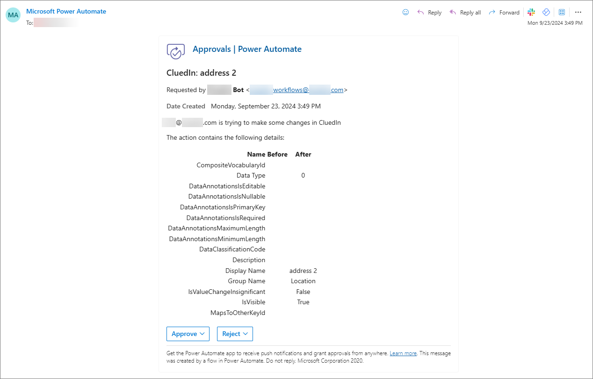
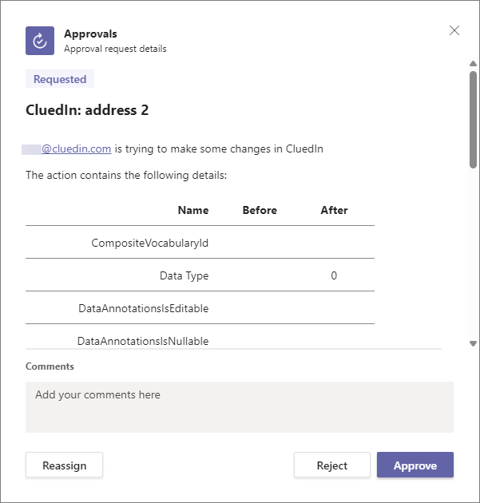
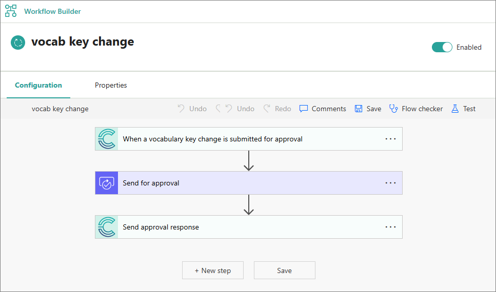
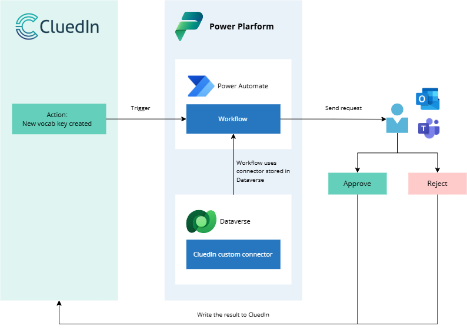

Power Automate is a key component of the Power Platform, which is Microsoft's suite of tools designed for low-code development, automation, and data analysis. Power Automate allows you to create, manage, execute, and automate workflows between various applications and services.

Power Automate can be integrated with CluedIn to **capture important events** in CluedIn and use them as **triggers to start workflows**. Such events include creating or modifying a vocabulary key, processing new records, inviting a new user, and more. When the workflow is started, it sends **approval requests** or **notifications** to the users in Outlook or the Approvals app in Teams. This way you can stay on top of certain processes in CluedIn, whether you are using the platform at the moment or not.

The following image is example of approval request in Outlook.

The following image shows an approval request in the Approvals app in Teams.

Power Automate can be connected with CluedIn with the help of our **CluedIn custom connector**. This custom connector enables you to create workflows in the Power Automate widget in CluedIn. This means that even though you create workflows in CluedIn, technically they are created in Power Automate.

The following screenshot shows an example of a workflow that is created in the Power Automate widget in CluedIn. The first and third actions of the workflow are provided by the CluedIn custom connector. The second action comes from the Approval connector, which is a standard Power Automate connector. Once you create a workflow in CluedIn, you do not have to configure these actions because they are automatically configured for you.

The CluedIn custom connector has predefined triggers that correspond to specific events in CluedIn. To install the CluedIn custom connector, you need to complete our [Power Automate pre-configuration guide](/microsoft-integration/power-automate/pre-configuration-guide) and [Power Automate configuration guide](/microsoft-integration/power-automate/configuration-guide).

{:.important}
The CluedIn custom connector is an underlying element of the integration between Power Automate and CluedIn. You cannot create workflows without CluedIn custom connector.

The CluedIn custom connector and its connector references are **stored in a Dataverse table** within a dedicated Power Platform environment. Therefore, it is essential to have a dedicated environment with Dataverse as the data store. Without Dataverse, there is no location to store the CluedIn custom connector, and the workflows will not function.

To use workflows in CluedIn, start from the [Power Automate pre-configuration guide](/microsoft-integration/power-automate/pre-configuration-guide).
