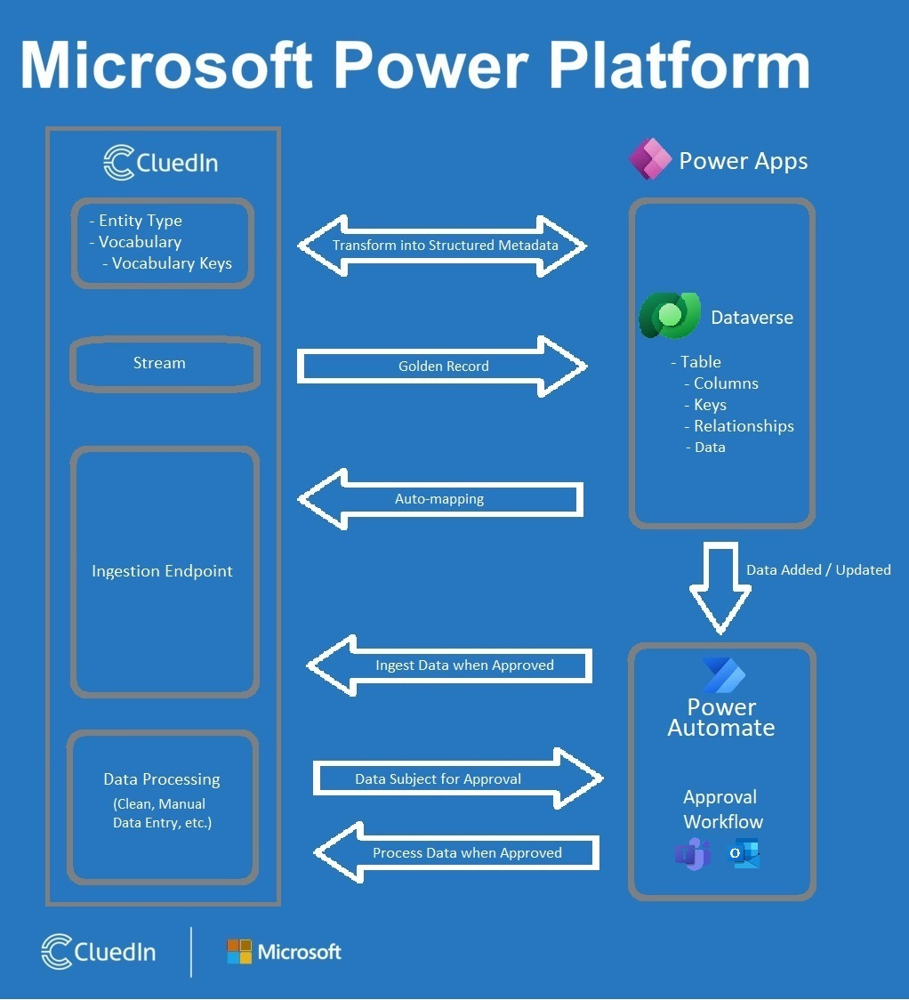

We are offering you an in-app experience for Power Apps and Power Automate. Now, you can build your workflows directly within CluedIn or manage your master data directly in Power Apps.

## Capabilities

This section describes the benefits of integration with Power Apps and Power Automate.

### Power Apps

Managing your master data directly in Power Apps (Dataverse) and automatically synchronizing the update with CluedIn via ingestion endpoint will make it easier for you to monitor the changes in your data. You can quickly see the changes in your data in CluedIn history.

Keep your golden record synced in the Dataverse table.

CluedIn supports 2 ways of synchronization with Dataverse.

| Dataverse                | CluedIn                       |
|:-------------------------|:------------------------------|
| Table Name: **Customer** | Entity type: **/Customer**    |
|                          | Vocabulary name: **Customer** |

| Dataverse |   | CluedIn |    |    |
|:----------|:--|:--------|:---|:---|
| _Colums_ | _Data type_ | _Vocabulary keys_ | _Data type_ | _Data mapping_ |
| Id | Unique Identifier | customer.id | Guid | Origin Entity Code |
| Name | Single line of Text _(Primary Column)_ | customer.name | Text | Display Name |
| Age | Whole Number | customer.age | Integer | |
| Birthday | Date and Time | customer.age | DateTime | |
| Gender | Choice | customer.email | Lookup | |
| Transaction | Lookup | customer.transactionId | Guid | Edge : _/Transaction_ |
| Email _(Key)_ | Single line of text | customer.email | Text | Entity Code |

CluedIn will use its streaming engine to sync golden records located in CluedIn with your Dataverse tables and uses its automated ingestion endpoint to synchronize new data coming from Dataverse.

### Power Automate

Using our Power Automate integrations, CluedIn can generate an approval sequence (that can be tailored) for accepting or rejecting data changed either from CluedIn to Dataverse or from Dataverse to CluedIn.

## Architecture

The following diagram illustrates how CluedIn interacts with Microsoft Power Platform.

- 2-way synchronization of Dataverse metadata to CluedIn entity types and vocabularies and vice versa.

- Keeping the golden record data in the Dataverse platform.

- Auto-mapping of columns, keys, and relationships.

- Approval workflow (approved through Teams or Outlook) for data change in the Dataverse table and pushing the data to CluedIn via ingestion endpoint.

- Approval workflow (approved through Teams or Outlook) during CluedIn clean or manual data entry data processing.

