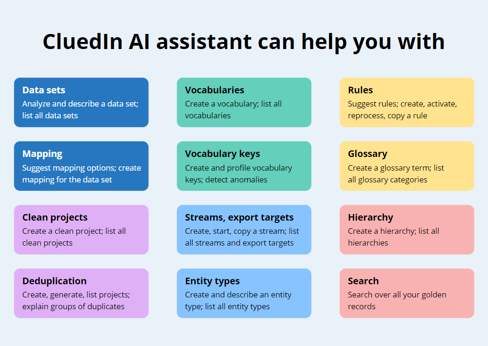

CluedIn Copilot is an AI assistant designed to streamline your interactions within the CluedIn platform using natural language commands. With the AI assistant, tasks such as adding tags to records based on specific criteria become effortless—simply prompt the assistant, and it automatically generates rules for you. The CluedIn Copilot experience can be personalized according to your language preference. In addition, you can always view detailed justifications of each action performed with the help of AI assistant.

The following diagram shows how CluedIn AI assistant can help you with your day-to-days tasks in CluedIn.

