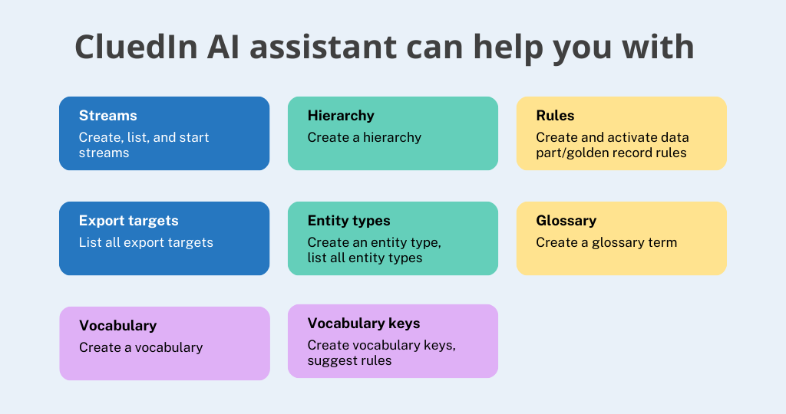
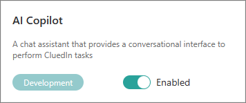
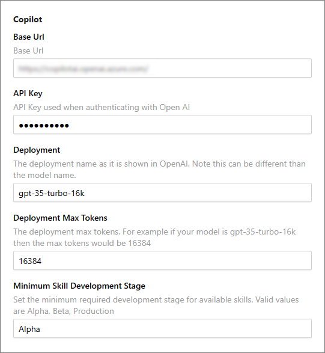

CluedIn AI Copilot is an AI assistant designed to streamline your interactions within the CluedIn platform using natural language commands. With the AI assistant, tasks such as adding tags to records based on specific criteria become effortless—simply prompt the assistant, and it automatically generates rules for you. The CluedIn AI Copilot experience can be personalized according to your language preference. In addition, you can always view detailed justifications of each action performed with the help of AI assistant.

The following diagram shows how CluedIn AI assistant can help you with your day-to-days tasks in CluedIn.

**For Azure Administrators and CluedIn Organization Administrators**

To make the AI assistant available in CluedIn, you need to fulfill several prerequisites:

1. In your Azure OpenAI resource, make sure that you have created a deployment that uses the **gpt-35-turbo** model.

1. Enable development features for your CluedIn instance. Depending on the type of CluedIn installation, do one of the following:

    - If you have CluedIn AMA, contact CluedIn support to get this feature in your system.

    - If you are running the local installation of CluedIn, in the **.env** file for your environment, set ENABLE_DEVELOPMENT_FEATURES to **true**, and then stop and start your CluedIn instance.

1. In CluedIn, go to **Administration** > **Feature Flags**, and then enable the **AI Copilot** feature.

    

1. In CluedIn, go to **Administration** > **Settings**. Scroll down to the **Copilot** section and complete the following fields:

    - **Base Url** – you can find this value in your Azure OpenAI resource. In Azure portal, go to **Resource Management** > **Keys and Endpoint**, and then get the value from the **Endpoint** field. Alternatively, you can find this value in Azure OpenAI Studio by going to **Playground** > **View code**.

    - **API Key** – you can find this value in your Azure OpenAI resource. In Azure portal, go to **Resource Management** > **Keys and Endpoint**. You can use either KEY 1 or KEY 2.

    - **Deployment** – specify the custom name you chose for your deployment when you deployed a model. In Azure portal, go to **Resource Management** > **Deployments**. Alternatively, you can find this value in Azure OpenAI Studio by going to **Management** > **Deployments**.

    - **Deployment Max Tokens** – specify the number of tokens that correspond to the [model](https://platform.openai.com/docs/models/moderation) used. The minimum number should be **16384**.

    - **Minimum Skill Development Stage** – specify which skills—alpha, beta, or production—you want to have available in CluedIn. Currently, almost all skills are **alpha**.

        

        For more information about the required variables, see [Microsoft documentation](https://learn.microsoft.com/en-us/azure/ai-services/openai/quickstart?tabs=command-line%2Cpython&pivots=programming-language-python#retrieve-key-and-endpoint).