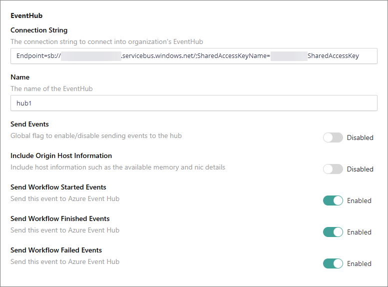
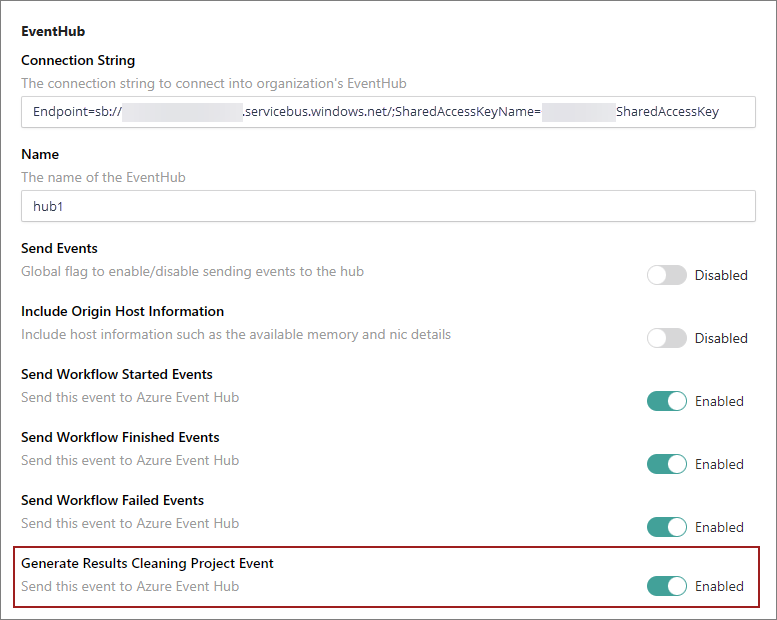
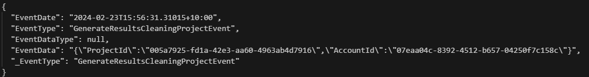

Event Hub integration enables the transmission of workflow events from CluedIn to your event hub. These events encompass various actions such as creating an entity type, publishing a hierarchy, creating a clean project, creating a deduplication project, splitting entities, processing clues, undoing deduplication, and many more. Essentially, any task featuring a progress bar in CluedIn is classified as a workflow event because it allows us to track the workflow's start and completion times.

**To connect CluedIn to Event Hub**

1. Create an event hub following the steps from [Microsoft tutorial](https://learn.microsoft.com/en-us/azure/event-hubs/event-hubs-create).

1. In CluedIn, go to **Administration** > **Settings**, and then scroll down to find the **EventHub** section.

1. Provide the **Connection String** to your event hub. To find the connection string:

    1. In your event hub, on the **Event Hubs Namespace** page, select **Shared Access Policies** on the left menu.

    1. Select a shared access policy in the list of policies. The default one is named **RootManageSharedAccessPolicy**. You can add a policy with appropriate permissions, and use that policy.

    1. Select the copy button next to the **Connection string-primary key** field.

        For more details, see [Get Event Hubs connection string](https://learn.microsoft.com/en-us/azure/event-hubs/event-hubs-get-connection-string#connection-string-for-a-namespace).

1. Enter the **Name** of your event hub that you created in step 1.

1. Choose the workflow events that you want to send from CluedIn to event hub. Enabling **Send Events** will automatically activate all events, while disabling it will deactivate all other events accordingly.

    Enabling **Include Origin Host Information** will send host details such as the pod's name, its allocated memory, and its IP address. This feature is useful for diagnostic purposes.

    

After you complete all the required fields in CluedIn settings and enable the necessary features, you'll begin receiving incoming messages on the **Event Hubs Namespace** page in the Azure portal. After at least one event has been generated, it will be displayed in the **Event Hub** section of CluedIn settings. All generated events will dynamically appear there.

You can also connect VS Code to your event hub to see the XML payload. The following screenshot shows an example of the message you will receive.

