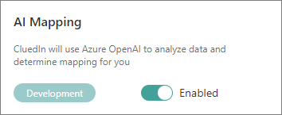
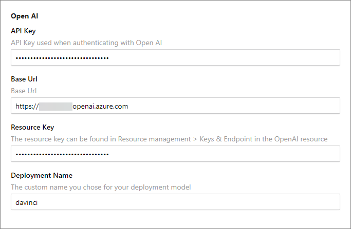

With Azure OpenAI integration, you can leverage AI capabilities to analyze data and determine mapping for you.

In this article, you will learn what you need to do to make the AI mapping available in CluedIn.

**For Azure Administrators and CluedIn Organization Administrators**

1. In CluedIn, go to **Administration** > **Feature Flags**, and then enable the **AI Mapping** feature.

    

1. Go to **Administration** > **Settings**. Scroll down to the **Open AI** section and complete the following fields:

    - **API Key** – you can find this value in your Azure OpenAI resource. In Azure portal, go to **Resource Management** > **Keys and Endpoint**. You can use either KEY 1 or KEY 2.

    - **Base URL** – you can find this value in your Azure OpenAI resource. In Azure portal, go to **Resource Management** > **Keys and Endpoint**, and then get the value from the **Endpoint** field. Alternatively, you can find this value in Azure OpenAI Studio by going to **Playground** > **View code**.

    - **Resource Key** – you can find this value in your Azure OpenAI resource. In Azure portal, go to **Resource Management** > **Keys and Endpoint**. Since you have already used one key in the **API Key** field, use the other key in the **Resource Key** field.

    - **Deployment Name** – this is the custom name you chose for your deployment when you deployed a model. You can find this value in your Azure OpenAI resource. In Azure portal, go to **Resource Management** > **Model Deployments**. Alternatively, you can find this value in Azure OpenAI Studio by going to **Management** > **Deployments**.

        

        For more information about the required variables, see [Microsoft documentation](https://learn.microsoft.com/en-us/azure/ai-services/openai/quickstart?tabs=command-line%2Cpython&pivots=programming-language-python#retrieve-key-and-endpoint).

**Notes on CluedIn's integration with Azure OpenAI**

CluedIn integrates with Azure OpenAI services solely to enable you to make requests and store responses through our platform.

To interact with Azure OpenAI services via CluedIn's Rule Engine, AI mapping, or Copilot, you must decide where to host Azure OpenAI, including which tenants and locations to use. CluedIn does not provide a default Azure OpenAI token; you must configure CluedIn with your own Azure OpenAI token. Selection of Azure OpenAI services and models within your environment is entirely at your discretion.

CluedIn transmits your prompts and the data contained within them to Azure OpenAI, giving you full control over the models and deployments used within your environment. Your prompts and results are also stored in CluedIn's SQL server to preserve your prompt history.

Please note that CluedIn cannot comment on how Azure OpenAI manages or processes data internally. Data handling by Azure OpenAI is governed solely by the agreement established directly between you and Microsoft Azure.