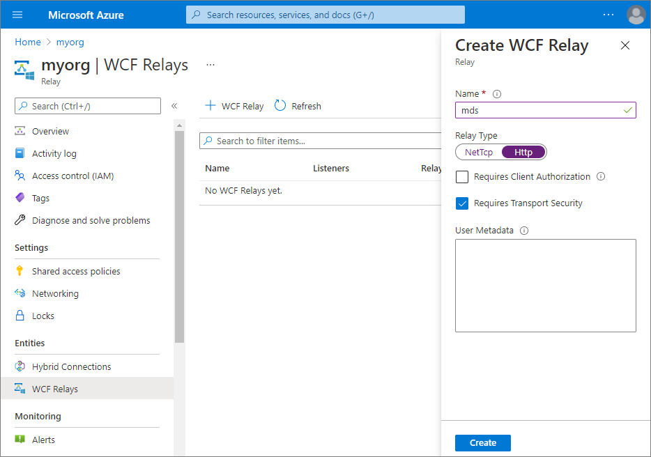
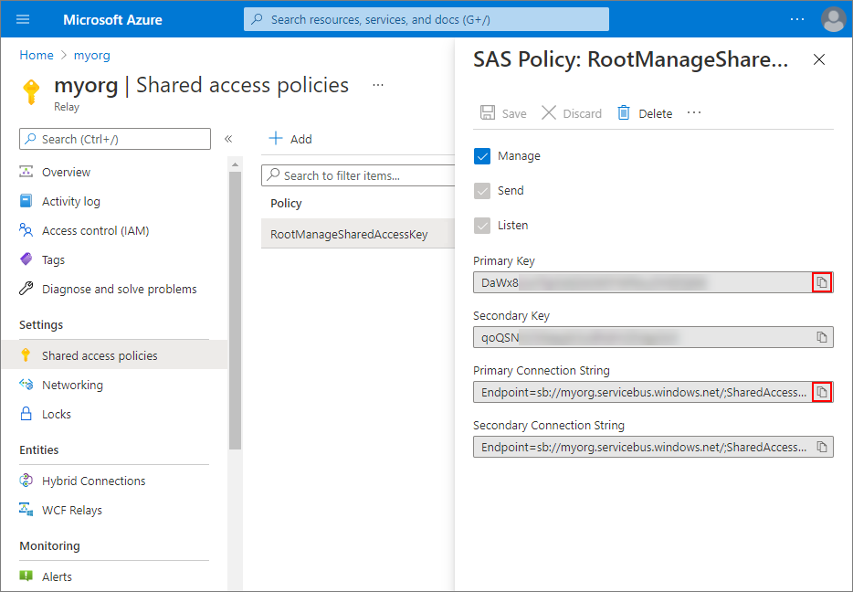

## On this page
{: .no_toc .text-delta }
- TOC
{:toc}


In this article, you will learn how to expose on-premises Master Data Services (MDS) to CluedIn in Azure by using Azure Relay.

 

**Prerequisites:**

- An outbound internet connection from on-premises MDS server.

- Administrator access to on-premises MDS server for one-time reconfiguration.

- An Azure subscription. If you don't have one, [create a free account](https://azure.microsoft.com/free/) before you begin.

## Set up Azure Relay

1. Sign in to the [Azure portal](https://portal.azure.com/).

2. Select **Create a resource**.

3. Search for **Relay**. Then, select **Create**.

     

4. In the **Subscription** field, select an Azure subscription in which to create the namespace.

5. In the **Resource group** field, choose an existing resource group in which to place the namespace, or create a new one.

6. In the **Name** field, enter a namespace name.

7. In the **Location** field, select the country or region in which your namespace should be hosted.

     

8. Select **Create**.

    The Azure portal creates your namespace and enables it. After a few minutes, the system provisions resources for your account.

## Create WCF Relay

1. Select **WCF Relays**, and then select **+ WCF Relay**.

2. In the **Name** field, enter _mds_.

3. In **Relay Type**, select **Http**.

4. Clear the **Requires Client Authorization** checkbox. Authorization will be performed by the MDS service itself.  

     

5. Select **Create**.

## Get management credentials

1. Select **All resources**, and then select the newly created namespace name.

2. Select **Shared access policies**, and then select **RootManageSharedAccessKey**.

4. In the **SAS Policy: RootManageSharedAccessKey** pane, do the following:

    - Select the **Copy** button next to **Primary Connection String**. This action copies the connection string to your clipboard for later use. Paste this value into Notepad or some other temporary location.

    - Select the **Copy** button next to **Primary Key**. This action copies the primary key to your clipboard for later use. Paste this value into Notepad or some other temporary location.

     

## Configure on-premises MDS server

1. Using IIS, locate the physical path for the MDS website. The default location for SQL Server 2019 Master Data Services is `C:\Program Files\Microsoft SQL Server\150\Master Data Services\WebApplication`.

2. Download [WindowsAzure.ServiceBus](https://www.nuget.org/packages/WindowsAzure.ServiceBus/) from nuget and extract **Microsoft.ServiceBus.dll** to the bin folder in the previously located path.

3. Make the following modifications to the `web.config` file in the previously located path. Note that you may need to create the parent nodes if not already present.

>Add the following behaviour to `system.serviceModel/behaviors/endpointBehaviors`.
>```xml
><behavior name="AzureRelay">
>    <transportClientEndpointBehavior>
>        <tokenProvider>
>            <sharedAccessSignature keyName="RootManageSharedAccessKey"
>                                   key="[YOUR_KEY]"/>
>        </tokenProvider>
>    </transportClientEndpointBehavior>
></behavior>
>```

>Add the `basicHttpRelayBinding` to `system.serviceModel/bindings`.
>```xml
><basicHttpRelayBinding>
>    <binding isDynamic="false">
>        <security mode="TransportWithMessageCredential"
>                    relayClientAuthenticationType="None">
>            <message clientCredentialType="UserName"/>
>        </security>
>    </binding>
></basicHttpRelayBinding>
>```

>Add the following to the `system.serviceModel/services/service` node whose `name` attribute matches your MDS service name. For a default install the name attribute will be `MDS1`.
>```xml
><endpoint address="https://[YOUR_NAMESPACE].servicebus.windows.net/mds"
>          binding="basicHttpRelayBinding"
>          contract="Microsoft.MasterDataServices.Services.ServiceContracts.IService"
>          behaviorConfiguration="AzureRelay"/>
>```

>Add the following to `system.serviceModel/extensions/behaviorExtensions`
>```xml
><add name="transportClientEndpointBehavior"
>        type="Microsoft.ServiceBus.Configuration.TransportClientEndpointBehaviorElement, Microsoft.ServiceBus"/>
>```

>Add the following to `system.serviceModel/extensions/bindingExtensions`
>```xml
><add name="basicHttpRelayBinding"
>     type="Microsoft.ServiceBus.Configuration.BasicHttpRelayBindingCollectionElement, Microsoft.ServiceBus"/>
>```

## Verify configuration

1. Verify the configuration by loading the service endpoint. For this, perform the sequence of steps as displayed on the following screenshot.

     

    As a result, you will see the screenshot similar to the following.

     

2. Verify that the on-premises MDS service has registered successfully with the Relay.

     