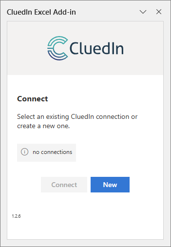
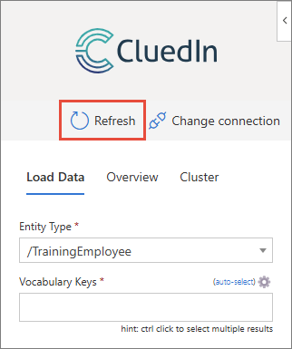

## On this page
{: .no_toc .text-delta }
- TOC
{:toc}

In this article, you will learn how to get the Excel Add-in, connect it to CluedIn, and use it to work with data. The add-in enables you to load the data from CluedIn into Excel, modify the data, and send the changes back to CluedIn.

## Add CluedIn Excel Add-in

The CluedIn Excel Add-in allows you to extend Excel application functionality across multiple platforms including Windows, Mac, and in a browser.

{:.important}
The CluedIn Excel Add-in is hosted on the internet. If you have a zero-trust corporate environment that restricts internet access, contact our support team at [support@cluedin.com](mailto:support@cluedin.com) to organize the installation into your tenant.

**To add CluedIn Excel Add-in**

1. In Excel, go to the **Home** tab, and then select **Add-ins**.

    

1. Select **More Add-ins**. In the search bar, enter _CluedIn_ and then start the search.

1. Next to the CluedIn Excel Add-in, select **Add**.

    

1. In the **License terms and privacy policy** dialog, select **Continue**.

    A new [group](#actions-in-cluedin-group) called **CluedIn** appears on the ribbon of the **Home** tab in Excel.

    

1. In the **New Office Add-in** pane, select **Allow and Continue**. If you do not see this pane, select **Show Taskpane** in the CluedIn group.

    As a result, the CluedIn Excel Add-in is added to your Excel application.

    

    Next, connect the add-in to your CluedIn instance.

## Connect CluedIn Excel Add-in to CluedIn

To enable the CluedIn Excel Add-in to communicate with your CluedIn instance, provide the server address and then sign in to your CluedIn instance when prompted. 

**To connect CluedIn Excel Add-in to CluedIn**

1. In the **CluedIn Excel Add-in** task pane, select **New**.

1. Enter the **Description** and the **Server address** of a CluedIn instance that you want to connect to. Then, select **Create**.

    

1. Hover over the newly added connection, and then select the checkbox next to in. Then, select **Connect**.

    

    A new window opens, prompting you to sign in to your CluedIn instance. You can sign in using your username and password, or with SSO if it is enabled for you. After you sign in to CluedIn, you can start [working with the CluedIn Excel Add-in](#work-with-cluedin-excel-add-in).

You can add multiple connections to the CluedIn Excel Add-in. However, you can connect only to one CluedIn instance at a time.

**To add another connection**

1. In the **CluedIn Excel Add-in** task pane, do one of the following:

    - If you have already connected to a CluedIn instance, select **Change connection**.

        

    - If you have not yet connected to a CluedIn instance, select **New**.

        

1. Enter the **Description** and the **Server address** of a CluedIn instance that you want to connect to. Then, select **Create**.

    A new connection is added to the CluedIn Excel Add-in.

    

    To connect to a specific CluedIn instance, hover over the needed connection, and then select the checkbox next to in. Then, select **Connect**. You will be prompted to sign in to the CluedIn instance.

## Actions in CluedIn group

When the CluedIn Excel Add-in is added, a new group called **CluedIn** appears on the ribbon of the **Home** tab in Excel. This group contains several actions for working with the add-in. Note that the actions become available only after you [connect to CluedIn](#connect-cluedin-excel-add-in-to-cluedin).

- **Show Taskpane** – opens the CluedIn Excel Add-in task pane to the right side of the window.

- **Create Entity Type** – opens the entity type creation pane in CluedIn in your default browser. For more information, see [Create entity type](/management/entity-type#create-an-entity-type).

- **Merge Entity** – initiates the merging process by opening the merging page in CluedIn in your default browser.

    To define the records for merging, select multiple cells or rows in the worksheet, and then select **Merge Entity**. In the **CluedIn Excel Add-in** task pane, select the checkbox next to the target record into which you want to merge other records. and then select **Merge**.

    

    As a result, the merging page opens in CluedIn in your default browser. There, you can select the winning properties for the target record and complete the merging process.

- **View Entity** – opens the golden record page in CluedIn in your default browser. To specify a golden record that you want to open in CluedIn, select the row number or any cell in the row of the record that you want to view.

- **Publish** – publishes the changes made to the data in Excel to CluedIn. 

- **Refresh** – refreshes the data on the worksheet to include any new data that has appeared in CluedIn since the last load or refresh.

## Work with CluedIn Excel Add-in

Once you connect to an instance of CluedIn, you can start working with the data from CluedIn in your Excel application.

### Load data from CluedIn to Excel

1. Select the **Entity Type** of golden records that you want to load. The dropdown list contains the entity types that are currently used in CluedIn.

1. Specify the **Vocabulary Keys** of golden records that you want to load. To add all vocabulary keys associated with the selected entity type, use the **Auto-select** option.

    

    Alternatively, start entering the name of the vocabulary key, and then select the needed option.

    

    If you cannot find the needed vocabulary keys, refresh the reference data.

    

1. (Optional) To specify additional filters for loading golden records, use the following options:

    - **Text Filter** – enter the text filter to load only golden records that contain specific text.

    - **Providers** – enter the name of the provider to load only golden records that appeared in CluedIn from a specific provider.

    - **Tags** – enter the tag to load only golden records that contain a specific tag.

    - **Glossary Terms** – enter the name of the glossary term to load only golden records that belong to a specific glossary term.

        You can enter multiple filters in each field, separated by commas.

        

1. Select **Load**.

    When the data is loaded, it becomes available in the spreadsheet, and you can start [modifying](#modify-loaded-data-in-excel) it as needed. By default, the rows are presented in alternating light blue and white colors.

    Note that the sheet name corresponds to the entity type of loaded golden records. If you want to load the data of another entity type, just add a new sheet, edit the configuration on the **Load Data** tab, and load the data. and You can have as many sheets as you like.

    

    You can view the summary on the latest data load on the **Overview** tab.

    

### Modify loaded data in Excel

When the data from CluedIn is loaded to Excel, you can modify it by making changes to the cells or adding new rows. These new rows will then become new records once published to CluedIn.

**To modify uploaded data in Excel**

1. Make changes to the loaded data. Note that the background of the modified cells is changed to orange.

    

    If you want to undo the changes you have just made, select **Undo** on the Quick Access Toolbar or press Ctrl+Z.  

1. To send your changes to CluedIn, on the **Home** tab, in the **CluedIn** group, select **Publish**.

    

    When the changes are published, the background of the modified cells is changed to blue.

    

    To make sure the changes have been saved in CluedIn, refresh the loaded data by selecting **Refresh** in the **CluedIn** [group](#actions-in-cluedin-group) on the **Home** ribbon tab. As a result, the background of the cells returns to its default color (light blue or white).

    You can view the summary on the latest published data load on the **Overview** tab.

    

### Cluster and edit data in Excel

You can identify groups of different cell values that may represent the same thing. Additionally, you can merge these values into one, thereby performing data cleaning.

**To cluster and edit data**

1. In the **CluedIn Excel Add-in** task pane, go to the **Cluster** tab.

1. Select the **Column Name** that you want to cluster, and then select **View Clusters**.

    

    The clustering results page opens in a new window where you can view the clusters identified per the selected column.

1. If you want to merge the values in a cluster:

    1. Select the corresponding checkbox and enter the new cell value.

    1. Select **Merge & Update Worksheet**.

        

        The modified values are highlighted in orange. To send these changes to CluedIn, select **Publish** in the **CluedIn** group on the **Home** ribbon tab.

        Note that after applying a new cell value, you cannot revert this change using the standard Excel undo functionality. If you want to return the data to its original state, go to the **Load Data** tab of the **CluedIn Excel Add-in** task pane, and select **Load**. You will see a message informing you that all unpublished changes will be lost. If you agree to this, select **Confirm**.