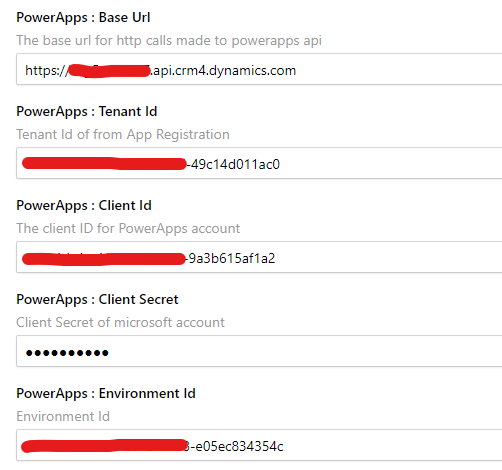
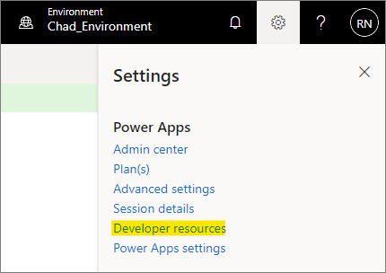
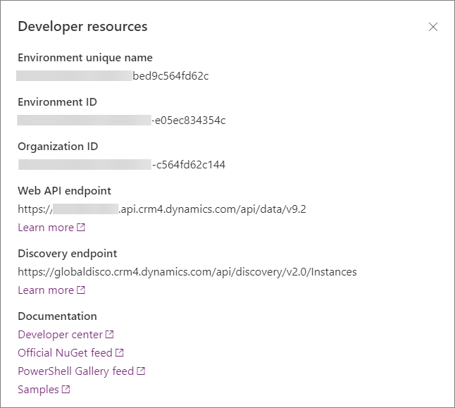

## On this page
{: .no_toc .text-delta }
1. TOC
{:toc}

## Credentials

To connect to Power Apps, you need to provide your [Microsoft 365](https://www.microsoft365.com/) credentials in CluedIn settings.

1. In CluedIn, on the navigation pane, go to **Administration** > **Settings**, and then find the **PowerApps** section.

1. Complete the following fields with the settings for PowerApps:

    - Base Url

    - Tenant Id

    - Client Id

    - Client Secret

    - Environment Id

    
    
    You can find the values for this by navigating to either the PowerApps page or the Power Automate page and checking the **Developer Resources** information.

    

    

    **Base Url** is the _Web API endpoint_ base URL.

5. For Tenant Id, Client Id, and Client Secret, you can generate this by navigating to your Azure Active Directory > App registration. Please refer to this [link](https://learn.microsoft.com/en-us/power-apps/developer/data-platform/walkthrough-register-app-azure-active-directory).

## Setup security roles

The following table lists the minimum role assignment we need to be able to successfully run the PowerApps Connector. Please refer to this [link](https://learn.microsoft.com/en-us/power-platform/admin/security-roles-privileges) for a detailed explanation of Security roles and privileges.

| Table | Create | Read | Write | Delete |
|:----------|:--|:--------|:---|:---|
| _Customization_ | | | | |
| Solution | Organization| Organization | Organization | Organization |
| Publisher | Organization| Organization | Organization | Organization |
| Entity | Organization| Organization | Organization | Organization |
| Entity Key | Organization| Organization |  | Organization |
| Attribute | Organization | Organization | Organization | Organization |
| System Form | Organization| Organization | Organization | Organization |
| View | Organization| Organization | Organization | Organization |
| Custom Control Default Config | Organization| | Organization | Organization |
| Process | Organization | Organization | Organization | Organization |
| _Custom Tables_ | | | | |
| Connection Reference | Organization | Organization | Organization | Organization |
| Connector | Organization | Organization | Organization | Organization |
| Dataflow | Organization | Organization | Organization | Organization |
| OptionSet | Organization | Organization | Organization | Organization |

## Setup application users

Upon setting up your App Registration and Security Roles, we need to register it under the Application User. Please refer to this [link](https://learn.microsoft.com/en-us/power-platform/admin/manage-application-users) for more information.