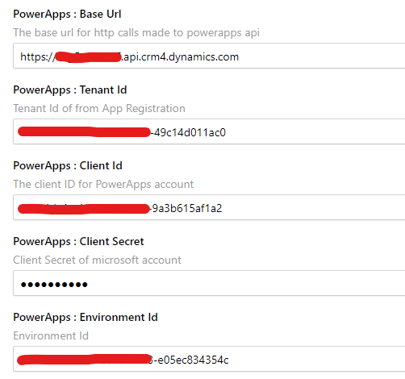

Enter your [Microsoft 365](https://www.microsoft365.com/) Credentials in CluedIn Settings.
1. Visit the CluedIn web application
2. Navigate to Administration => Settings
3. Scroll down to the Organization Settings section where you find the settings for PowerApps.

    - Username
    - Password
    - Redirect Uri (default: http://localhost/)
4. You can find the values for this by navigating to either the PowerApps page or the Power Automate page and checking the Developer Resources information.

    - **Base Url** is the _Web API endpoint_ base URL
    - Environment Id
5. For Client Id, you can generate this by navigating to your Azure Active Directory => App registration. Please refer to this [link](https://learn.microsoft.com/en-us/power-apps/developer/data-platform/walkthrough-register-app-azure-active-directory).
    - Client Id