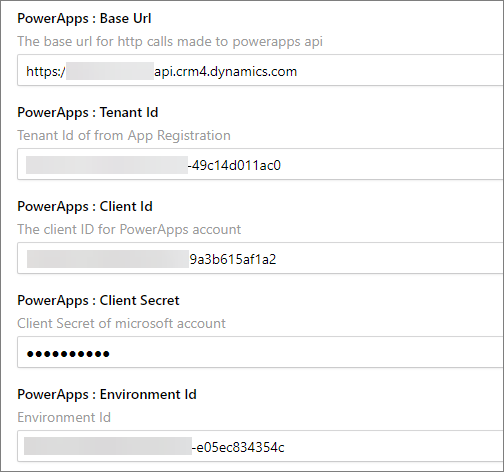

## Credentials
Enter your [Microsoft 365](https://www.microsoft365.com/) Credentials in CluedIn Settings.
1. Visit the CluedIn web application
2. Navigate to Administration => Settings
3. Scroll down to the Organization Settings section, where you will find the settings for PowerApps.

    - Base Url
    - Tenant Id
    - Client Id
    - Client Secret
    - Environment Id
4. You can find the values for this by navigating to either the PowerApps page or the Power Automate page and checking the Developer Resources information.

    - **Base Url** is the _Web API endpoint_ base URL
    - Environment Id
5. For Tenant Id, Client Id & Client Secret, you can generate this by navigating to your Azure Active Directory => App registration. Please refer to this [link](https://learn.microsoft.com/en-us/power-apps/developer/data-platform/walkthrough-register-app-azure-active-directory).
    - Tenant Id
    - Client Id
    - Client Secret

## Setup Security Roles
The following table lists the minimum role assignment we need to be able to successfully run the PowerApps Connector. Please refer to this [link](https://learn.microsoft.com/en-us/power-platform/admin/security-roles-privileges) for a detailed explanation of Security roles and privileges.

| Table | Create | Read | Write | Delete |
|:----------|:--|:--------|:---|:---|
| _Customization_ | | | | |
| Solution | Organization| Organization | Organization | Organization |
| Publisher | Organization| Organization | Organization | Organization |
| Entity | Organization| Organization | Organization | Organization |
| Entity Key | Organization| Organization |  | Organization |
| Attribute | Organization | Organization | Organization | Organization |
| System Form | Organization| Organization | Organization | Organization |
| View | Organization| Organization | Organization | Organization |
| Custom Control Default Config | Organization| | Organization | Organization |
| Process | Organization | Organization | Organization | Organization |
| _Custom Tables_ | | | | |
| Connection Reference | Organization | Organization | Organization | Organization |
| Connector | Organization | Organization | Organization | Organization |
| Dataflow | Organization | Organization | Organization | Organization |

## Setup Application Users
Upon setting up your App Registration and Security Roles, we need to register it under the Application User. Please refer to this [link](https://learn.microsoft.com/en-us/power-platform/admin/manage-application-users) for more information.