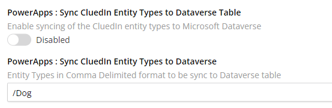
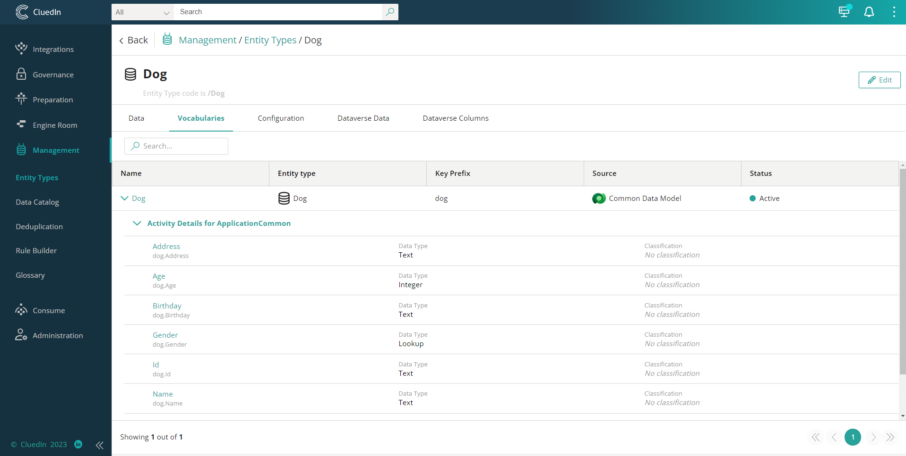
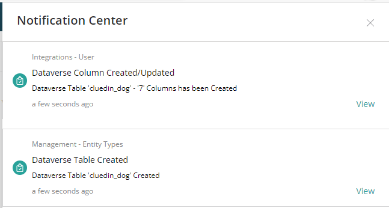
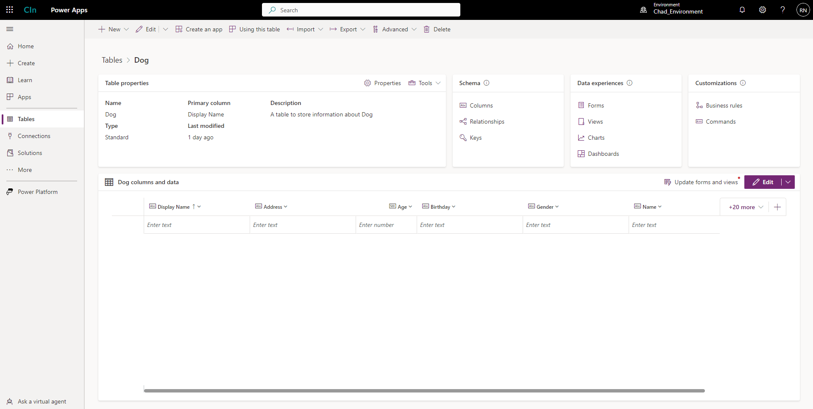

This feature allows you to sync CluedIn entity types, vocabularies, and vocabulary keys with Dataverse table and columns.

**To sync CluedIn entity types with Dataverse table**

1. On the navigation pane, go to **Administration** > **Settings**, and then find the **PowerApps** section.

1. In **Sync CluedIn Entity Types to Dataverse Table**, turn on the toggle, and then enter the entity type that you want to sync. If you want to sync multiple entity types, separate them with a comma (for example, _/_Type1,/Type2,/Type3_).

    

    All the vocabulary keys below will be created as columns in the Dataverse table.

    

    Once the synchronization has been successfully completed, you'll receive two notifications: **Dataverse Table Created** and **Dataverse Column Created/Updated**.

    

1. Verify the table and columns created in Dataverse.

    